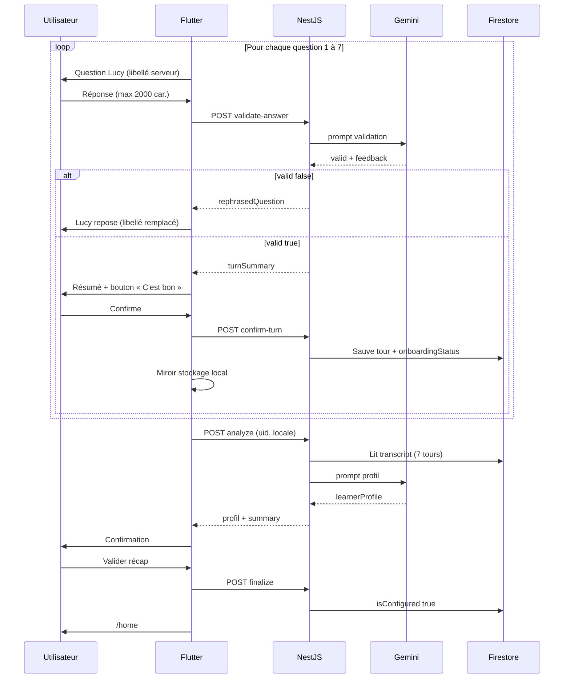
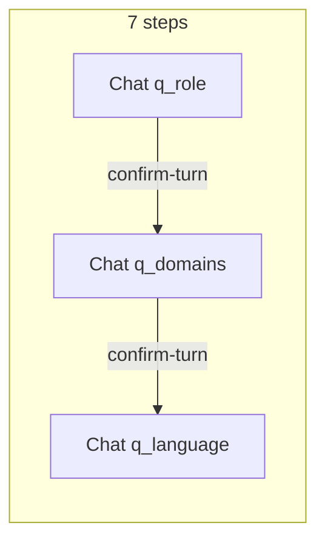
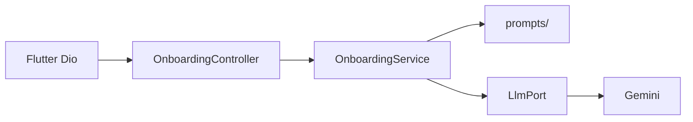

# Lucy — Spécification produit

> Document unique : **auth** (livré) + **onboarding** (à implémenter). Autres briques (chat, documents) seront ajoutées ici plus tard.

---

## 1. Vue d’ensemble

| Brique | Statut | Code / suivi |
|--------|--------|----------------|
| **Authentification** | **Livré** | `lib/features/auth/`, [tasks/todo.md](./tasks/todo.md), [docs/firebase-console-t11.md](./docs/firebase-console-t11.md) |
| **Onboarding / config apprenant** | **À implémenter** | `frontend/` + `Lucy/backend/` (NestJS) — §4 |
| Home / shell | À venir | `lib/features/auth/presentation/pages/home/` (placeholder) |
| Chat tuteur IA | À venir | — |
| Documents / RAG | À venir | — |

---

## 2. Conventions projet (toutes features)

| Règle | Détail |
|--------|--------|
| Architecture | Clean Architecture : UI → Notifier → Service → Repository |
| l10n | Pas de texte UI en dur ; `context.l10n.*` ; fr / en / de |
| Erreurs backend | Translator → l10n ; pas de message SDK/API brut |
| Couleurs UI | Uniquement `Theme.of(context).colorScheme` ; hex seulement dans `lib/core/theme/lucy_colors.dart` |
| Models / state | Freezed + Riverpod (`build_runner` après changement) |
| Référence structure | [`afroschool_admin_web`](file:///Users/espoirhermanfokokom/develop/project/afroschool_admin_web) |

### Commandes utiles (frontend)

```bash
cd frontend
flutter pub get
dart run build_runner build --delete-conflicting-outputs
flutter gen-l10n
flutter analyze
flutter test
```

---

## 3. Authentification (livrée)

- Routes : `/login`, `/signup`, `/reset-password`, `/home` (placeholder), splash + guard.
- Firebase **email + mot de passe** ; profil `users/{uid}` (`fullName`, `email`, `createdAt`).
- l10n **fr / en / de** ; pas de Google / Apple Sign-In.
- **Évolution avec onboarding (§4)** : signup/login → `/onboarding` si `isConfigured != true` (`null`/absent = `false`) ; lecture profil Firestore au bootstrap ; sinon `/home`.

---

## 4. Onboarding / configuration apprenant

> **Périmètre** : parcours obligatoire (Flutter) ; après **chaque** réponse → **Lucy valide** (API) → **l’utilisateur confirme** ce que Lucy a compris → **persistance Firestore** du tour ; après **7** tours confirmés → **`analyze`** (transcript lu côté serveur) → confirmation finale → `isConfigured`. Prompts dans `Lucy/backend/src/prompts/`.  
> **Hors périmètre** : chat tuteur, upload documents, RAG, contenu `/home` au-delà du garde d’accès.  
> **Décisions post-revue** : §4.11.

**Dépendance :** auth §3 livrée.

### 4.1 Décisions validées

#### App (Flutter + Firestore)

| # | Sujet | Décision |
|---|--------|----------|
| O1 | Onboarding skippable | **Non — obligatoire** |
| O2 | Flag | **`isConfigured`** (`bool`), défaut **`false`** au signup |
| O3 | Stockage | `learnerProfile`, `onboardingCompletedAt`, `onboardingTranscript` |
| O4 | Langues UI | **fr / en / de** |
| O5 | Architecture | `features/onboarding/` — UI → Notifier → Service → Repository |
| O6 | Après onboarding | Redirect **`/home`** (placeholder) |
| O7 | Édition ultérieure | Modifier `learnerProfile` sans `isConfigured: false` |
| O8 | Réponses | Questions scriptées app ; réponses en **langage naturel** |
| O9 | Structuration profil | **IA backend** (pas de mapping manuel dans l’app) |
| O10 | Validation **par étape** | **`validate-answer`** puis **confirmation utilisateur** (« c’est bon ») avant question suivante ; si `valid: false`, Lucy **repose** la question (`rephrasedQuestion`) — max **10** tentatives par `questionId` |
| O11 | Analyse finale | Après **7** tours **confirmés et persistés** : **`analyze`** (transcript **Firestore**, pas body client seul) → `learnerProfile` |
| O12 | Confirmation finale | Récap `summaryForUser` avant `isConfigured: true` |
| O13 | Progression | Enum **`onboardingStatus`** sur `users/{uid}` pour tracer l’étape (§4.4.2) |
| O14 | Persistance intermédiaire | Après « C’est bon » : **`POST confirm-turn`** → **Nest écrit Firestore** ; Flutter miroir **stockage local** uniquement |
| O17 | UX discussion | **1 step = 1 chat** (7 chats) ; design **type messagerie** ; indicateur **Lucy écrit** pendant les appels IA |
| O18 | Navigation steps | **Scroll / swipe** entre chats **déjà terminés** + chat courant ; **step suivant bloqué** tant que le courant n’est pas confirmé (`confirm-turn`) |
| O19 | Qualité UI | **Beau design MVP** : hiérarchie claire, bulles, avatar Lucy, thème `colorScheme` uniquement (pas de hex en dur dans les widgets) |
| O15 | Retour arrière | L’utilisateur peut **revenir** modifier une réponse antérieure ; invalider Q3 **n’invalide pas** Q4–Q7 déjà confirmés |
| O16 | Libellés questions | Textes officiels **côté serveur** (`questionId` + `locale`) — le client n’envoie pas un `questionText` arbitraire |

#### Backend (NestJS + Gemini)

| # | Sujet | Décision |
|---|--------|----------|
| A1 | Stack | **NestJS** — `Lucy/backend/` |
| A2 | LLM initial | **Google Gemini** |
| A3 | Changer de LLM | **`LlmPort`** + `LLM_PROVIDER` (`gemini` \| `openai` …) |
| A4 | Auth API | **Firebase Admin** — `Bearer <idToken>` |
| A5 | Prompts | `backend/src/prompts/` (Git) — pas dans Flutter |
| A6 | Appel LLM | **Serveur uniquement** |
| A7 | Firestore + garde API | **Nest (Admin SDK)** : écrit transcript, statut, tentatives, langue ; **Flutter** : lecture + stockage local ; `analyze` / `finalize` lisent-écrivent via Nest |
| A8 | Modèle | `gemini-2.5-flash` (`GEMINI_MODEL`) |
| A9 | API | Préfixe **`/v1`** |

### 4.2 Objectif

L’apprenant répond à **7 questions Lucy** (UI conversation). **À chaque réponse** :

1. NestJS + Gemini **`validate-answer`** (compréhensible pour cette question).
2. Si `valid: false` → **`rephrasedQuestion`** remplace le libellé affiché (même `questionId`) — max **10** essais.
3. Si `valid: true` → **`turnSummary`** + **« C’est bon »** / **« Ce n’est pas ça »** (retour saisie, sans appeler `confirm-turn`).
4. **« C’est bon »** → **`POST confirm-turn`** : Nest persiste le tour + met à jour **`onboardingStatus`** (+ miroir local).
5. Si **10** échecs `validate` sur une question → plus de `rephrasedQuestion` ; Lucy produit un **`fallbackSummary`** à valider (rendu simplifié si refus, §4.6).

Quand **7** tours confirmés en base → **`analyze`** → récap ; si **10** échecs `analyze` → **`fallbackProfileSummary`** à valider (§4.6) → **`finalize`** → `isConfigured: true`.

**Deux appels IA distincts :**

1. **`validate-answer`** — à chaque saisie (`valid` + `turnSummary` ou `rephrasedQuestion`).
2. **`analyze`** — une fois (structuration `learnerProfile`).

Parcours fermé. **Pas** de chat ouvert.

### 4.3 Flux produit



| Étape | Responsable | API |
|-------|-------------|-----|
| Question affichée | **App** (l10n) | — |
| Réponse utilisateur | **Utilisateur** | — |
| **Validation IA** | **NestJS + Gemini** | `POST /v1/onboarding/validate-answer` |
| **Confirmation utilisateur** | **App** | Après `valid: true` + `turnSummary` |
| **Sauvegarde tour** | **Nest → Firestore** (`confirm-turn`) | Après « C’est bon » |
| Question suivante | **App** | Uniquement après sauvegarde tour |
| **Profil structuré** | **NestJS + Gemini** | `POST /v1/onboarding/analyze` (transcript Firestore) |
| Confirmation finale | **App** | Récap `summaryForUser` |
| Finalisation | **Nest** (`finalize`) | `isConfigured`, `learnerProfile`, `onboardingCompletedAt` |

### 4.4 Firestore `users/{uid}`

| Champ | Rôle |
|-------|------|
| `fullName`, `email`, `createdAt` | Auth (signup) |
| `isConfigured` | `false` jusqu’à confirmation finale ; **`null` / absent = `false`** (comptes existants §4.11) |
| `onboardingStatus` | Enum §4.4.2 — progression |
| `onboardingCompletedAt` | ISO 8601 après confirmation finale |
| `learnerProfile` | Sortie IA (§4.4.1) ; **mise à jour** possible plus tard (merge, pas de suppression de clés sans remplacement) |
| `onboardingTranscript` | `{ questionId, questionText, answerText, confirmedAt }[]` — **incrémental** (1→7) |
| `onboardingAttempts` | `{ [questionId]: number }` — tentatives `validate` par question (plafond 10) |
| `tutoringLanguage` | **Langue de base** pour les réponses et le tuteur (§4.4.3) — définie à `q_language`, modifiable ensuite |
| `uiLocale` | Langue **UI** de l’appareil / app (`fr` \| `en` \| `de`) — peut différer de `tutoringLanguage` |
| `pendingLearnerProfile` | Brouillon post-`analyze` en attente de validation récap |
| `pendingSummaryForUser` | Récap IA en attente de validation récap |
| `onboardingAnalyzeAttempts` | Nombre d’appels `analyze` (plafond 10, puis mode fallback §4.6) |

#### 4.4.2 `onboardingStatus` (enum)

| Valeur | Signification |
|--------|----------------|
| `not_started` | Jamais commencé (`onboardingTranscript` vide ou absent) |
| `in_progress` | Au moins un tour sauvegardé, &lt; 7 |
| `awaiting_analyze` | 7 tours confirmés en base, analyse pas encore lancée ou en cours |
| `awaiting_final_confirm` | `analyze` OK, récap affiché, pas encore `isConfigured` |
| `completed` | Aligné avec `isConfigured: true` |

Transitions : `not_started` → `in_progress` (1er tour) → … → `awaiting_analyze` (7ᵉ tour) → `awaiting_final_confirm` → `completed`.

#### 4.4.3 Langues (`tutoringLanguage` + `uiLocale`)

| Concept | Rôle |
|---------|------|
| **`uiLocale`** | Langue des libellés UI (l10n app, catalogue §4.5). Stockée en local + copiée sur le doc user. |
| **`tutoringLanguage`** | **Langue de base** : celle dans laquelle l’apprenant **doit répondre** et que Lucy utilise pour expliquer. |
| Compréhension | Lucy peut **comprendre** d’autres langues, mais `validate-answer` doit favoriser `valid: true` si la réponse est exploitable **dans `tutoringLanguage`** (sinon `valid: false` + `rephrasedQuestion` invitant à répondre dans cette langue). |
| Avant `q_language` | Utiliser `uiLocale` comme langue attendue des réponses. |
| Après confirm `q_language` | **`tutoringLanguage`** = choix confirmé ; mise à jour par **`confirm-turn`** à chaque modification de cette réponse. |
| Conflit local / Firestore | **Firestore fait foi** ; au login/reprise, resynchroniser le stockage local depuis le doc user. |

#### 4.4.1 `learnerProfile` (enums)

| Clé | Valeurs |
|-----|---------|
| `primary_role` | `student`, `professional`, `educator`, `self_learner`, `other` |
| `main_domains` | `sciences`, `law`, `medicine`, `languages`, `business`, `cs`, `other` (array ≥1) |
| `learning_goal` | `exam`, `understand_course`, `quick_review`, `professional`, `certification`, `other` |
| `self_assessed_level` | `beginner`, `intermediate`, `advanced`, `variable` |
| `explanation_style` | `step_by_step`, `summary_first`, `analogies`, `socratic` |
| `feedback_tone` | `encouraging`, `neutral`, `strict` |
| `tutoring_language` | `fr`, `en`, `de`, `match_document` |

### 4.5 Questions (MVP)

| `questionId` | Thème | Exemple (FR) |
|--------------|-------|----------------|
| `q_role` | `primary_role` | Parlez-moi de votre situation… |
| `q_domains` | `main_domains` | Quels sujets allez-vous travailler avec moi ? |
| `q_goal` | `learning_goal` | Quel est votre objectif principal ? |
| `q_level` | `self_assessed_level` | Comment décririez-vous votre niveau ? |
| `q_style` | `explanation_style` | Comment aimez-vous qu’on vous explique ? |
| `q_tone` | `feedback_tone` | Quel ton pour les corrections ? |
| `q_language` | `tutoring_language` | Dans quelle langue dois-je vous expliquer ? |

- UI : **discussion type chat** (§4.5.1) ; libellés depuis **catalogue serveur** + l10n ; pas de « Plus tard ».
- **Libellés UI** : **l10n Flutter** (`onboardingQuestionQRole`, etc. fr/en/de) — §4.13 R7.
- **Prompts Nest** : `questionId` + `locale` → texte résolu côté serveur (catalogue aligné sur les clés l10n).
- **Reprise (Q3)** : rouvrir sur la **dernière question non confirmée** ; afficher l’**historique** déjà en base.
- **Après chaque saisie** : `validate-answer` → si `valid: false` et tentatives &lt; 10 : **`rephrasedQuestion` remplace** le libellé ; si **10** échecs : **`fallbackSummary`** (plus de nouvelle question) → utilisateur valide ou refuse (rendu **réduit** au retry).
- **Si `valid: true`** : **`turnSummary`** + **« C’est bon »** / **« Ce n’est pas ça »** (retour saisie, **ne compte pas** comme `confirm-turn`).
- **« C’est bon »** → `confirm-turn` (Nest écrit Firestore + `onboardingStatus`).
- **Retour arrière** : modifier Q*n* n’efface pas les autres tours ; re-`validate` + `confirm-turn` si texte changé ; si un **`analyze`** avait déjà réussi → statut `awaiting_analyze` + bouton **« Regénérer le profil »** (pas d’`analyze` auto silencieux).
- **7 tours en base** → `analyze` ; échecs répétés → **`fallbackProfileSummary`** (§4.6) puis validation utilisateur.
- **Récap final refusé (Q14)** : retour au parcours — Lucy **repose / clarifie** la question concernée ou demande de **reformuler** la réponse, puis re-`validate` / `confirm-turn` / **« Regénérer le profil »** si besoin.
- **Interdit** en UI : « Peux-tu préciser… » sans `rephrasedQuestion`.

#### 4.5.1 Design UX — 7 chats (1 step = 1 conversation)

> **Priorité produit** : l’onboarding doit **ressembler à une vraie conversation** avec Lucy, pas à un formulaire. Le **design soigné** est un critère MVP (lisibilité, confiance, perception « tuteur IA »).

**Modèle mental**

| Concept | Règle |
|---------|--------|
| **Step** | Une des **7 questions** (`q_role` … `q_language`). |
| **Chat du step** | Fil **vertical** dédié : messages Lucy (question, `rephrasedQuestion`, `turnSummary`, `fallbackSummary`) + messages utilisateur (réponses texte). **Pas** de mélange des messages d’un autre step dans ce fil. |
| **Progression** | On ne peut ouvrir le **step N+1** (saisie active) que si le step **N** est **terminé** (`confirm-turn` OK pour ce `questionId`). |
| **Navigation latérale** | L’utilisateur peut **parcourir** (swipe horizontal ou onglets / PageView) les chats des steps **déjà terminés** + le **step courant** ; les steps **futurs** sont **verrouillés** (indicateur visuel : cadenas / point grisé). |
| **Scroll vertical** | Dans le chat du step actif (ou d’un step passé en lecture seule), scroll libre sur **l’historique de ce step uniquement**. |



**Pendant que Lucy « écrit » (appels API)**

- Afficher une ligne **typing** : **avatar / icône Lucy** + indicateur basique (**3 points animés** ou équivalent Material).
- États concernés : `validate-answer`, `confirm-turn`, `analyze`, `finalize` en cours.
- Masquer l’indicateur dès réponse reçue ; afficher ensuite la **bulle Lucy** avec le contenu (`rephrasedQuestion`, `turnSummary`, etc.).
- **Désactiver** zone de saisie + boutons partagés pendant ce temps (§4.7).

**Composants UI (Flutter)**

| Widget | Rôle |
|--------|------|
| `onboarding_step_shell_page` | Coque : barre progression **7 points**, pager horizontal, zone saisie globale |
| `onboarding_step_chat_panel` | Un step : `ListView` des bulles + typing indicator |
| `onboarding_lucy_bubble` | Bulle Lucy (question, reformulation, résumé) — alignée **gauche**, avatar |
| `onboarding_user_bubble` | Bulle utilisateur — alignée **droite** |
| `onboarding_lucy_typing_row` | Avatar + animation « Lucy écrit… » (l10n) |
| `onboarding_step_progress_dots` | 7 points : fait / courant / verrouillé |

**Design (beau, cohérent app)**

- **Material 3** : `Theme.of(context).colorScheme` pour bulles, fond, texte secondaire ; radius / padding via `Theme` ou constantes `lib/core/theme/` (pas de couleurs en dur dans la feature).
- **Avatar Lucy** : asset ou icône centralisé (`lib/core/constants/` ou `shared`) — même visuel sur bulles et typing.
- **Bulles** : coins arrondis asymétriques (style messagerie) ; contraste suffisant (accessibilité).
- **Step courant** : titre discret ou sous-titre l10n (ex. « Étape 3 sur 7 ») + point actif mis en avant.
- **Step verrouillé** : pas de champ texte ; tap → snackbar l10n « Terminez l’étape en cours ».
- **Step terminé (lecture)** : bulles en lecture seule ; bouton **Modifier** sur ce step → repasse en mode édition (§4.5 retour arrière).
- **Mobile + web** (Q17) : pager swipe sur mobile ; sur web large, possibilité **tabs** ou pager + mêmes règles de verrouillage.

**État notifier (indicatif)**

- `currentStepIndex` (0–6), `completedQuestionIds`, `chatsByQuestionId: Map<questionId, List<ChatMessage>>`, `isLucyTyping`, `typingContext` (validate | confirm | analyze).
- Reprise (Q3) : reconstruire les **7 panels** depuis Firestore + local ; ouvrir le panel du **premier step non confirmé**.

### 4.6 Backend NestJS + Gemini

#### Arborescence `Lucy/backend/`

```text
backend/
  src/
    main.ts
    app.module.ts
    core/
      auth/
        firebase-auth.guard.ts
        firebase-admin.module.ts
      config/
      llm/
        llm.module.ts
        llm.port.ts
        gemini.llm.adapter.ts
        openai.llm.adapter.ts   # futur
      errors/
    prompts/
      onboarding-validate-answer.system.md
      onboarding-validate-answer.user.hbs
      onboarding-analyze.system.md
      onboarding-analyze.user.hbs
    features/onboarding/
      questions/          # catalogue questionId × locale (§4.5)
      onboarding.module.ts
      onboarding.controller.ts
      onboarding.service.ts
      firebase-user.repository.ts  # lecture/écriture users/{uid}
      dto/
      validators/
  .env.example
```



#### Port LLM

```typescript
export interface LlmStructuredRequest {
  systemPrompt: string;
  userPrompt: string;
  responseJsonSchema: object;
}

export interface LlmStructuredResponse {
  rawText: string;
  parsedJson?: unknown;
}

export interface LlmPort {
  generateStructured(input: LlmStructuredRequest): Promise<LlmStructuredResponse>;
}
```

| `LLM_PROVIDER` | Adapter |
|----------------|---------|
| `gemini` (défaut) | `GeminiLlmAdapter` |
| `openai` (futur) | `OpenaiLlmAdapter` |

`OnboardingService` n’importe **pas** Gemini directement.

#### `POST /v1/onboarding/validate-answer` (à chaque réponse)

| | |
|--|--|
| Auth | `FirebaseAuthGuard` — `Bearer <Firebase idToken>` |
| Quand | **Immédiatement** après la saisie d’une réponse, **avant** la question suivante |

**Requête :**

```json
{
  "locale": "fr",
  "turn": {
    "questionId": "q_role",
    "answerText": "Je suis étudiant en L2 biologie…"
  }
}
```

| Champ | Règles |
|-------|--------|
| `locale` | `fr` \| `en` \| `de` |
| `turn.questionId` | Un des IDs §4.5 |
| `turn.answerText` | Non vide ; **≤ 2000 caractères** (UTF-16 length côté serveur + client) |
| `turn.questionText` | **Interdit / ignoré** — le serveur résout le libellé via catalogue §4.5 |

**Avant appel LLM (serveur) :**

- Lire Firestore `users/{uid}` : si `isConfigured === true` → **403** `ONBOARDING_ALREADY_COMPLETE`.
- Si `onboardingAttempts[questionId] >= 10` → ne plus appeler le flux `rephrasedQuestion` ; répondre en mode **`fallbackSummary`** (§ ci-dessous).
- Si `valid: false` → incrémenter **`onboardingAttempts[questionId]`** en Firestore (Nest).

**Réponse 200 :**

```json
{
  "valid": true,
  "turnSummary": "Tu es étudiant en biologie en L2 — c’est bien noté."
}
```

```json
{
  "valid": false,
  "rephrasedQuestion": "Tu es plutôt étudiant, en reconversion pro, ou tu apprends seul·e ?",
  "reason": "too_vague"
}
```

| Champ | Rôle |
|-------|------|
| `valid` | `true` → afficher `turnSummary` + attendre confirmation utilisateur ; `false` → **même** `questionId`, `rephrasedQuestion` |
| `turnSummary` | Si `valid: true` — **obligatoire** : reformulation courte de ce que Lucy a compris (langue `locale`) |
| `rephrasedQuestion` | Si `valid: false` — **obligatoire** : repose la question, plus simple |
| `reason` | `too_vague`, `off_topic`, `too_short`, `unintelligible`, `too_long`, `wrong_language` |
| `fallbackSummary` | Si tentatives ≥ 10 : **rendu** synthétique de ce que Lucy retient ; l’utilisateur doit le valider via `confirm-turn` (type `fallback`) |
| `fallbackReduced` | Si `true` sur requête suivante : regénérer un rendu **plus court** après refus utilisateur |

**Règles prompt `onboarding-validate-answer` :**

- Jugement **simple** : la réponse permet-elle de comprendre l’intention pour **cette** question ?
- **Ne pas** produire `learnerProfile` à cette étape.
- Si `valid: false` : fournir **`rephrasedQuestion`** — reformulation **pédagogique** de la question (ex. choix guidés, phrases courtes), **pas** une méta-demande du type « Peux-tu préciser », « Peux-tu en dire plus », « Clarifie ».
- Si `valid: true` : `turnSummary` court (**requis**).
- Sortie JSON : `{ valid, turnSummary?, rephrasedQuestion?, reason? }`.

**Flutter (si `valid: false`) :**

- **Remplacer** le libellé de la question courante par `rephrasedQuestion` (une seule bulle question active).
- Conserver le même `questionId` et l’index d’étape (1/7 … 7/7).
- Vider le champ réponse.

**Flutter (si `valid: true`) :**

- Afficher `turnSummary` + **« C’est bon »** / **« Ce n’est pas ça »** (retour saisie).
- **« C’est bon »** → `POST confirm-turn` → question suivante (swipe / Suivant).

**Flutter (mode `fallbackSummary` après 10 échecs) :**

- Afficher le rendu ; **Valider** → `confirm-turn` avec `confirmationType: fallback` ; **Refuser** → rappeler `validate-answer` avec `fallbackReduced: true` pour un rendu plus court.

| HTTP | `error` | Quand |
|------|---------|--------|
| 401 | `UNAUTHORIZED` | Token invalide / expiré |
| 400 | `VALIDATION_ERROR` | DTO invalide |
| 400 | `ANSWER_TOO_LONG` | &gt; 2000 caractères |
| 403 | `ONBOARDING_ALREADY_COMPLETE` | `isConfigured === true` |
| 502 | `LLM_RESPONSE_INVALID` | JSON IA invalide |
| 503 | `LLM_UNAVAILABLE` | Gemini indisponible |

**Flutter :** boutons envoi / « C’est bon » **désactivés** pendant tout appel réseau (widget bouton partagé §4.7).

#### `POST /v1/onboarding/confirm-turn` (après « C’est bon » ou validation `fallbackSummary`)

| | |
|--|--|
| Auth | `FirebaseAuthGuard` |
| Quand | L’utilisateur valide un `turnSummary` ou un `fallbackSummary` |

**Requête :**

```json
{
  "locale": "fr",
  "confirmationType": "normal",
  "turn": {
    "questionId": "q_role",
    "answerText": "Je suis étudiant en L2 biologie…"
  },
  "fallbackReduced": false
}
```

| Champ | Règles |
|-------|--------|
| `confirmationType` | `normal` \| `fallback` |
| `turn` | Requis si `normal` ; pour `fallback`, texte retenu = dernier `answerText` ou contenu validé du rendu |
| `fallbackReduced` | Utilisé côté validate en amont ; ici informatif si besoin |

**Serveur (obligatoire) :**

- Upsert `onboardingTranscript` pour ce `questionId` (`questionText` depuis catalogue, `confirmedAt` ISO).
- Mettre à jour **`onboardingStatus`** (`in_progress` / `awaiting_analyze` si 7 tours).
- Si `q_language` confirmé → **`tutoringLanguage`**.
- **Ne pas** incrémenter `onboardingAttempts` ici (uniquement sur `valid: false` dans `validate-answer`).

**Réponse 200 :** `{ "onboardingStatus", "completedTurns": 3 }`

| HTTP | `error` | Quand |
|------|---------|--------|
| 400 | `VALIDATION_ERROR` | Tour invalide |
| 403 | `ONBOARDING_ALREADY_COMPLETE` | Déjà configuré |

#### `POST /v1/onboarding/analyze` (après 7 réponses validées)

| | |
|--|--|
| Auth | `FirebaseAuthGuard` — `Authorization: Bearer <Firebase idToken>` |
| `uid` | Depuis le token — **jamais** dans le body |

**Requête :**

```json
{
  "locale": "fr"
}
```

| Champ | Règles |
|-------|--------|
| `locale` | `fr` \| `en` \| `de` |
| `transcript` (body) | **Non utilisé en MVP** — le serveur lit **`onboardingTranscript`** dans Firestore `users/{uid}` |

**Avant analyse :**

- `isConfigured === true` → **403** `ONBOARDING_ALREADY_COMPLETE`.
- Firestore : **exactement 7** entrées confirmées, `questionId` uniques §4.5 ; sinon **400** `ONBOARDING_TRANSCRIPT_INCOMPLETE`.
- Incrémenter **`onboardingAnalyzeAttempts`** à chaque appel.
- Si **`onboardingAnalyzeAttempts` ≥ 10** et dernier échec : ne pas bloquer définitivement — générer **`fallbackProfileSummary`** (résumé profil simplifié) ; l’utilisateur **valide** ou **refuse** → si refuse, relancer `analyze` avec prompt **réduit** (même plafond logique, pas de 429 terminal).

**Réponse 200 :**

```json
{
  "learnerProfile": {
    "primary_role": "student",
    "main_domains": ["sciences"],
    "learning_goal": "exam",
    "self_assessed_level": "intermediate",
    "explanation_style": "step_by_step",
    "feedback_tone": "encouraging",
    "tutoring_language": "fr"
  },
  "summaryForUser": "Tu prépares un examen en sciences, niveau intermédiaire, en français, avec un ton encourageant."
}
```

**Erreurs structurées :**

```json
{
  "statusCode": 422,
  "error": "ONBOARDING_PROFILE_INCOMPLETE",
  "message": "...",
  "details": { "missingFields": ["self_assessed_level"] }
}
```

| HTTP | `error` | Quand |
|------|---------|--------|
| 401 | `UNAUTHORIZED` | Token absent / invalide |
| 400 | `VALIDATION_ERROR` | DTO invalide |
| 400 | `ONBOARDING_TRANSCRIPT_INCOMPLETE` | Transcript Firestore ≠ 7 tours |
| 403 | `ONBOARDING_ALREADY_COMPLETE` | Déjà configuré |
| 422 | `ONBOARDING_PROFILE_INCOMPLETE` | Enums / champs manquants |
| 502 | `LLM_RESPONSE_INVALID` | JSON IA invalide |
| 503 | `LLM_UNAVAILABLE` | Gemini indisponible |
| 500 | `INTERNAL_ERROR` | Autre |

| API | UX app |
|-----|--------|
| 401 | Rediriger auth |
| 422 | Reformuler / compléter |
| 502 / 503 | Retry ; si ≥ 10 échecs → **`fallbackProfileSummary`** + validation utilisateur |

**Réponse 200 (succès standard) :** écrit aussi `pendingLearnerProfile` + `pendingSummaryForUser` en Firestore ; `onboardingStatus = awaiting_final_confirm`.

**Réponse 200 (mode fallback après 10 échecs analyze) :**

```json
{
  "fallbackProfileSummary": "…",
  "requiresUserConfirmation": true
}
```

Flutter : mapper **tous** les `error` → l10n ; écrans / bannières explicites (§4.7, Q16).

#### `POST /v1/onboarding/finalize` (récap final accepté)

| | |
|--|--|
| Auth | `FirebaseAuthGuard` |
| Body | `{ "accept": true }` ou refus implicite via retour UI (Q14) |

**Si `accept: true` :** copier `pendingLearnerProfile` → `learnerProfile`, `isConfigured: true`, `onboardingCompletedAt`, `onboardingStatus: completed`, effacer champs `pending*`.

**Si refus (UI Q14) :** pas d’appel `finalize` ; retour parcours + clarification / re-saisie.

#### Prompts (`backend/src/prompts/`)

| Fichier | Rôle |
|---------|------|
| `onboarding-validate-answer.system.md` | Validation **simple** d’un tour (§4.6) |
| `onboarding-validate-answer.user.hbs` | `{{locale}}`, `{{questionId}}`, `{{questionText}}`, `{{answerText}}` |
| `onboarding-analyze.system.md` | Structuration `learnerProfile`, enums §4.4.1 |
| `onboarding-analyze.user.hbs` | `{{locale}}`, `{{transcriptJson}}` |

**Règles system (figées) :**

- Extraire un profil ; ne pas discuter.
- Sortie : `{ learnerProfile, summaryForUser }` uniquement.
- `learnerProfile` : enums §4.4.1 seulement ; `main_domains` array ≥1.
- `summaryForUser` : 2–4 phrases, langue `locale`, ton bienveillant, sans codes techniques.
- Ambiguïté : valeur la plus probable + mention dans `summaryForUser`.
- Interdit : markdown, champs hors schéma.

`PromptLoaderService` charge les fichiers au démarrage.

#### Variables d’environnement (backend)

```bash
PORT=3000
NODE_ENV=development
FIREBASE_PROJECT_ID=lucy-7504c
# GOOGLE_APPLICATION_CREDENTIALS=./serviceAccount.json

LLM_PROVIDER=gemini
GEMINI_API_KEY=
GEMINI_MODEL=gemini-2.5-flash

# Futur : LLM_PROVIDER=openai, OPENAI_API_KEY=...
```

| Secret | Où |
|--------|-----|
| `GEMINI_API_KEY` | Serveur **uniquement** |
| Service account Firebase | Serveur **uniquement** |

#### Sécurité API

- Guard Firebase sur `/v1/onboarding/*` + lecture Firestore Admin pour transcript / statut.
- CORS : origines web Lucy + `localhost` (dev).
- Rate limit : **`validate-answer`** et **`analyze`** (ex. 30 req/min/uid chacun) + plafonds métier §4.6 (10 tentatives / question, 10 `analyze`).
- Logs prod : ne pas logger `answerText` en clair ; logger `uid`, `questionId`, `requestId`, `onboardingStatus`.

### 4.7 Flutter

#### Intégration API

| Élément | Convention |
|---------|------------|
| HTTP | `dio` |
| Base URL | `ApiEndpoints.baseUrl` (ex. dev `http://localhost:3000`) |
| Header | `Authorization: Bearer ${getIdToken()}` — interceptor : sur **401**, `getIdToken(true)` puis **un** retry |
| Stockage local | `uiLocale`, brouillon transcript / index courant (reprise après kill app) |
| Data sources | `onboarding_validate_remote_data_source.dart`, `onboarding_analyze_remote_data_source.dart` |

**Pas** de SDK Gemini dans l’app.

#### Structure `lib/features/onboarding/`

```
onboarding/
├── data/
│   ├── datasources/
│   │   ├── onboarding_profile_remote_data_source.dart
│   │   ├── onboarding_validate_remote_data_source.dart
│   │   ├── onboarding_confirm_remote_data_source.dart
│   │   ├── onboarding_analyze_remote_data_source.dart
│   │   └── onboarding_finalize_remote_data_source.dart
│   ├── dtos/  mappers/  repositories/
├── domain/  entities/  repositories/
├── services/  onboarding_service.dart
└── presentation/
    ├── pages/
    │   ├── onboarding_step_shell_page.dart
    │   └── onboarding_confirm_page.dart
    └── widgets/
        ├── onboarding_step_chat_panel.dart
        ├── onboarding_lucy_bubble.dart
        ├── onboarding_user_bubble.dart
        ├── onboarding_lucy_typing_row.dart
        └── onboarding_step_progress_dots.dart
```

Flux : UI → Notifier → Service → repositories (**API Nest** pour validate / confirm / analyze / finalize ; **lecture** profil Firestore pour guard ; **écriture** user doc onboarding = **Nest uniquement**).

#### UI onboarding (§4.5.1)

- **Shell** : `PageView` / pager **horizontal** = 7 chats ; **7 points** en tête ; saisie + envoi liés au **step courant** uniquement.
- **Verrouillage** : impossible d’aller au step **k+1** tant que `questionId` du step **k** n’a pas `confirm-turn` ; swipe vers steps futurs **bloqué**.
- **Lucy typing** : `onboarding_lucy_typing_row` pendant tout `isLucyTyping`.
- **Précédent / Suivant** (optionnel) : même règles que le swipe (Suivant = step suivant **seulement si** courant terminé).
- **Erreurs (Q16)** : chaque code API → message l10n + action (retry, retour saisie) ; pas de `message` serveur brut.

#### Routing

| Route | `isConfigured` | Accès |
|-------|----------------|--------|
| `/onboarding` | `false` | Parcours + analyse + confirmation |
| `/home` | `true` | Shell placeholder |

Signup / login → `/onboarding` si `isConfigured != true` (lire Firestore **avant** redirect, pas seulement Auth). Connecté sur `/onboarding` avec `true` → `/home`. **Adapter** `LucyRouterGuards` + provider profil (§3, §4.11 A3).

#### Boutons (partagés)

- Envoi réponse, « C’est bon », actions récap : **widget bouton partagé** (`lib/shared/widgets/buttons/`) avec `onPressed` null pendant `loading` / appel API.

#### Écran confirmation (O12)

- Afficher `pendingSummaryForUser` / `summaryForUser` + libellés humains (enums → l10n).
- **C’est correct** → `POST finalize` → redirect `/home` après ack.
- **Ce n’est pas correct (Q14)** → retour parcours : Lucy **clarifie** ou demande de **reformuler** ; re-`validate` / `confirm-turn` ; si profil déjà généré → **« Regénérer le profil »** (`analyze`).
- Navigation **`/home`** uniquement après succès **`finalize`** (Firestore `isConfigured: true`).

### 4.8 Critères d’acceptation

**Statut MVP** : cases `[x]` = livré et couvert par les tests structurels (`test/core/architecture/spec_48_onboarding_dod_test.dart`, `backend/.../spec-48-dod.spec.ts`). Cases `[ ]` = **post-MVP** (plan [tasks/plan.md](./tasks/plan.md) §9).

#### App

- [x] 7 questions ; réponses texte libre.
- [x] **`validate-answer` après chaque saisie** ; si `valid: true`, **`turnSummary` + confirmation utilisateur** avant question suivante.
- [x] Si `valid: false` : **`rephrasedQuestion` remplace** le libellé (pas « Peux-tu préciser »).
- [x] max **10** tentatives / question ; 10 échecs validate → **`fallbackSummary`** + validation / rendu réduit si refus.
- [x] **« Ce n’est pas ça »** après `turnSummary` → retour saisie sans `confirm-turn`.
- [x] **`confirm-turn`** après « C’est bon » ; Nest écrit Firestore ; miroir local.
- [x] **`analyze`** + **`finalize`** pour clôturer (écran confirmation profil).
- [ ] fallback profil après 10 échecs analyze.
- [ ] **7 chats** (1 step = 1 fil) ; typing Lucy pendant appels IA ; steps futurs **verrouillés**.
- [ ] Design messagerie complète (avatar, `colorScheme`) ; **swipe entre steps** terminés + courant.
- [ ] Retour arrière : modifier un tour n’efface pas les autres.
- [x] Réponses ≤ **2000 caractères** ; boutons désactivés pendant appels (widget partagé).
- [x] Guard router : `isConfigured` lu depuis Firestore (`onboardingStatus` via réponses API confirm-turn).
- [x] Confirmation obligatoire avant Firestore.
- [x] `onboardingTranscript` + `learnerProfile` + `isConfigured: true` après validation.
- [x] Pas de skip ; garde `/home` si `false`.
- [x] l10n fr/en/de ; Clean Architecture ; pas de message API brut.

#### Backend

- [x] Catalogue `questionId` + `locale` côté serveur ; client n’envoie pas `questionText`.
- [x] `validate-answer` : vague → `valid: false` + `rephrasedQuestion` ; clair → `valid: true` + **`turnSummary` obligatoire**.
- [x] `isConfigured === true` → **403** sur les deux routes.
- [x] `analyze` : lit Firestore, 7 entrées → 200 + `learnerProfile` §4.4.1.
- [x] Transcript Firestore &lt; 7 → `ONBOARDING_TRANSCRIPT_INCOMPLETE`.
- [x] &gt; **2000 caractères** → `ANSWER_TOO_LONG` ; catalogue `questions/` ; `confirm-turn` + `finalize`.
- [x] Nest **Admin** : seul writer onboarding ; Flutter read + local mirror.
- [x] JSON IA invalide → 502 ; profil incomplet → 422.
- [x] Deux prompts distincts dans `src/prompts/`.
- [x] Tests : `OnboardingService` + `LlmPort` mocké (validate + analyze).

### 4.9 Plan de mise en place

1. Scaffold `backend/` (Nest, guard, `LlmPort`, Gemini).
2. Prompts + `validate-answer` + `confirm-turn` + `analyze` + `finalize` + catalogue `questions/`.
3. Flutter : `isConfigured`, router, feature onboarding (read Firestore).
4. Boucle 7 questions ; Nest Admin écrit ; `finalize` clôt.
5. Tests + `.env.example`.

### 4.10 Limites onboarding

- Obligatoire ; Gemini via port ; validation enum avant 200.
- Hors scope : chat, RAG, questions inventées par LLM ; `match_document` **uniquement** dans `learnerProfile` post-analyse si pertinent, **pas** pendant choix `q_language`.
- Jamais : clé Gemini dans Flutter ; `isConfigured` sans profil valide ; `isConfigured` depuis l’API seule.

### 4.11 Décisions post-revue (2026-05-25)

| ID revue | Décision produit / technique |
|----------|----------------------------|
| A1 | Source de vérité : **Firestore** après chaque tour **confirmé** par l’utilisateur ; `analyze` lit ce transcript. |
| A2 | API : vérifier `isConfigured`, transcript, plafonds tentatives. |
| A3 | **Adapter** router + bootstrap : lecture profil Firestore avant redirect `/home` vs `/onboarding`. |
| A4 | `isConfigured` **absent ou null = false** (migration comptes existants). |
| A5 | Libellés questions : **catalogue serveur** (`questionId` + `locale`). |
| A6 | `rephrasedQuestion` **remplace** le libellé affiché (pas d’empilement ambigu). |
| A7 | Max **10** tentatives `validate` par `questionId` ; stocker la réponse **après** confirmation utilisateur. |
| A8 | Rate limit sur **validate** et **analyze**. |
| A9 | Double validation : **IA** puis **utilisateur** (« C’est bon ») avant persistance et question suivante. |
| A10 | `turnSummary` **obligatoire** si `valid: true` ; boutons désactivés pendant appels. |
| A11 | Logique `disabled` dans le **widget bouton partagé**. |
| A12 | Persistance **Firestore** après chaque bon tour + miroir local. |
| A13 | Max **10** tentatives `analyze`. |
| A14 | Retour arrière autorisé ; modification Q*n* n’invalide pas les autres tours. |
| A16 | `uiLocale` + brouillon dans **stockage local** (reprise). |
| A17 | `tutoringLanguage` sur le doc user, mise à jour à chaque confirmation/modification de `q_language`. |
| A18 | `answerText` ≤ **2000 caractères**. |
| A19 | `learnerProfile` : **mise à jour** par merge ; pas de suppression de champs sans valeur de remplacement. |
| A20 | Erreurs : l10n + UI claire ; 401 → refresh token (1 retry) puis auth. |

### 4.12 Clarifications produit (2026-05-25)

| Q | Décision |
|---|----------|
| **Q1** | 10 échecs `validate` → **`fallbackSummary`** (plus de question) ; refus → rendu **réduit**. |
| **Q2** | **« Ce n’est pas ça »** → retour saisie sans `confirm-turn`. |
| **Q3** | Reprise dernière question non confirmée + **historique chat** complet. |
| **Q4** | Après edit post-analyze → **« Regénérer le profil »** (manuel). |
| **Q5** | Tentatives sur `valid: false` (Nest) ; **`confirm-turn`** si étape bonne + statut. |
| **Q6** | Tous les comptes existants refont l’onboarding. |
| **Q7** | 10 échecs `analyze` → **`fallbackProfileSummary`** ; refus → `analyze` réduit. |
| **Q8** | Catalogue `backend/src/onboarding/questions/`. |
| **Q9** | **Nest seul** écrit onboarding Firestore ; Flutter lit + local. |
| **Q10** | **2000 caractères**. |
| **Q11** | `tutoringLanguage` = langue des réponses ; `uiLocale` = UI. |
| **Q12** | Firestore &gt; local. |
| **Q13** | Swipe entre **chats des steps terminés** + courant ; **7 points** ; step suivant **bloqué** jusqu’à `confirm-turn`. |
| **UX chat** | §4.5.1 : messagerie, avatar Lucy, indicateur **écrit**, design soigné MVP. |
| **Q14** | Refus récap → clarification / re-saisie. |
| **Q16** | Erreurs UX explicites (l10n). |
| **Q17** | Mobile + web. |

**Endpoints :** `validate-answer` · `confirm-turn` · `analyze` · `finalize`.

### 4.13 Affinages produit (R1–R8, 2026-05-25)

| R | Décision |
|---|----------|
| **R1** | **Widget partagé** `lib/shared/widgets/branding/lucy_avatar.dart` (asset embarqué MVP, adaptable plus tard). |
| **R2** | **7 chats séparés** côté frontend (§4.5.1) — pas de fil global unique. |
| **R3** | Refus récap / clarification **dans le chat du step concerné** ; modèle mental = **7 canaux de discussion isolés** (MVP : HTTP, pas de WebSocket onboarding). |
| **R4** | Après édition d’un step : **rester sur ce step** jusqu’à re-confirmation. |
| **R5** | Limite **2000 caractères** (`String.length` / équivalent serveur). |
| **R6** | Firestore : Flutter **lecture seule** sur champs onboarding ; **écriture Nest** (Admin). |
| **R7** | Libellés des 7 questions : **l10n Flutter** (`onboardingQuestion*` fr/en/de) ; backend reçoit `questionId` + `locale` et résout le texte pour les prompts (catalogue aligné sur les clés l10n). |
| **R8** | Inspiration visuelle **WhatsApp** (bulles, typing, densité) ; Material 3 + `colorScheme`. |

---

*Ce document a été créé avec Cursor (IA). Dernière mise à jour : R1–R8 §4.13, widget Lucy partagé, questions l10n (2026-05-25).*
