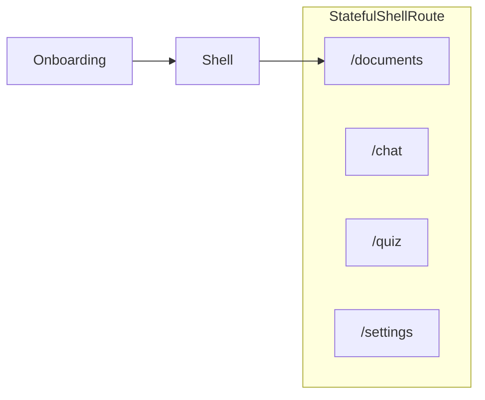

# Lucy — Spécification produit (travail restant)

> Ce document décrit **uniquement ce qu’il reste à faire**.  
> **Déjà livré** (hors spec active) : authentification Firebase + Nest `users/me`, onboarding 7 questions + API Nest, centralisation données (pas de Firestore client), thème Flex + widgets partagés. Détails techniques : `docs/spec-backend-centralization.md`, `docs/manual-checkpoints-onboarding.md`, historique git.

---

## 1. Vue d’ensemble — backlog

| Priorité | Brique | Statut | Section |
|----------|--------|--------|---------|
| **P0** | Shell post-login (bottom nav, 4 onglets) | **Livré** | §2 |
| P1 | Upload documents (PDF, Storage, métadonnées) | À venir | §3 |
| P2 | Pipeline RAG (extraction, embeddings, vector search) | À venir | §3 |
| P3 | Chat source-based (réponses + citations) | À venir | §3 |
| P4 | Quiz / flashcards depuis le corpus | À venir | §3 |

---

## 2. Shell post-login (P0 — livré)

> **Référence UI** : [`telC_frontend`](../telC/telC_frontend) — `StatefulShellRoute.indexedStack`, `TcAppShell`, `AnimatedBottomNavigationBar`, `pageUnderDevelopment`.

### 2.1 Objectif

Après `isConfigured: true`, l’apprenant entre dans une **coque à 4 onglets**. **Documents** est l’onglet **par défaut** : à terme, c’est là qu’il **dépose ses PDF / livres** pour que le backend les lise (RAG). **MVP shell** = navigation + pages « En cours de réalisation » (pas d’upload ni de chat LLM dans ce lot).

### 2.2 Vision produit (Documents / Chat / Quiz)

Aligné pitch *Personalized learning AI agent based on your own documents* :

| Onglet | Rôle produit (cible) | MVP shell |
|--------|----------------------|-----------|
| **Documents** | Upload + gestion du corpus privé → Storage / Firestore / vector search | Placeholder |
| **Chat** | Questions/réponses **uniquement** depuis les docs uploadés (+ sources) | Placeholder |
| **Quiz** | Quiz / flashcards générés depuis le même corpus | Placeholder |
| **Paramètres** | Compte, langue, déconnexion | Déconnexion + reste « en cours » |

### 2.3 Navigation

| Ordre | Onglet | Route | Icône (Material) |
|-------|--------|-------|------------------|
| 1 (défaut) | Documents | `/documents` | `Icons.description_outlined` |
| 2 | Chat | `/chat` | `Icons.chat_bubble_outline` |
| 3 | Quiz | `/quiz` | `Icons.quiz_outlined` |
| 4 | Paramètres | `/settings` | `Icons.settings_outlined` |

**Décisions**

| # | Sujet | Décision |
|---|--------|----------|
| S1 | Destination post-login | **`/documents`** (plus `/home` comme écran final) |
| S2 | `/home` | Redirect **`/documents`** (compat) |
| S3 | Bottom bar | `animated_bottom_navigation_bar`, `colorScheme` |
| S4 | Layout | Barre du bas sur toutes largeurs MVP ; sidebar desktop = phase 2 |
| S5 | Placeholder | l10n `pageUnderDevelopment` (fr / en / de) |
| S6 | Transitions | `NoTransitionPage` entre branches |
| S7 | Garde | Shell si connecté **et** `isConfigured == true` |

### 2.4 Critères d’acceptation

- [x] `StatefulShellRoute.indexedStack` — 4 branches (`documents`, `chat`, `quiz`, `settings`)
- [x] `LucyAppShell` — `Scaffold` + `AnimatedBottomNavigationBar` (4 icônes, `activeColor: primary`)
- [x] Redirect bootstrap : configuré → **`/documents`**
- [x] `/home` → **`/documents`**
- [x] Documents / Chat / Quiz : AppBar + `pageUnderDevelopment`
- [x] Paramètres : **Se déconnecter** + placeholder pour le reste
- [x] l10n : `navDocuments`, `navChat`, `navQuiz`, `navSettings`, titres AppBar, `pageUnderDevelopment`
- [x] `flutter analyze` + tests router verts

### 2.5 Structure cible

```
lib/core/shell/lucy_app_shell.dart
lib/core/router/          # paths, names, guards, StatefulShellRoute
lib/features/documents/presentation/pages/documents_page.dart
lib/features/chat/presentation/pages/chat_page.dart
lib/features/quiz/presentation/pages/quiz_page.dart
lib/features/settings/presentation/pages/settings_page.dart
lib/shared/widgets/placeholders/   # optionnel — corps « en cours »
```

Retirer ou rediriger : `lib/features/auth/presentation/pages/home/home_page.dart`.

### 2.6 Routing



| Route | `isConfigured` | Comportement |
|-------|----------------|--------------|
| `/documents`, `/chat`, `/quiz`, `/settings` | `true` | Shell |
| idem | `false` | → `/onboarding` |
| `/home` | `true` | → `/documents` |

### 2.7 Plan d’implémentation

1. `flutter pub add animated_bottom_navigation_bar`
2. l10n + `LucyRoutePaths` / `LucyRouteNames`
3. `LucyAppShell` + refactor `app_router.dart`
4. `LucyRouterGuards` + bootstrap → `/documents`
5. Pages placeholder + `settings` (logout)
6. Tests ; redirect `/home`

### 2.8 Commandes

```bash
cd frontend
flutter pub add animated_bottom_navigation_bar
dart run build_runner build --delete-conflicting-outputs
flutter gen-l10n
flutter analyze
flutter test
```

---

## 3. Prochaines briques (après le shell — hors P0)

> Stack cible (pitch) : **Firebase Storage** + **Firestore** + **vector search** + **NestJS** + génération (Gemini) sur chunks retrouvés uniquement.

| Sprint (pitch) | Contenu | Notes |
|----------------|---------|--------|
| **Sprint 1** | Upload documents (UI + API + Storage) | Première feature métier sur onglet Documents |
| **Sprint 2** | RAG : extraction, embeddings, recherche | Backend |
| **Sprint 3** | Agent : chat source-based, quiz, résumés | Onglets Chat + Quiz |
| **Sprint 4** | Polish UI, perf, limites (taille fichier, quota) | |

**Non spécifié ici** — à rédiger en § dédié quand le shell P0 est livré.

---

## 4. Conventions projet (toutes features)

| Règle | Détail |
|--------|--------|
| Architecture | Clean Architecture : UI → Notifier → Service → Repository |
| l10n | `context.l10n.*` — fr / en / de ; pas de texte UI en dur |
| Erreurs API | Translator → l10n |
| Couleurs | `colorScheme` dans les widgets ; hex dans `lib/core/theme/lucy_colors.dart` |
| Models / state | Freezed + Riverpod ; `dart run build_runner build` après changement |
| API | Préfixe `/v1`, `Authorization: Bearer <Firebase idToken>` |
| Référence structure | `afroschool_admin_web`, `telC_frontend` (shell) |

```bash
cd frontend && flutter pub get
dart run build_runner build --delete-conflicting-outputs
flutter gen-l10n && flutter analyze && flutter test
```

---

## 5. Réalisé (référence courte — ne pas ré-implémenter)

| Brique | Emplacement |
|--------|-------------|
| Auth email/mot de passe | `lib/features/auth/` |
| Onboarding 7 Q + validate/confirm/analyze/finalize | `lib/features/onboarding/`, `backend/src/features/onboarding/` |
| Profil / `isConfigured` | `GET/POST /v1/users/me`, guards router |
| Reprise onboarding | `GET /v1/onboarding/progress` |
| Pas de Firestore client | `docs/firestore-rules-centralization.md` |

Spec onboarding détaillée : [`docs/spec-onboarding-delivered.md`](./docs/spec-onboarding-delivered.md).

---

*Ce document a été créé avec Cursor (IA). Dernière mise à jour : allègement spec — backlog P0 shell + roadmap RAG, 2026-05-25.*
