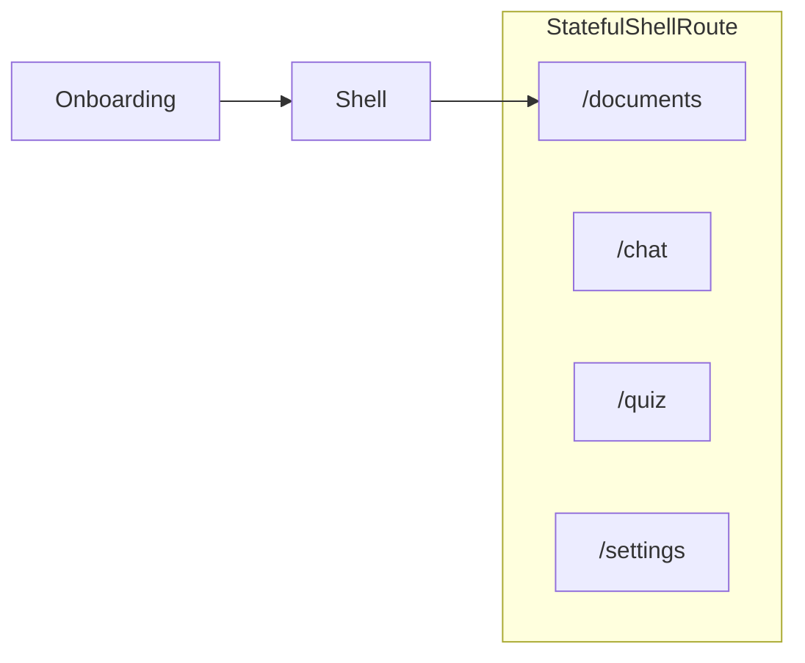

# Lucy — Spécification produit (travail restant)

> Ce document décrit **uniquement ce qu’il reste à faire**.  
> **Déjà livré** (hors spec active) : authentification Firebase + Nest `users/me`, onboarding 7 questions + API Nest, centralisation données (pas de Firestore client), thème Flex + widgets partagés. Détails techniques : `docs/spec-backend-centralization.md`, `docs/manual-checkpoints-onboarding.md`, historique git.

---

## 1. Vue d’ensemble — backlog

| Priorité | Brique | Statut | Section |
|----------|--------|--------|---------|
| **P0** | Shell post-login (bottom nav, 4 onglets) | **Livré** | §2 |
| **P1 — D1** | Upload documents (titre, PDF/Word/txt, Storage, liste) | **Spec validée** | §3 |
| **P1b** | Stockage binaire **Cloudflare R2** (sans Blaze Firebase) | **Livré (backend)** | §3.4, [docs/spec-storage-r2.md](./docs/spec-storage-r2.md) |
| **P2 — D2** | Pipeline RAG (extraction → md → chunks → embeddings) | **Spec validée** | §3, [docs/spec-documents-rag.md](./docs/spec-documents-rag.md) |
| P3 — D3 | Retrieval API (recherche vectorielle) | **Livré** | §3 |
| **P4a — D4** | Chat source-based (multi-fils, sources UI) | **Spec validée** | §6, [docs/spec-chat-rag.md](./docs/spec-chat-rag.md) |
| P4b — D4 | Quiz depuis corpus | À venir | §3 (après chat) |

---

## 2. Shell post-login (P0 — livré)

> **Référence UI** : [`telC_frontend`](../telC/telC_frontend) — `StatefulShellRoute.indexedStack`, `TcAppShell`, `AnimatedBottomNavigationBar`, `pageUnderDevelopment`.

### 2.1 Objectif

Après `isConfigured: true`, l’apprenant entre dans une **coque à 4 onglets**. **Documents** est l’onglet **par défaut** : à terme, c’est là qu’il **dépose ses PDF / livres** pour que le backend les lise (RAG). **MVP shell** = navigation + pages « En cours de réalisation » (pas d’upload ni de chat LLM dans ce lot).

### 2.2 Vision produit (Documents / Chat / Quiz)

Aligné pitch *Personalized learning AI agent based on your own documents* :

| Onglet | Rôle produit (cible) | MVP shell |
|--------|----------------------|-----------|
| **Documents** | Upload + gestion du corpus privé → Storage / Firestore / vector search | Placeholder |
| **Chat** | Questions/réponses **uniquement** depuis les docs uploadés (+ sources) | Placeholder |
| **Quiz** | Quiz / flashcards générés depuis le même corpus | Placeholder |
| **Paramètres** | Compte, langue, déconnexion | Déconnexion + reste « en cours » |

### 2.3 Navigation

| Ordre | Onglet | Route | Icône (Material) |
|-------|--------|-------|------------------|
| 1 (défaut) | Documents | `/documents` | `Icons.description_outlined` |
| 2 | Chat | `/chat` | `Icons.chat_bubble_outline` |
| 3 | Quiz | `/quiz` | `Icons.quiz_outlined` |
| 4 | Paramètres | `/settings` | `Icons.settings_outlined` |

**Décisions**

| # | Sujet | Décision |
|---|--------|----------|
| S1 | Destination post-login | **`/documents`** (plus `/home` comme écran final) |
| S2 | `/home` | Redirect **`/documents`** (compat) |
| S3 | Bottom bar | `animated_bottom_navigation_bar`, `colorScheme` |
| S4 | Layout | &lt; 600 px : barre du bas ; ≥ 600 px : sidebar (ref. telC) ; 600–1024 : menu hamburger |
| S5 | Placeholder | l10n `pageUnderDevelopment` (fr / en / de) |
| S6 | Transitions | `NoTransitionPage` entre branches |
| S7 | Garde | Shell si connecté **et** `isConfigured == true` |

### 2.4 Critères d’acceptation

- [x] `StatefulShellRoute.indexedStack` — 4 branches (`documents`, `chat`, `quiz`, `settings`)
- [x] `LucyAppShell` — responsive telC : bottom bar mobile + `LucySidebar` desktop
- [x] Redirect bootstrap : configuré → **`/documents`**
- [x] `/home` → **`/documents`**
- [x] Documents / Chat / Quiz : AppBar + `pageUnderDevelopment`
- [x] Paramètres : déconnexion mobile (bouton) ; desktop (sidebar) + placeholder
- [x] l10n : `navDocuments`, `navChat`, `navQuiz`, `navSettings`, titres AppBar, `pageUnderDevelopment`
- [x] `flutter analyze` + tests router verts

### 2.5 Structure cible

```
lib/core/shell/lucy_app_shell.dart
lib/core/shell/lucy_sidebar.dart
lib/core/constants/responsive_constants.dart
lib/core/router/          # paths, names, guards, StatefulShellRoute
lib/features/documents/presentation/pages/documents_page.dart
lib/features/chat/presentation/pages/chat_page.dart
lib/features/quiz/presentation/pages/quiz_page.dart
lib/features/settings/presentation/pages/settings_page.dart
lib/shared/widgets/placeholders/   # optionnel — corps « en cours »
```

Retirer ou rediriger : `lib/features/auth/presentation/pages/home/home_page.dart`.

### 2.6 Routing



| Route | `isConfigured` | Comportement |
|-------|----------------|--------------|
| `/documents`, `/chat`, `/quiz`, `/settings` | `true` | Shell |
| idem | `false` | → `/onboarding` |
| `/home` | `true` | → `/documents` |

### 2.7 Plan d’implémentation

1. `flutter pub add animated_bottom_navigation_bar`
2. l10n + `LucyRoutePaths` / `LucyRouteNames`
3. `LucyAppShell` + refactor `app_router.dart`
4. `LucyRouterGuards` + bootstrap → `/documents`
5. Pages placeholder + `settings` (logout)
6. Tests ; redirect `/home`

### 2.8 Commandes

```bash
cd frontend
flutter pub add animated_bottom_navigation_bar
dart run build_runner build --delete-conflicting-outputs
flutter gen-l10n
flutter analyze
flutter test
```

---

## 3. Documents & RAG (spec **validée** — prête pour implémentation)

> Détail complet (schéma Firestore, endpoints, chunking) : [`docs/spec-documents-rag.md`](./docs/spec-documents-rag.md).

### 3.1 Objectif

L’apprenant **dépose des fichiers texte** — **PDF, Word (.docx), .txt, .md** — avec un **titre** par document. Le **backend** extrait le texte, le normalise, le découpe en **chunks** avec **embeddings**, et les indexe pour que le **chat** (plus tard) ne réponde qu’à partir de ce corpus.

| Utilisateur | Résultat attendu |
|-------------|------------------|
| Apprenant | Upload + liste + statut (en cours / prêt / erreur) |
| Système | Recherche par similarité sur chunks **+** filtre par `title` / `documentId` |

### 3.2 Réponse à « Markdown ou CSV ? »

| Choix | Recommandation MVP |
|-------|-------------------|
| **PDF / Word / .txt / .md** | Texte extrait → **Markdown** (ou plain) — **pas CSV** |
| **CSV** | Réservé à une phase ultérieure (fichiers tabulaires `.csv` / tableurs) |

Le CSV décrit des **colonnes/lignes** ; un PDF est du **texte continu** : le convertir en CSV n’a pas de sens pour le RAG. Pipeline MVP : **fichier → texte → md → chunks → vecteurs**.

### 3.3 Décisions validées (2026-05-25)

| # | Sujet | Décision |
|---|--------|----------|
| V1 | Formats | **PDF**, **.docx**, **.txt**, **.md** (pas `.doc` legacy en MVP) |
| V2 | Limites | **20 Mo** / fichier, **500 pages** / ~1,5 M car. — **pas de quota** sur le nombre de docs |
| V2c | Upload UI | **Un upload/traitement à la fois** |
| V2d | Embeddings | **Gemini uniquement** — défaut `text-embedding-004` ; **pas de mock** ; tests = double `EmbeddingPort` |
| V2e | Titre | **Immuable** après création (pas de `PATCH title`) |
| V3 | Upload | **URL signée** (Storage provider) + validation binaire à `complete` |
| V3b | Provider binaire | **Cloudflare R2** en dev/prod sans Blaze — spec [docs/spec-storage-r2.md](./docs/spec-storage-r2.md) ; Firebase Storage conservé en fallback (`STORAGE_PROVIDER=firebase`) |
| V4 | Vecteurs | **Firestore** ; retrieval filtré **`uid` + searchEnabled** |

### 3.4 Stockage & vecteurs

| Couche | Techno | Contenu |
|--------|--------|---------|
| Binaire | **Cloudflare R2** (cible) ou **Firebase Storage** (legacy / Blaze) | Fichier original (`original.{ext}`) — voir [docs/spec-storage-r2.md](./docs/spec-storage-r2.md) |
| Métadonnées | **Firestore** `users/{uid}/documents/{docId}` | `title`, `status`, `searchEnabled`, chemins, compteurs |
| Index | **Firestore** `.../chunks/{chunkId}` | `text`, `ordinal`, pages, **`embedding`** |
| Traitement | **NestJS** | Extraction, chunking, **Gemini embeddings** |
| Client | **Flutter** | HTTP Nest uniquement (pas de SDK Firestore documents) |

**Contexte retrieval** : `contextHeader` **calculé côté serveur**. **Titre** fixe après création. Pendant `processing` : **spinner + texte** (pas %). **Max 5** docs actifs pour la recherche. Détails : [`docs/spec-documents-rag.md`](./docs/spec-documents-rag.md) §2.8–§2.9.

### 3.5 Phases

| Phase | Livrable | Critères d’acceptation (résumé) |
|-------|----------|----------------------------------|
| **D1** | Upload + liste | pdf/docx/txt/md ; Web + mobile ; CORS Storage ; 1 upload à la fois ; `PATCH searchEnabled` (max 5) ; `GET …/download` ; titre **immuable** ; pas de DELETE en `processing` ; spinner sans % |
| **D2** | Indexation | `complete` → `processing` → `ready` ; chunks + embeddings ; échec → `failed` |
| **D3** | Retrieval | `POST /v1/retrieval/search` top-k — **livré** |
| **D4a** | Chat multi-fils + sources | [docs/spec-chat-rag.md](./docs/spec-chat-rag.md) — consomme D3 |
| **D4b** | Quiz | Feature séparée ; pas de génération quiz dans le chat MVP |

### 3.6 Commandes

```bash
cd backend && npm test
cd frontend && flutter analyze && flutter test
```

### 3.7 Structure cible (résumé)

```
backend/src/features/documents/
lib/features/documents/
```

### 3.8 Tests & frontières

Voir [`docs/spec-documents-rag.md`](./docs/spec-documents-rag.md) §8–9. Règle clé : **Nest seul** accès Storage/Firestore ; **jamais** le fichier entier envoyé au LLM chat.

---

## 6. Chat source-based (P4a — spec **validée**)

> Détail complet : [`docs/spec-chat-rag.md`](./docs/spec-chat-rag.md).

### 6.1 Objectif

Tuteur **multi-fils** : l’apprenant gère plusieurs conversations avec Lucy. Les réponses s’appuient **uniquement** sur les documents **actifs pour la recherche** (`searchEnabled`, configurés dans l’onglet **Documents**). Chaque réponse assistant affiche des **sources** soignées (titre, pages, extrait).

### 6.2 Décisions validées (2026-05-27)

| # | Sujet | Décision |
|---|--------|----------|
| CH1 | Fils | **Plusieurs** fils par utilisateur, persistés Firestore via Nest |
| CH2 | Sources | **Obligatoires** en UI (cartes sous la bulle Lucy) |
| CH3 | Corpus | Pas de sélecteur de docs dans le chat — activation dans **Documents** |
| CH4 | Streaming | **Oui** en MVP — `POST …/messages/stream` (SSE), sources en fin de flux |
| CH5 | Sans doc actif | **Bloquer** le chat + CTA Documents (`CHAT_NO_ACTIVE_DOCUMENTS`) |
| CH6 | Quiz | **Hors** chat MVP ; demandes « fais-moi un quiz » → message d’orientation vers l’onglet Quiz (à venir) |
| CH7 | Cache local | **SharedPreferences** miroir par `uid` (fils + messages) ; vérité serveur = Nest/Firestore |
| CH8 | Personnalisation | Réponses Lucy selon **`learnerProfile`** onboarding (`users/{uid}`) — style, ton, langue |
| CH9 | Auth API | **`Authorization: Bearer <Firebase idToken>`** sur tous les endpoints chat (comme documents) |
| CH10 | Sync | **GET serveur** à l’entrée de chaque fil ; multi-appareil ; pas d’assistant partiel persisté |
| CH11 | Concurrence | **409** `CHAT_STREAM_IN_PROGRESS` — un stream par fil |
| CH12 | LLM | Citations dans **même** session Gemini (tool calling) ; fallback 2 passes si besoin |
| CH13 | Historique | **100** messages (API + prompt avec plafond tokens) |
| CH14 | UI | États vide / erreur / offline / noCorpus (pattern afroschool) |

### 6.3 Phases

| Phase | Livrable |
|-------|----------|
| **CHAT-1** | Backend `/v1/chats/*` + **SSE** stream + citations |
| **CHAT-2** | Flutter stream UI + cartes sources |
| **CHAT-3** | Miroir **SharedPreferences** + resync / offline |
| **CHAT-4** | Garde corpus vide + tests + CP-CHAT |
| **QUIZ-1** | Feature quiz (spec séparée plus tard) |

### 6.4 Dépendances

- **D3** retrieval livré.
- **Documents** : au moins un doc `ready` avec `searchEnabled` pour envoyer un message.

---

## 4. Conventions projet (toutes features)

| Règle | Détail |
|--------|--------|
| Architecture | Clean Architecture : UI → Notifier → Service → Repository |
| l10n | `context.l10n.*` — fr / en / de ; pas de texte UI en dur |
| Erreurs API | Translator → l10n |
| Couleurs | `colorScheme` dans les widgets ; hex dans `lib/core/theme/lucy_colors.dart` |
| Models / state | Freezed + Riverpod ; `dart run build_runner build` après changement |
| API | Préfixe `/v1`, `Authorization: Bearer <Firebase idToken>` |
| Référence structure | `afroschool_admin_web`, `telC_frontend` (shell) |

```bash
cd frontend && flutter pub get
dart run build_runner build --delete-conflicting-outputs
flutter gen-l10n && flutter analyze && flutter test
```

---

## 5. Réalisé (référence — ne pas ré-implémenter)

| Brique | Emplacement |
|--------|-------------|
| Auth email/mot de passe | `lib/features/auth/` |
| Onboarding 7 Q + validate/confirm/analyze/finalize | `lib/features/onboarding/`, `backend/src/features/onboarding/` |
| Profil / `isConfigured` | `GET/POST /v1/users/me`, guards router |
| Reprise onboarding | `GET /v1/onboarding/progress` |
| Pas de Firestore client | `docs/firestore-rules-centralization.md` |

Spec onboarding détaillée : [`docs/spec-onboarding-delivered.md`](./docs/spec-onboarding-delivered.md).

---

*Ce document a été créé avec Cursor (IA). Dernière mise à jour : chat P4a (streaming SSE + miroir local), D3 livré — 2026-05-27.*
