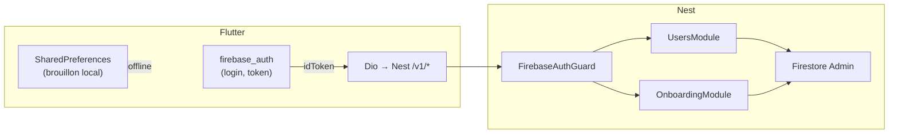
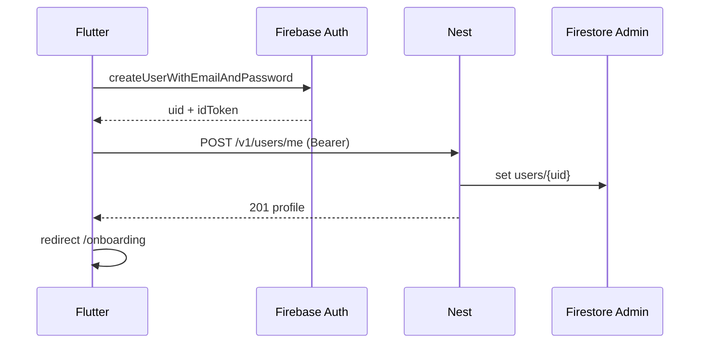

# Lucy — Spécification : centralisation backend (données)

> **Statut** : implémenté (C-B1 → C-F3 livrés ; C-OPS + C-DOC en cours)  
> **Parent** : [SPEC.md](../SPEC.md) §3 (auth), §4 (onboarding)  
> **Objectif** : NestJS = **seule** couche d’accès Firestore pour les données métier ; Flutter garde **Firebase Auth** uniquement.

---

## 1. Objectif

### 1.1 Problème actuel

| Composant | Accès Firestore aujourd’hui |
|-----------|----------------------------|
| **Nest** | Écriture onboarding (`confirm-turn`, `analyze`, `finalize`) + lecture pour `analyze` |
| **Flutter** | **Lecture** reprise onboarding ; **lecture/écriture** profil auth (`users/{uid}` au signup) |

Conséquences : deux chemins vers la même collection, setup dev fragile (backend `memory` vs Firestore client), règles de sécurité Firestore à maintenir pour le client, modèle mental lourd.

### 1.2 Cible



| Couche | Responsabilité |
|--------|----------------|
| **Flutter** | UI, l10n, Firebase Auth (email/mdp, reset, `getIdToken`), brouillon local (A16), appels HTTP Nest |
| **Nest** | Vérification token, **toute** lecture/écriture `users/{uid}`, LLM, règles métier |
| **Firestore** | Persistance ; **aucun accès direct SDK client** après migration |

### 1.3 Utilisateurs / cas d’usage

- **Développeur** : un seul `.env` backend ; plus de divergence memory vs Firestore client.
- **Apprenant** : parcours identique (login → onboarding → home) ; latence bootstrap légèrement plus élevée (1–2 GET HTTP).
- **Ops** : règles Firestore strictes (deny client write sur `users/{uid}`).

### 1.4 Hors périmètre (cette spec)

- Remplacer **Firebase Auth** par login Nest (JWT maison).
- Chat tuteur, documents, RAG.
- Refonte UI auth (design login/signup/reset reste §3).
- Suppression de `firebase_core` côté Flutter (toujours requis pour Auth).

### 1.5 Décisions validées

| # | Sujet | Décision |
|---|--------|----------|
| C1 | Auth identité | **Firebase Auth reste dans Flutter** |
| C2 | Données user | **100 % via Nest** (profil + progression onboarding) |
| C3 | Source de vérité | **API Nest** ; brouillon local = miroir offline uniquement |
| C4 | Préfixe API | **`/v1`** (existant) |
| C5 | Auth API | **`Authorization: Bearer <Firebase idToken>`** (existant) |
| C6 | Config backend | **Inchangée** : `GOOGLE_APPLICATION_CREDENTIALS` + `.env` obligatoires en mode Firebase réel |
| C7 | Architecture Flutter | Clean Architecture — UI → Notifier → Service → Repository → **RemoteDataSource (Dio)** |
| C8 | Architecture Nest | Feature `users/` + extension `onboarding/` ; repository Firestore Admin |
| C9 | Référence structure | [`afroschool_admin_web`](file:///Users/espoirhermanfokokom/develop/project/afroschool_admin_web) (features isolées, providers Riverpod) |

---

## 2. Commandes

### 2.1 Backend (`Lucy/backend/`)

```bash
cd backend
npm install
cp .env.example .env
# Éditer .env : GOOGLE_APPLICATION_CREDENTIALS, FIRESTORE_PROVIDER=firebase, etc.
npm run start:dev
npm test
```

Pile locale sans GCP (tests API uniquement, pas E2E Flutter complet) :

```bash
npm run start:dev:local
```

### 2.2 Frontend (`Lucy/frontend/`)

```bash
cd frontend
flutter pub get
dart run build_runner build --delete-conflicting-outputs
flutter gen-l10n
flutter analyze
flutter test
```

Lancer avec backend local :

```bash
# Terminal 1 — backend (voir §2.1)
# Terminal 2
flutter run -d chrome
# Optionnel staging :
# flutter run --dart-define=LUCY_API_BASE_URL=https://api.example.com
```

### 2.3 Vérification manuelle post-migration

1. Signup → profil créé via `POST /v1/users/me` (vérifier doc Firestore).
2. Login → router lit `isConfigured` via `GET /v1/users/me`.
3. Kill app mid-onboarding → reprise via `GET /v1/onboarding/progress` + brouillon local.
4. `flutter analyze` + tests sans import `cloud_firestore` dans `lib/`.

---

## 3. Structure projet

### 3.1 Backend — nouveaux fichiers

```
backend/src/
├── features/
│   ├── users/
│   │   ├── users.module.ts
│   │   ├── users.controller.ts
│   │   ├── users.service.ts
│   │   ├── dto/
│   │   │   ├── create-user-profile.dto.ts
│   │   │   └── user-profile-response.dto.ts
│   │   └── users.repository.port.ts      # réutilise ou étend FirebaseUserRepository
│   └── onboarding/
│       ├── onboarding.controller.ts      # + GET progress
│       └── dto/
│           └── onboarding-progress-response.dto.ts
└── app.module.ts                         # import UsersModule
```

### 3.2 Backend — endpoints

| Méthode | Route | Auth | Rôle |
|---------|-------|------|------|
| `GET` | `/v1/users/me` | Bearer | Profil + `isConfigured` + champs routing |
| `POST` | `/v1/users/me` | Bearer | Création idempotente profil signup |
| `GET` | `/v1/onboarding/progress` | Bearer | Reprise onboarding (ex-lecture Firestore Flutter) |
| `POST` | `/v1/onboarding/*` | Bearer | **Inchangé** (validate, confirm, analyze, finalize) |

#### `GET /v1/users/me` — réponse 200

```json
{
  "uid": "abc123",
  "fullName": "Jane Doe",
  "email": "jane@example.com",
  "createdAt": "2026-05-25T12:00:00.000Z",
  "isConfigured": false,
  "onboardingStatus": "in_progress",
  "uiLocale": "fr"
}
```

Champs absents du doc Firestore : defaults (`isConfigured: false`, `onboardingStatus: "not_started"`).

#### `POST /v1/users/me` — body

```json
{
  "fullName": "Jane Doe",
  "email": "jane@example.com",
  "uiLocale": "fr"
}
```

- **201** si créé ; **200** si doc existant (idempotent merge).
- **409** `USER_PROFILE_CONFLICT` si email/doc incohérent (uid ≠ owner).
- Écriture **Nest Admin SDK** uniquement.

#### `GET /v1/onboarding/progress` — réponse 200

Alignée sur `OnboardingResumeProgress` Flutter :

```json
{
  "onboardingStatus": "awaiting_final_confirm",
  "transcript": [
    {
      "questionId": "q_role",
      "questionText": "…",
      "answerText": "…",
      "confirmedAt": "2026-05-25T12:05:00.000Z"
    }
  ],
  "pendingLearnerProfile": { },
  "pendingSummaryForUser": "…"
}
```

**404** ou `{ "transcript": [], "onboardingStatus": "not_started" }` si jamais commencé — **choix implémentation** : prefer **200 + état vide** (évite bruit 404 au signup).

Erreurs structurées : codes existants `LucyErrorCodes` + translator Flutter.

### 3.3 Frontend — fichiers impactés

```
lib/
├── core/network/api_endpoints.dart           # + usersMe, onboardingProgress
├── features/auth/
│   ├── data/datasources/
│   │   ├── user_profile_remote_data_source.dart      # interface inchangée
│   │   └── user_profile_api_remote_data_source.dart  # NEW (Dio)
│   ├── data/providers/auth_data_provider.dart        # swap Firestore → API
│   └── data/repositories/auth_repository_impl.dart   # signup → POST users/me
├── features/onboarding/
│   ├── data/datasources/
│   │   └── onboarding_progress_api_remote_data_source.dart  # NEW
│   └── data/providers/onboarding_data_provider.dart
└── pubspec.yaml                              # retirer cloud_firestore si unused
```

**Supprimer** (après migration + tests) :

- `firestore_user_profile_remote_data_source.dart`
- `onboarding_progress_firestore_data_source.dart`

---

## 4. Style de code

### 4.1 Flutter

| Règle | Détail |
|--------|--------|
| Flux | UI → Notifier → Service → Repository → RemoteDataSource |
| l10n | Aucun texte UI en dur |
| Erreurs API | Mapper → clés l10n ; jamais `e.message` brut |
| Endpoints | `ApiEndpoints` uniquement |
| Models | Freezed + `@JsonKey` snake_case si JSON backend camelCase documenté |
| Nommage | snake_case fichiers, PascalCase classes |

### 4.2 NestJS

| Règle | Détail |
|--------|--------|
| Controllers | `@UseGuards(FirebaseAuthGuard)` sur routes protégées |
| DTOs | Validation parse* existante ; pas de `any` exposé |
| Repository | Port + impl Firebase / memory (pattern onboarding) |
| Erreurs | `LucyApiError` + codes centralisés |
| Secrets | Jamais exposés au client |

### 4.3 Firestore Security Rules (post-migration)

```javascript
// users/{uid} — client SDK n'écrit plus
match /users/{uid} {
  allow read, write: if false; // tout passe par Admin SDK Nest
}
```

*(Ajuster si d’autres collections client-side plus tard.)*

---

## 5. Stratégie de tests

### 5.1 Backend

| Fichier | Couverture |
|---------|------------|
| `users.controller.spec.ts` | GET/POST me, guard, 401 |
| `users.service.spec.ts` | création idempotente, defaults |
| `onboarding.controller.spec.ts` | GET progress, états awaiting_* |
| `spec-*-dod.spec.ts` | Mettre à jour DoD si critères routing changent |

Mode `FIRESTORE_PROVIDER=memory` : tests unitaires sans GCP.

### 5.2 Flutter

| Fichier | Couverture |
|---------|------------|
| `auth_repository_impl_test.dart` | signup appelle POST users/me |
| `onboarding_bootstrap_resume_test.dart` | reprise via API mock |
| `spec_48_onboarding_dod_test.dart` | pas de import `cloud_firestore` dans features |
| Widget tests | Overrides Dio mock (pattern `onboarding_chat_test_overrides.dart`) |

### 5.3 E2E manuel

Checklist : [manual-checkpoints-onboarding.md](./manual-checkpoints-onboarding.md) — ajouter étape « vérifier absence accès Firestore client ».

---

## 6. Limites et garde-fous

### 6.1 Toujours faire

- Vérifier `Bearer` idToken sur toutes les routes `/v1/users/*` et `/v1/onboarding/*`.
- Mapper erreurs backend → l10n Flutter.
- Garder brouillon local (SharedPreferences) comme **miroir** ; resync depuis API au bootstrap.
- Documenter nouveaux endpoints dans SPEC.md §4.6 et README backend.

### 6.2 Demander avant

- Supprimer `cloud_firestore` du `pubspec.yaml`.
- Changer le schéma Firestore `users/{uid}`.
- Modifier le flux signup (rollback Firebase user si POST profile échoue).
- Déployer règles Firestore deny-all en prod.

### 6.3 Ne jamais faire

- Exposer `GOOGLE_APPLICATION_CREDENTIALS` ou `GEMINI_API_KEY` au client.
- Réintroduire lecture/écriture Firestore directe dans Flutter pour le métier.
- Bypass repository (UI → Dio direct).
- Committer clés JSON ou `.env`.

### 6.4 Config backend — rappel

Centraliser **ne supprime pas** la config :

| Variable | Toujours requis (Firebase réel) |
|----------|----------------------------------|
| `GOOGLE_APPLICATION_CREDENTIALS` | Oui |
| `FIREBASE_PROJECT_ID` | Oui |
| `FIRESTORE_PROVIDER=firebase` | Oui (E2E Flutter) |
| `GEMINI_API_KEY` | Si `LLM_PROVIDER=gemini` |

Le backend **ne peut pas** se connecter à Firestore sans credentials — c’est voulu.

---

## 7. Plan d’implémentation (phases)

| Phase | ID | Backend | Flutter | Critère done |
|-------|-----|---------|---------|--------------|
| 1 | B1 | `UsersModule` + GET/POST `/v1/users/me` | — | curl + tests Nest |
| 2 | F1 | — | Profil + `isConfigured` via API ; router/guards | tests auth + analyze |
| 3 | B2 | GET `/v1/onboarding/progress` | — | tests Nest |
| 4 | F2 | — | Bootstrap onboarding via API | tests reprise |
| 5 | F3 | — | Retirer datasources Firestore | no `cloud_firestore` in lib |
| 6 | OPS | Règles Firestore + README | — | rules deploy doc |

**Ordre strict** : B1 → F1 → B2 → F2 → F3 → OPS.

### 7.1 Flux signup migré



Si `POST /v1/users/me` échoue : **supprimer user Firebase** (comportement actuel SPEC §3).

### 7.2 Flux bootstrap migré

1. `authStateChanges` → user connecté  
2. `GET /v1/users/me` → `isConfigured` → router  
3. Si onboarding : `GET /v1/onboarding/progress` → notifier  
4. Si API indisponible : fallback brouillon local (A16), resync quand API OK  

---

## 8. Mise à jour SPEC parent

Après implémentation, modifier [SPEC.md](../SPEC.md) :

- §4.1 **A7** : « Flutter : **aucun** accès Firestore ; Nest seul writer/reader via API ».
- §4.4.3 conflit local : « **API Nest fait foi** ».
- §4.7 : retirer références lecture Firestore client ; lister `GET users/me`, `GET onboarding/progress`.
- §3 : profil signup via `POST /v1/users/me`.

---

## 9. Critères d’acceptation (DoD)

- [x] Aucun `import 'package:cloud_firestore/cloud_firestore.dart'` dans `lib/features/`.
- [x] Signup crée profil uniquement via Nest.
- [x] Router et guards utilisent `GET /v1/users/me`.
- [x] Reprise onboarding via `GET /v1/onboarding/progress`.
- [x] Tests backend + Flutter verts ; `flutter analyze` clean.
- [x] README backend + SPEC.md § mis à jour.
- [x] Règles Firestore : deny client sur `users/{uid}` ([firestore-rules-centralization.md](./firestore-rules-centralization.md)).
- [ ] E2E manuel signup → onboarding → `/home` (backend `.env` Firebase réel).
- [ ] E2E manuel : signup → onboarding → finalize → `/home` avec `.env` Firebase réel.

---

*Ce document a été créé avec Cursor (IA).*
