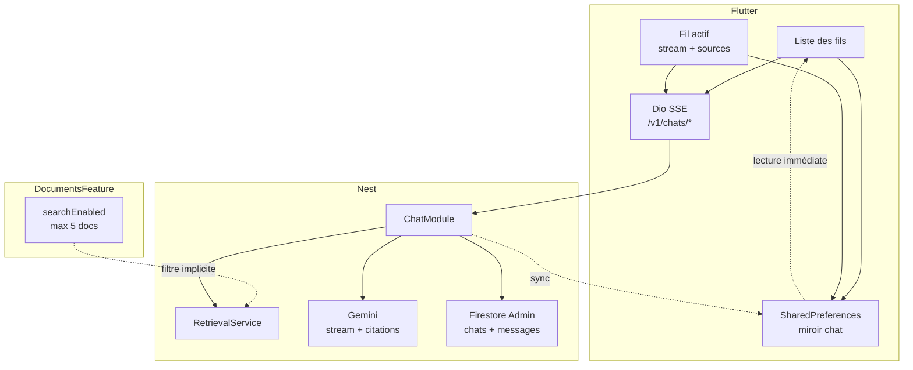

# Lucy — Chat source-based (spec détaillée)

> **Statut** : **Validée** (2026-05-27 — décisions utilisateur + parent [SPEC.md](../SPEC.md) §6)  
> **Dépendances livrées** : documents D1–D2, retrieval D3 ([docs/spec-documents-rag.md](./spec-documents-rag.md))  
> **Hors périmètre MVP** : génération de quiz (feature **Quiz** séparée).  
> **Inclus MVP** : réponses **streaming** (SSE) + **miroir local** Flutter (`SharedPreferences`).

---

## 1. Objectif

### 1.1 Utilisateurs

| Persona | Besoin |
|---------|--------|
| **Apprenant** | Plusieurs **fils de conversation** avec Lucy ; poser des questions sur le **corpus actif** (docs avec `searchEnabled` activés dans l’onglet Documents) |
| **Apprenant** | Voir des **sources** claires et soignées sous chaque réponse (titre du document, pages, extrait) |
| **Apprenant** | Sans doc actif : être **guidé** vers Documents pour activer la recherche — **pas** de chat « à vide » |
| **Apprenant** | Réponse Lucy en **streaming** (texte progressif) ; **sources** à la fin du flux |
| **Apprenant** | **Reprise immédiate** des fils/messages au retour sur l’app (cache local), resync serveur en arrière-plan |
| **Développeur** | Orchestration **Nest** : retrieval → LLM stream → persistance ; Flutter HTTP + **miroir local** |

### 1.2 Problème

Le retrieval seul (`POST /v1/retrieval/search`) ne suffit pas : il faut une **conversation persistée**, une **réponse rédigée** par le LLM **ancrée** sur les chunks, et une **UI** qui rend les citations lisibles.

### 1.3 Cible (vision)



### 1.4 Hors périmètre (MVP chat)

| Exclu | Où / quand |
|-------|------------|
| **Quiz** (génération, cartes, scoring) | Feature `quiz/` — phase D4b |
| Demande « fais-moi un quiz » dans le chat | Réponse Lucy **texte** : renvoi vers l’onglet Quiz (à venir) — **aucun** appel quiz depuis le chat |
| Choix des documents dans le chat | Déjà fait dans **Documents** (`searchEnabled`) |
| Firestore SDK côté Flutter pour les chats | Règle centralisation inchangée |
| Miroir local comme **seule** source de vérité | Firestore (Nest) reste la vérité serveur ; local = cache UX |
| Envoi du PDF / fichier entier au LLM | Interdit (chunks + `contextHeader` uniquement) |

---

## 2. Décisions validées (2026-05-27)

| # | Sujet | Décision |
|---|--------|----------|
| C1 | **Fils multiples** | Un utilisateur peut avoir **plusieurs** conversations (`chatId` distincts), listées et reprises |
| C2 | **Sources UI** | **Obligatoire** — composant dédié soigné (titre, pages, extrait, score optionnel en debug masqué) |
| C3 | **Périmètre corpus** | Uniquement les docs **`searchEnabled === true`** et **`status === ready`** — configurés dans l’onglet **Documents**, pas de sélecteur dans le chat |
| C4 | **Réponse LLM** | MVP : **streaming obligatoire** — texte token-par-token via **SSE** ; sources après fin du flux (voir §2.1, §4.4) |
| C5 | **Aucun doc actif** | **Bloquer** l’envoi ; écran / bannière avec CTA vers **Documents** (activer la recherche) — code `CHAT_NO_ACTIVE_DOCUMENTS` |
| C6 | **Retrieval sans hit** | Autorisé : Lucy répond qu’elle ne trouve pas d’extrait pertinent dans les docs actifs ; **sources = tableau vide** (pas confondre avec C5) |
| C7 | **Quiz depuis le chat** | Message d’orientation uniquement ; génération = feature Quiz plus tard |
| C8 | **Persistance serveur** | Firestore sous `users/{uid}/chats/{chatId}` + sous-collection `messages` ; **Nest seul** en écriture |
| C9 | **Modèle** | **Gemini** : flux texte (`generateContentStream` ou port dédié) + passe **structurée** finale pour `citedChunkIds` (voir §8) |
| C10 | **Historique dans le prompt** | Jusqu’aux **100 derniers messages** du fil (voir §12.7) ; retrieval sur le **dernier message utilisateur** uniquement |
| C13 | **Sync à l’entrée** | À chaque ouverture d’un fil (et liste fils) : **GET serveur** = vérité ; miroir local = affichage immédiat puis **réconciliation** (§12.1) |
| C14 | **Un stream actif** | Au plus **un** `POST …/stream` en cours par `chatId` → sinon **409** `CHAT_STREAM_IN_PROGRESS` (§12.2) |
| C15 | **États UI conversation** | États explicites : chargement, vide, erreur, hors-ligne, pas de corpus — pattern `AFEmptyState` (afroschool) (§12.11) |
| C11 | **Miroir local Flutter** | **SharedPreferences** par `uid` : fils + messages + `lastActiveChatId` + brouillon champ de saisie ; resync API au bootstrap / pull-to-refresh (voir §3.4) |
| C12 | **Personnalisation Lucy** | Ton, style et langue de réponse pilotés par **`learnerProfile`** enregistré à la **fin de l’onboarding** sur `users/{uid}` (SPEC onboarding §4.4.1) — **obligatoire** pour chaque génération chat (voir §2.3, §8.3) |

### 2.1 Streaming (MVP — décision C4)

| Étape UX | Comportement |
|----------|--------------|
| Envoi | Bulle **user** immédiate (optimiste + persistée local) |
| Génération | Bulle Lucy **vide** puis texte qui **s’accumule** (`text_delta` SSE) |
| Fin de flux | Événement **`sources`** puis **`done`** (ids messages serveur) ; cartes sources sous la bulle |
| Erreur mid-stream | Événement **`error`** ; **pas** de message assistant `completed` côté serveur ; UI : état erreur (§12.1) ; au reopen → sync serveur |

**Backend** : `POST /v1/chats/:chatId/messages/stream` — `Content-Type: text/event-stream` (SSE).

**Flutter** : consommation via `dio` + transformateur SSE (ou package dédié si nécessaire) ; mise à jour du miroir local à chaque `text_delta` (debounce ~100–200 ms) et à `done`.

**Tests Nest** : endpoint stream testable avec flux fixture (Mock stream LLM) ; pas d’appel réseau Gemini en CI unitaire.

### 2.2 Titre d’un fil

| Règle | Détail |
|-------|--------|
| Création | `POST /v1/chats` → titre par défaut l10n `chatDefaultTitle` (« Nouvelle conversation ») |
| Après 1er message user | Backend peut **tronquer** le début du premier message (ex. 60 car.) pour `title` auto (option CHAT-2) |

### 2.3 Personnalisation — `learnerProfile` (décision C12)

Après `POST /v1/onboarding/finalize`, Firestore contient `users/{uid}.learnerProfile` (snake_case), même structure que l’analyse onboarding :

| Champ | Effet sur le chat |
|-------|-------------------|
| `explanation_style` | `step_by_step`, `summary_first`, `analogies`, `socratic` — structure de la réponse |
| `feedback_tone` | `encouraging`, `neutral`, `strict` — ton des retours |
| `self_assessed_level` | Adapter profondeur / vocabulaire |
| `learning_goal`, `primary_role`, `main_domains` | Contexte métier dans le system prompt |
| `tutoring_language` | **`fr` / `en` / `de`** : langue de réponse Lucy. **`match_document`** (MVP) : **même règle que `fr`/`en`/`de`** si profil explicite ; sinon langue UI (`uiLocale`). **Plus tard** : réglage langue dans **Paramètres** (hors MVP chat) — jusqu’alors **seul** `learnerProfile` fait foi |

**Règles**

- Le **backend** charge `learnerProfile` à chaque message (via `UsersProfileRepository` ou lecture document user) — **jamais** reconstruit côté Flutter.
- Fichier prompt dédié : `backend/src/prompts/chat-tutor.system.hbs` (Handlebars), alimenté par le profil + règles RAG (§8.3).
- Si `isConfigured !== true` ou `learnerProfile` absent → **409** `CHAT_LEARNER_PROFILE_MISSING` (utilisateur ne devrait pas atteindre le shell chat ; garde router côté app).
- Le miroir local **ne duplique pas** le profil (trop sensible / source de divergence) — seulement fils et messages.

Référence enums : `backend/src/features/onboarding/domain/learner-profile.enums.ts`, modèle Flutter `LearnerProfile`.

---

## 3. Modèle de données (Firestore)

### 3.1 Conversation

`users/{uid}/chats/{chatId}`

| Champ | Type | Notes |
|-------|------|--------|
| `title` | string | Affiché dans la liste des fils |
| `createdAt` | timestamp | |
| `updatedAt` | timestamp | Tri liste **desc** |
| `lastMessagePreview` | string? | Optionnel — extrait dernier message assistant ou user |

### 3.2 Message

`users/{uid}/chats/{chatId}/messages/{messageId}`

| Champ | Type | Notes |
|-------|------|--------|
| `role` | `'user' \| 'assistant'` | |
| `content` | string | Texte affiché dans la bulle |
| `createdAt` | timestamp | Ordre chronologique |
| `status` | `'completed' \| 'failed'`? | **Assistant** seulement ; user implicitement `completed` (§12.1) |
| `sources` | array? | **Uniquement** `assistant` `completed` — voir §3.3 |

### 3.3 Source (citation)

Objet embarqué dans le message assistant (pas de collection séparée) :

| Champ | Type | Notes |
|-------|------|--------|
| `documentId` | string | |
| `title` | string | Titre document |
| `chunkId` | string | |
| `excerpt` | string | Extrait court affiché (ex. 300 car. max côté API) |
| `pageStart` | number? | |
| `pageEnd` | number? | |
| `score` | number? | Optionnel — **non affiché** en prod UI (réservé debug) |

Les sources sont un **sous-ensemble** des hits retrieval réellement cités par le LLM (schéma JSON impose des `chunkId` connus).

### 3.4 Miroir local Flutter (décision C11)

Aligné [spec-backend-centralization.md](./spec-backend-centralization.md) (brouillon onboarding = miroir offline, **vérité = API Nest**).

| Règle | Détail |
|-------|--------|
| Stockage | **`SharedPreferences`** — clé `lucy_chat_mirror_{uid}` (JSON) |
| Contenu | `threads[]`, `messagesByChatId` (map chatId → messages), `lastActiveChatId`, `composerDraftByChatId?`, `syncedAt` (ISO) |
| Écriture | Après chaque sync API réussie ; pendant le stream (`text_delta` debounced) ; à la pause app / dispose notifier |
| Lecture | **Immédiate** depuis le cache à l’ouverture, puis **sync obligatoire** (§12.1) |
| Conflit | **Serveur gagne** pour le fil ouvert après chaque `GET …/messages` ; ne pas écraser un fil en cours de stream local (§12.1) |
| Multi-appareil | Même `uid` sur téléphone + tablette : **sync à l’entrée** du fil sur chaque appareil ; pas de fusion temps réel (MVP) |
| Déconnexion | **Supprimer** `lucy_chat_mirror_{uid}` (et brouillon associé) |
| Hors ligne | Afficher le cache + bannière l10n `chatOfflineBanner` ; pas d’envoi sans réseau |
| Modèle | `ChatLocalMirror` (Freezed) + `ChatLocalMirrorPrefsDataSource` (même pattern que `OnboardingLocalDraftPrefsDataSource`) |

**Ne pas** stocker de secrets ni de token dans le miroir — uniquement données chat sérialisables.

---

## 4. API Nest (`/v1/chats`)

### 4.0 Authentification (toutes les routes)

| Élément | Détail |
|---------|--------|
| Mécanisme | **`FirebaseAuthGuard`** — header `Authorization: Bearer <Firebase idToken>` (pas de JWT maison Lucy) |
| Vérification | Nest appelle Firebase Admin `verifyIdToken` → `request.user.uid` |
| Isolation | Toute lecture/écriture chat filtrée par **`uid` du token** (pas d’accès au fil d’un autre utilisateur) |
| Flutter | `dio` envoie le token comme pour `/v1/documents` et `/v1/onboarding/*` |
| Dev local | `Bearer dev:<uid>` si stack dev documentée dans `main.ts` |

Le flux SSE **`/messages/stream`** utilise la **même** authentification ; la connexion sans token valide → **401** avant ouverture du flux.

### 4.1 Liste des fils

`GET /v1/chats`

- Réponse : `[{ id, title, updatedAt, lastMessagePreview? }]`
- Tri : `updatedAt` **desc**

### 4.2 Créer un fil

`POST /v1/chats`

- Body optionnel : `{ title?: string }`
- Réponse : `{ id, title, createdAt, updatedAt }`

### 4.3 Messages d’un fil

`GET /v1/chats/:chatId/messages`

- Réponse : `[{ id, role, content, createdAt, sources?, status? }]`
- Ordre : `createdAt` **asc**
- Query : `limit` (défaut **100**, max **100**) ; `before` (messageId) pour pagination optionnelle au-delà
- `status` assistant : `completed` \| `failed` (pas de `streaming` persisté — §12.1)
- 404 si fil inexistant ou autre `uid`

### 4.4 Envoyer un message — streaming (cœur RAG, décision C4)

`POST /v1/chats/:chatId/messages/stream`

- Headers réponse : `Content-Type: text/event-stream`, `Cache-Control: no-cache`, connexion keep-alive.
- Body requête : `{ content: string }` (1–4000 car., trim)

**Pipeline serveur (avant ouverture du flux)**

1. Vérifier fil appartient à `uid`.
2. Charger **`learnerProfile`** depuis `users/{uid}` (C12) → sinon **409** `CHAT_LEARNER_PROFILE_MISSING`.
3. **Garde C5** : au moins un document `ready` + `searchEnabled` → sinon **409** `CHAT_NO_ACTIVE_DOCUMENTS` (JSON, pas de SSE).
4. Persister message **user** ; émettre événement SSE `user_message` (objet complet).
5. `RetrievalService.search(uid, { query: content, limit: 5 })`.
6. Construire prompt via `chat-tutor.system.hbs` (profil + C10 + blocs `contextHeader` + quiz §8.3).

**Pipeline serveur (flux SSE)**

| Événement `event` | Payload JSON (champ `data`) |
|-------------------|-----------------------------|
| `user_message` | `{ id, role, content, createdAt }` |
| `text_delta` | `{ delta: string }` — morceaux de la réponse Lucy |
| `sources` | `{ sources: ChatSource[] }` — après fin génération texte |
| `done` | `{ assistantMessage: { id, role, content, createdAt, sources }, userMessageId }` |
| `error` | `{ code, message }` — ferme le flux |

**Après le flux texte**

7. Appel structuré court (`generateStructured`) sur **réponse complète + hits** → `citedChunkIds[]` (§8).
8. Mapper → `sources[]` ; persister message **assistant** ; mettre à jour fil (`updatedAt`, `title`, `lastMessagePreview`).
9. Émettre `sources` puis `done`.

**Cas retrieval vide (C6)** : flux texte possible sans sources ; `sources: []` dans `done`.

**Concurrence (C14)** : si un stream est déjà actif sur ce `chatId` → **409** `CHAT_STREAM_IN_PROGRESS` (JSON, pas de second flux).

**Corpus désactivé après garde (A4)** : la garde docs s’exécute **à l’envoi** ; désactiver un doc **après** le début du stream n’annule pas la réponse en cours.

**SSE robustesse** : commentaires `: ping` toutes les **15 s** pendant attente LLM ; client timeout **120 s** sans événement → fermeture + état erreur.

**Endpoint non-stream (tests / debug uniquement)**

`POST /v1/chats/:chatId/messages` — réponse JSON `{ userMessage, assistantMessage }` ; **même pipeline** sans SSE ; utilisé par tests Nest, **pas** par l’app Flutter en prod.

### 4.5 Supprimer un fil (MVP+)

`DELETE /v1/chats/:chatId` — messages en cascade côté repository.

### 4.6 Prêt à chatter (optionnel UI)

`GET /v1/chats/eligibility`

- Réponse : `{ canChat: boolean, activeDocumentCount: number }`
- Évite un POST raté pour afficher l’état vide Documents.

### 4.7 Erreurs API → l10n

| HTTP | Code | Clé l10n (exemple) |
|------|------|---------------------|
| 409 | `CHAT_NO_ACTIVE_DOCUMENTS` | `chatErrorNoActiveDocuments` |
| 409 | `CHAT_LEARNER_PROFILE_MISSING` | `chatErrorLearnerProfileMissing` |
| 401 | `UNAUTHORIZED` | `chatErrorUnauthorized` |
| 404 | `CHAT_NOT_FOUND` | `chatErrorNotFound` |
| 400 | `VALIDATION_ERROR` | `chatErrorInvalidMessage` |
| 503 | `LLM_UNAVAILABLE` | `chatErrorLlmUnavailable` |
| 422 | `LLM_RESPONSE_INVALID` | `chatErrorInvalidResponse` |
| 409 | `CHAT_STREAM_IN_PROGRESS` | `chatErrorStreamInProgress` |
| * | *(autre)* | `chatGenericError` |

**Erreurs SSE** : champ `code` uniquement côté client (pas de `message` brut en UI).

---

## 5. Phases de livraison

| Phase | Id | Contenu | Dépendance |
|-------|-----|---------|------------|
| **CHAT-1** | P4a | Backend : module `chat/`, Firestore, CRUD §4.1–4.3, **SSE** §4.4, garde C5, port LLM stream | D3 |
| **CHAT-2** | P4a | Flutter : consommation SSE, bulles stream + **cartes sources** à `done` | CHAT-1 |
| **CHAT-3** | P4a | Flutter : **miroir SharedPreferences** (§3.4), resync, offline banner, liste fils | CHAT-2 |
| **CHAT-4** | P4a | État « activer documents », `eligibility`, tests + CP-CHAT | CHAT-3 |
| **QUIZ-1** | P4b | Feature Quiz séparée | Chat stable |

### 5.1 Critères d’acceptation (résumé CP-CHAT)

- [ ] Créer plusieurs fils ; historique visible **immédiatement** après redémarrage app (cache local) puis aligné serveur
- [ ] Question avec ≥1 doc actif → texte Lucy **en streaming** + **≥1 source** en fin de flux quand le corpus contient l’info
- [ ] 0 doc actif → pas d’envoi possible ; message + lien/onglet Documents
- [ ] « Génère un quiz » → réponse texte sans création de quiz
- [ ] Déconnexion → miroir local supprimé pour l’`uid`
- [ ] `flutter analyze` + tests Nest/Flutter verts

---

## 6. Structure projet

### 6.1 Backend (`backend/src/features/chat/`)

```
chat/
  chat.module.ts
  chat.controller.ts
  services/
    chat.service.ts
    chat-rag.service.ts          # retrieval + prompt builder (learnerProfile)
    chat-stream.service.ts       # SSE + LLM stream + citations
  repositories/
    chats.repository.port.ts
    firestore-chats.repository.ts
    in-memory-chats.repository.ts
  dto/
  domain/
```

Enregistrement dans `app.module.ts`. Injection de `RetrievalService` (exporter depuis `RetrievalModule`).

### 6.2 Frontend (`lib/features/chat/`)

```
chat/
  data/
    models/                      # Freezed : ChatThread, ChatMessage, ChatSource, ChatLocalMirror
    datasources/
      chat_remote_datasource.dart
      chat_stream_remote_datasource.dart   # SSE
      chat_local_mirror_prefs_data_source.dart
    repositories/chat_repository_impl.dart
  domain/
    repositories/chat_repository.dart
  presentation/
    pages/
      chat_page.dart             # liste fils + panneau conversation (master-detail desktop)
      chat_conversation_page.dart  # ou route /chat/:id selon router
    notifiers/
      chat_threads_notifier.dart
      chat_conversation_notifier.dart
    widgets/
      chat_thread_list_tile.dart
      chat_user_bubble.dart
      chat_lucy_bubble.dart
      chat_source_card.dart      # UI soignée §1.1
      chat_no_corpus_banner.dart
  services/
    chat_service.dart
  utils/
    chat_error_translator.dart
```

**Widgets partagés** : extraire si besoin `lib/shared/widgets/chat/` (bulles génériques) — ne pas coupler au domaine onboarding.

`lib/core/network/api_endpoints.dart` : `chats`, `chat(id)`, `chatMessages(id)`, `chatMessagesStream(id)`, `chatEligibility`.

`lib/core/constants/chat_local_mirror_keys.dart` : clés SharedPreferences (pattern onboarding).

---

## 7. UI — Sources (exigence C2)

Chaque message assistant avec `sources.length > 0` affiche sous la bulle :

- En-tête l10n du type « Sources »
- Pour chaque source : **carte** (`surfaceContainerLow` / bordure légère) avec :
  - **Titre** du document (typo titleSmall, gras)
  - **Pages** si présentes (`chatSourcePages` avec placeholders)
  - **Extrait** (bodySmall, max 3–4 lignes + ellipsis)
- Tap optionnel (MVP+) : navigation Documents ou snackbar « ouvrir document » (pas de viewer PDF obligatoire en MVP)

Pas de `score` visible pour l’apprenant.

### 7.1 États vides / erreur (décision C15)

Widget partagé type **`AFEmptyState`** (réf. `afroschool_admin_web`) — ex. `LucyConversationStatus` :

| État | Quand | Action |
|------|--------|--------|
| `loading` | Premier sync fil / liste | Indicateur |
| `empty` | Fil sans messages | l10n + hint envoyer |
| `offline` | Pas de réseau | `chatOfflineBanner` ; envoi désactivé |
| `noCorpus` | `!canChat` | Bannière + CTA Documents |
| `error` | Sync ou stream échoué | l10n + bouton réessayer |
| `streaming` | Flux en cours | Bulle Lucy + désactiver envoi |

---

## 8. Prompt & LLM (streaming + citations + profil)

### 8.1 Génération — **une session** (décision A5-D)

- **Objectif** : texte + `citedChunkIds` **cohérents** (éviter 2ᵉ passe décorrélée).
- **Approche MVP** : `generateContentStream` Gemini avec **function calling** / JSON final dans le **même** tour : le modèle stream le champ `answer` ; en fin de tour, outil ou bloc structuré fournit `citedChunkIds[]`.
- **Fallback** (si API indisponible) : stream texte puis **une** passe `generateStructured` citations (§8.2) — logs `chat_citation_fallback`.
- **Adapter** : `LlmStreamingPort` étendu pour supporter stream + métadonnées finales (`citedChunkIds`).
- **System prompt** : `chat-tutor.system.hbs` + **`learnerProfile`** (C12).

### 8.2 Citations (fallback uniquement)

- Si pas de tool calling : après flux texte, `generateStructured` → `{ citedChunkIds[] }`.
- Validation : chaque id ∈ hits du tour ; mapper → `sources[]` (§3.3).
- Émettre SSE `sources` **avant** `done` ; le client n’affiche les cartes sources qu’à `sources` (texte stream peut continuer jusqu’à fin si fallback).

### 8.3 Fichier `chat-tutor.system.hbs` (personnalisation onboarding)

Contenu minimal attendu :

- Identité : Lucy, tuteur personnalisé pour cet apprenant.
- Bloc **Learner profile** (JSON ou liste lisible) : tous les champs §2.3.
- Consignes de style : respecter `explanation_style` et `feedback_tone` **strictement**.
- Langue : selon `tutoring_language` (et règle `match_document`).
- RAG : répondre **uniquement** à partir des extraits fournis dans le user prompt ; si hors corpus, l’indiquer clairement.
- Quiz : si demande de quiz / QCM, expliquer que la génération se fera dans l’**onglet Quiz** (bientôt) — ne pas produire de quiz ici.
- Ne pas exposer les codes enum bruts à l’utilisateur dans la réponse.

**User prompt** (par message) : historique récent (C10) + question + section `## Retrieved excerpts` (hits avec `contextHeader`).

**Tests** : fixture `learnerProfile` en memory ; vérifier que le system prompt contient `explanation_style` / `feedback_tone` attendus.

---

## 9. Stratégie de tests

| Couche | Cible |
|--------|--------|
| **Nest** | `ChatStreamService` : séquence SSE, garde C5, **profil onboarding** dans prompt, citations ; repo memory |
| **Nest e2e** | POST `.../stream` → deltas + `sources` + `done` (mock stream) |
| **Flutter** | `ChatLocalMirrorPrefsDataSource` round-trip ; notifier merge cache + API |
| **Flutter** | Notifier : eligibility false ; widget stream + `ChatSourceCard` |
| **Manuel** | Stream visible ; kill app → fils toujours là ; 0 doc actif → bannière |

```bash
cd backend && npm test -- chat
cd lucy_frontend && flutter test test/features/chat/
```

---

## 10. Frontières

| Toujours | Demander avant | Jamais |
|----------|----------------|--------|
| Nest seul writer Firestore chats | Changer protocole SSE / debounce local | SDK Firestore chat côté Flutter |
| **Streaming SSE** pour l’app prod | Endpoint JSON non-stream réservé tests | Clé Gemini côté client |
| Charger **`learnerProfile`** onboarding à chaque tour | Modifier enums profil sans migration | Réponses génériques ignorant le profil |
| Routes protégées **Firebase idToken** | Auth JWT maison | Appels chat sans `Authorization` |
| Miroir local par `uid` + purge au logout | Autre store (Hive, fichiers) sans accord | Miroir comme vérité sans sync serveur |
| Corpus = docs actifs Documents uniquement | | Générer quiz depuis ChatModule |
| Sources après fin de flux stream | Partage de fils entre users | Contourner `searchEnabled` |
| Mapper erreurs → l10n | | PDF entier dans le prompt |

---

## 11. Commandes

```bash
cd backend && npm test && npm run start:dev:local
cd lucy_frontend
dart run build_runner build --delete-conflicting-outputs
flutter gen-l10n && flutter analyze && flutter test
```

Variables : `GEMINI_API_KEY` (déjà requis pour embeddings).

---

## 12. Décisions arbitrées (post-revue spec — 2026-05-27)

Réponses produit aux questions de la revue critique. **À traiter comme normatif** pour l’implémentation.

### 12.1 Persistance, sync multi-appareil (A1, A3)

| Règle | Détail |
|-------|--------|
| **Vérité** | Firestore (via Nest) = source de vérité |
| **Entrée dans un fil** | Toujours `GET /v1/chats/:chatId/messages` ; **remplacer** le cache local de ce fil par la réponse |
| **Message user** | Persisté **avant** le stream ; visible après sync même si stream échoue |
| **Message assistant** | Persisté **uniquement** en `status: completed` avec `content` + `sources` finaux |
| **Échec stream** | `status: failed` **ou** pas de doc assistant (user seul) ; **jamais** `completed` avec texte partiel |
| **Rouvrir l’app / autre appareil** | Sync à l’entrée → l’utilisateur voit l’état serveur (pas un brouillon partiel d’un autre device) |
| **Pendant stream local** | Ne pas laisser un `GET` écraser le fil si `streaming` local **et** `updatedAt` serveur inchangé ; après `done`/`error`, sync immédiate |
| **IDs client** | `clientMessageId` (UUID) optionnel dans body stream ; serveur renvoie `id` définitif dans `user_message` pour réconciliation miroir |

**Documents (même principe, important multi-appareil)** : à l’ouverture de l’onglet **Documents**, `GET /v1/documents` resync (déjà le comportement cible du notifier) — pas de vérité locale pour la liste docs. Voir note dans [spec-documents-rag.md](./spec-documents-rag.md) §12.

### 12.2 Un stream par fil (A2)

- **409** `CHAT_STREAM_IN_PROGRESS` si second `POST …/stream` sur le même `chatId`.
- Flutter : bouton envoi désactivé pendant `streaming` (défense en profondeur).

### 12.3 Corpus actif (A4)

- Garde `searchEnabled` **au début** du traitement seulement.
- Désactiver un doc dans Documents **après** l’envoi : **pas** d’annulation du stream en cours.

### 12.4 Langue tuteur (A6)

- MVP : langue = `learnerProfile.tutoring_language` (`fr` \| `en` \| `de`).
- `match_document` : traité comme **fallback `uiLocale`** jusqu’à feature Paramètres.
- **Paramètres** (post-MVP) : pourra surcharger le profil — hors scope CHAT MVP ; documenter ticket futur.

### 12.5 Auth & limites (A8, A9, A10)

- Identique **documents / onboarding** : `FirebaseAuthGuard`, pas de JWT maison.
- SSE : ping 15 s ; pas de `message` technique en UI sur `error`.
- `DELETE` fil : refusé (**409**) si stream en cours sur ce fil.
- Compte supprimé / RGPD : cascade `users/{uid}/chats` — ticket ops si hors MVP.

### 12.6 Critères sources (A13)

- Test auto : si retrieval top-1 score > seuil fixture → au moins 1 `citedChunkId` dans la réponse (e2e mock).
- Manuel : question factuelle sur PDF connu → ≥1 carte source.

### 12.7 Historique **100** messages (A7)

| Usage | Limite |
|-------|--------|
| **API** `GET messages` | **100** derniers par défaut ; pagination `before` au-delà |
| **Prompt LLM (C10)** | Jusqu’à **100** messages **chronologiques**, puis **troncature** si le bloc historique dépasse **24 000 tokens** estimés (retirer les plus anciens) |
| **Miroir local** | Stocker au plus **100** messages par fil (éviter explosion SharedPreferences) |

*Note ingénierie* : 100 en prompt est le plafond demandé ; la troncature token évite timeouts Gemini.

### 12.8 Quiz & couplage (A12)

- Orientation quiz : consigne prompt uniquement (inchangé).
- Couplage Documents / Onboarding / Retrieval : accepté.

---

*Ce document a été créé avec Cursor (IA). Spec chat — arbitrages post-revue intégrés, 2026-05-27.*
