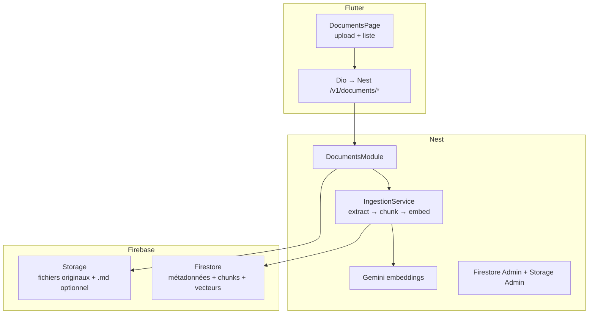
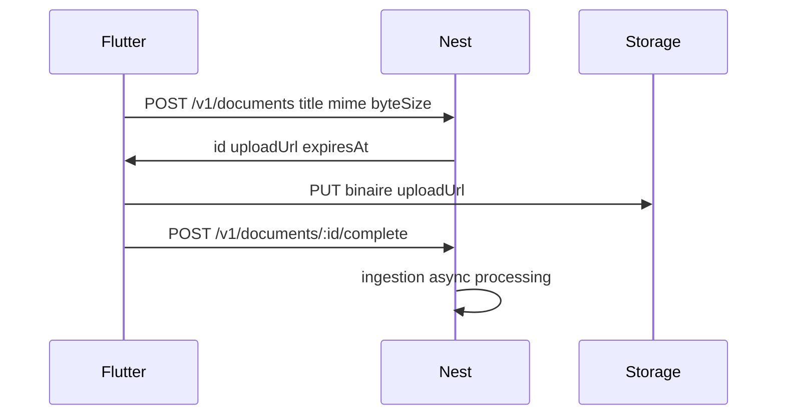

# Lucy — Documents & RAG (spec détaillée)

> **Statut** : **Validée** (2026-05-25 — parent [SPEC.md](../SPEC.md) §3)  
> **Objectif** : corpus privé par utilisateur (fichiers texte : PDF, Word, .txt/.md → md → chunks → embeddings) pour chat/quiz **source-based** (phases ultérieures).

---

## 1. Objectif

### 1.1 Utilisateurs

| Persona | Besoin |
|---------|--------|
| **Apprenant** | Déposer **PDF, Word (.docx) ou fichiers texte** (`.txt`, `.md`), **titre** obligatoire ; **choisir jusqu’à 5 docs actifs** pour la recherche ; **télécharger** l’original ; conserver / **supprimer** des entrées |
| **Chat / Quiz** (plus tard) | Réponses **uniquement** à partir des chunks des docs **actifs** (`searchEnabled`) |
| **Développeur** | Repos Firestore en `memory` possible en dev ; **embeddings toujours Gemini** (pas de mock embeddings) ; job + worker in-process (§2.9) |

### 1.2 Problème

Sans index structuré, le LLM ne peut pas citer ni restreindre les réponses au matériel de l’utilisateur.

### 1.3 Cible (vision)



### 1.4 Hors périmètre (cette spec — phases D1/D2)

- Chat source-based, quiz, résumés automatiques (SPEC §3 P3/P4).
- Pipeline OCR complet (hors MVP) ; en revanche PDF **protégé par mot de passe** ou **scan sans texte extractible** → `failed` + codes **`DOCUMENT_PASSWORD_PROTECTED`** / **`DOCUMENT_OCR_REQUIRED`** et snackbar l10n explicite (§2.9 Q6).
- Partage de documents entre utilisateurs.
- Accès Firestore/Storage **direct** depuis Flutter (règle centralisation inchangée).

---

## 2. Décisions techniques

### 2.0 Décisions validées (utilisateur — 2026-05-25)

| # | Sujet | Décision |
|---|--------|----------|
| V1 | **Types de fichiers** | **PDF** + **Word (.docx)** + **texte** (`.txt`, `.markdown` / `.md`) — pas limité au PDF seul |
| V2 | **Limites** | **20 Mo** / fichier, **pas de quota** sur le nombre de documents ; **500 pages** (PDF) ou ~1,5 M car. (Word/txt) — voir §2.6 |
| V2b | **Recherche** | Bibliothèque illimitée ; **au plus 5** documents peuvent avoir **`searchEnabled: true`** à la fois ; l’utilisateur **choisit manuellement** lesquels activer (§2.9 Q1–Q2) |
| V2c | **Upload UI** | **Un seul upload / traitement à la fois** côté app (pas de parallèle utilisateur) |
| V3 | **Upload** | **URL signée Firebase Storage** (PUT direct depuis Flutter) — voir §2.7 |
| V4 | **Vecteurs** | **Firestore** : sous-collection `chunks` + champ `embedding` (pas de DB vectorielle externe) |

**Hors MVP types** : `.doc` (Word 97), Excel/CSV, images seules — phase ultérieure.

### 2.1 Markdown ou CSV à l’upload ?

| Format intermédiaire | Quand l’utiliser | MVP Lucy |
|---------------------|------------------|----------|
| **Markdown (.md)** | PDF, DOCX, pages web, livres — texte **narratif** avec titres de sections | **Oui** — format canonique du texte extrait |
| **Texte brut** | Fallback si extraction sans structure | Oui (équivalent md sans `#`) |
| **CSV** | Tableaux, exports Excel, données **colonnes/lignes** | **Non en MVP** — phase ultérieure si upload `.csv`/`.xlsx` |

**Décision D-FMT1** : après extraction (PDF / DOCX / txt), persister le texte normalisé en **Markdown** (titres `##` quand détectés, paragraphes `\n\n`). Pas de CSV pour ces formats.

**Extraction D2 (backend)** :

| MIME | Extension | Bibliothèque cible |
|------|-----------|-------------------|
| `application/pdf` | `.pdf` | `pdf-parse` (ou équivalent) |
| `application/vnd.openxmlformats-officedocument.wordprocessingml.document` | `.docx` | `mammoth` → HTML/md |
| `text/plain` | `.txt` | lecture UTF-8 directe |
| `text/markdown` | `.md` | lecture UTF-8 (normalisation légère) |

### 2.2 Où stocker quoi ?

| Donnée | Emplacement | Raison |
|--------|-------------|--------|
| Fichier original | **Firebase Storage** `users/{uid}/documents/{docId}/original.{ext}` | Binaire ; extension d’origine conservée |
| Texte extrait (md) | **Storage** si &gt; ~100 Ko, sinon champ Firestore `extractedTextPreview` + path Storage | Limite taille doc Firestore |
| Métadonnées document | **Firestore** `users/{uid}/documents/{docId}` | Liste, statut, titre, indexation |
| Chunks + embeddings | **Firestore** sous-collection `chunks` | Aligné pitch « Firestore + vector search » ; un seul stack ops |

**Décision D-STORE1** : pas de second vector DB (Pinecone, etc.) en MVP — **Firestore Vector Search** (ou champ embedding + requête vectorielle Firebase) sur les chunks.

### 2.3 Chunk + « contexte » + titre

Chaque **document** a un **`title`** saisi par l’utilisateur (obligatoire à l’upload) — utilisé dans l’UI et la recherche.

Chaque **chunk** stocke :

| Champ | Rôle |
|-------|------|
| `ordinal` | Ordre dans le document |
| `text` | Contenu du fragment (md/plain) |
| `tokenEstimate` | Contrôle taille / coût |
| `pageStart`, `pageEnd` | Optionnel (PDF) |
| `embedding` | Vecteur (dimension selon `GEMINI_EMBEDDING_MODEL`, défaut §2.9 Q10) |

**Décision D-CTX1** : le **titre** est au niveau **document**. Le **`contextHeader` n’est pas stocké** dans Firestore : il est **calculé à la volée** au retrieval : `Document: {title}\nPages: {start}-{end}\n\n` + `chunk.text`.

### 2.4 Chunking (MVP)

| Paramètre | Valeur proposée |
|-----------|-----------------|
| Taille cible | ~800 tokens (~3200 caractères) |
| Chevauchement | ~100 tokens |
| Séparateurs | `\n\n`, puis `. ` en dernier recours |

### 2.5 Pipeline statuts

`uploading` → `processing` → `ready` | `failed`

| Statut | UI | Règles |
|--------|-----|--------|
| `uploading` | Barre upload | Suppression autorisée |
| `processing` | **Spinner + message** « Indexation en cours… » (pas de pourcentage MVP — §2.9 Q3) — **pas d’annulation** | **DELETE interdit** (409) |
| `ready` | Badge prêt ; toggle « Actif pour la recherche » | `searchEnabled` modifiable |
| `failed` | Snackbar l10n + **Réessayer** (re-upload ou reprocess) | Suppression autorisée |

**Transitions autorisées** (contrat API §4.1) :

| De → Vers | Déclencheur |
|-----------|-------------|
| — → `uploading` | `POST /documents` |
| `uploading` → `processing` | `POST …/complete` (fichier validé) |
| `processing` → `ready` | Ingestion OK |
| `processing` → `failed` | Ingestion erreur |
| `uploading` → `failed` | TTL abandon (§2.8 C6) ou validation échouée |
| `failed` → `processing` | `POST …/reprocess` ou nouvel upload |
| `*` (sauf `processing`) → *(supprimé)* | `DELETE` |

**`searchEnabled`** (défaut `false` ; `true` seulement si `status === ready`) : au plus **5** docs `true` par utilisateur. Un `PATCH` qui activerait un **6ᵉ** doc → **409** `SEARCH_ACTIVE_LIMIT_EXCEEDED` + snackbar l10n (désactiver un autre d’abord). Les docs `ready` avec `false` restent en bibliothèque mais **hors retrieval**.

### 2.6 Limites MVP (**validées**)

| Limite | Valeur |
|--------|--------|
| Types MIME | `application/pdf`, `application/vnd.openxmlformats-officedocument.wordprocessingml.document`, `text/plain`, `text/markdown` |
| Extensions acceptées | `.pdf`, `.docx`, `.txt`, `.md` |
| Taille max | **20 Mo** / fichier |
| Documents / utilisateur | **Aucune limite** (nombre illimité en bibliothèque) |
| Upload simultané (UI) | **1** à la fois (nouvel upload bloqué si un doc est `uploading` ou `processing`) |
| Actifs pour recherche | **0..5** via `searchEnabled` (choix manuel ; pas d’activation auto) |
| Volume texte | PDF : **500 pages** max ; Word/txt : **≤ ~1,5 M caractères** extraits (sinon `DOCUMENT_TOO_LARGE`) |

### 2.7 Upload — URL signée Storage (**validé V3**)

Flux retenu (meilleur pour fichiers jusqu’à 20 Mo) :



| Pourquoi signée (vs multipart Nest) | Détail |
|-------------------------------------|--------|
| Performance | Le fichier ne transite pas par le serveur Nest |
| Coût / mémoire | Pas de buffer 20 Mo en RAM sur l’API |
| Firebase | Pattern standard Admin SDK `getSignedUrl` + règles via metadata `uid` |

Nest vérifie `mimeType`, `byteSize` **avant** l’URL ; `complete` vérifie objet Storage + **signature binaire** (§2.8 C1).

---

### 2.8 Décisions post-review (réponses produit — 2026-05-25)

| ID | Décision |
|----|----------|
| **C1** | À `complete` : lire métadonnées Storage + **magic bytes** (PDF `%PDF`, DOCX `PK\x03\x04`, txt/md UTF-8). Si ≠ `mimeType` / extension → `failed` + `DOCUMENT_TYPE_MISMATCH`. Pas de scan antivirus (C7). |
| **C2** | Si objet Storage absent juste après PUT : **retry serveur** 3× (200 ms, 500 ms, 1 s) puis `409 DOCUMENT_UPLOAD_NOT_READY` + header `Retry-After: 2`. Le client peut rappeler `complete`. |
| **C3** | **Pas de quota 20 docs.** Champ `searchEnabled: boolean` (défaut `false`). Retrieval filtre **obligatoirement** `uid` + `searchEnabled == true` (+ `documentId` optionnel). |
| **C4** | `complete` **idempotent** : si déjà `processing` ou `ready` → **200** avec état courant (no-op). Si `uploading` sans fichier → `409`. |
| **C5** | Pendant `processing` : **pas de DELETE** (`409 DOCUMENT_PROCESSING_IN_PROGRESS`). UI : spinner + message (pas de % — §2.9 Q3). |
| **C6** | Docs `uploading` &gt; **24 h** : job sweeper → `failed` + `UPLOAD_ABANDONED` ; objet Storage orphelin supprimé. Liste : bouton supprimer + réessayer. |
| **C7** | Bucket **privé**, accès **Admin SDK Nest uniquement** — suffisant MVP. |
| **C8** | DOCX : `mammoth` ; si texte extrait &lt; **200 caractères** → `failed` + `DOCUMENT_EMPTY_EXTRACTION` + snackbar l10n. Spec UI : avertir que mise en page complexe peut être dégradée. |
| **C9** | `contextHeader` **non persisté** — calcul au retrieval uniquement (D-CTX1). |
| **C10** | Table complète codes → l10n (§4.2) ; `DocumentErrorTranslator` exhaustif + fallback générique. |
| **C11** | Ingestion **durable** : job Firestore + **worker in-process Nest** (MVP) ; reprise au boot si `processing` &gt; 15 min ; retries transientes **3×** backoff. **Avant prod** : migrer vers **Cloud Tasks / Pub/Sub** (§2.9 Q4). |
| **C12** | Erreur frontend : **snackbar** l10n ; actions **Réessayer** (`reprocess` si `failed`, ou relancer flux upload). Pas de DLQ utilisateur. |
| **C13** | Enum `DocumentStatus` partagé ; transitions §2.5 ; tests contrat statut backend + parsing enum Flutter. |
| **C14** | Retrieval : filtre **`uid` du token** + **`searchEnabled == true`** sur le parent document ; jamais de requête vectorielle globale. |
| **C15** | D1/D2 : **pdf, docx, txt, md** dès le début (aligner plan + spec). |

### 2.9 Décisions complémentaires (Q1–Q10 — 2026-05-26)

| Q | Décision |
|---|----------|
| **Q1** | **Max 5** documents **`searchEnabled: true`** en parallèle. Écran Documents : l’utilisateur **sélectionne** lesquels sont actifs pour la recherche ; peut en **ajouter** (si &lt; 5 actifs) ou en **retirer** ; **supprimer** une entrée ; **télécharger** l’original uploadé via `GET …/download` (URL signée GET). |
| **Q2** | Activation recherche **manuelle uniquement** (toggle / liste), défaut `searchEnabled: false`. |
| **Q3** | Pendant `processing` : **spinner + texte** uniquement (pas de barre de %). |
| **Q4** | **MVP** : job Firestore + worker Nest in-process ; **avant mise en production** : bascule vers **Cloud Tasks** (ou équivalent) — pas de double stack obligatoire en dev. |
| **Q5** | Cibles **Web + mobile** dès D1 ; valider **CORS** bucket Storage + signed URL **tôt** (tests manuels navigateur). |
| **Q6** | PDF **mot de passe** → `failed` + **`DOCUMENT_PASSWORD_PROTECTED`** ; scan **sans texte** extractible → `failed` + **`DOCUMENT_OCR_REQUIRED`** ; snackbar l10n **claire** (pas de pipeline OCR MVP). |
| **Q7** | **Titre immuable** après création du document (pas de `PATCH` sur `title`). |
| **Q8** | **Doublons autorisés** (même fichier / titre plusieurs fois = entrées distinctes). |
| **Q9** | **`reprocess`** : **pas de plafond** côté API sur le nombre d’appels utilisateur ; retries internes ingestion restent §C11. |
| **Q10** | **Pas de mock embeddings** : toujours **Gemini Embeddings**. Variable **`GEMINI_EMBEDDING_MODEL`** avec défaut **`text-embedding-004`** (Google) ; dimension alignée sur ce modèle pour l’index Firestore. Les tests unitaires **injectent un faux `EmbeddingPort`** (double de test), pas un mode « mock provider » global. |

---

## 3. Modèle de données Firestore

```
users/{uid}/documents/{docId}
  title: string                    # requis, 3–120 car.
  fileName: string
  mimeType: string
  storagePath: string
  byteSize: number
  status: "uploading" | "processing" | "ready" | "failed"
  searchEnabled: boolean              # défaut false ; true seulement si ready
  errorCode?: string
  pageCount?: number
  chunkCount?: number
  extractedTextStoragePath?: string
  ingestionAttempts?: number          # retries internes ingestion (C11), pas limite utilisateur reprocess (Q9)
  createdAt, updatedAt: timestamp

users/{uid}/documents/{docId}/chunks/{chunkId}
  ordinal: number
  text: string
  tokenEstimate: number
  pageStart?: number
  pageEnd?: number
  embedding: vector               # Firestore vector field
  createdAt: timestamp
```

Index : composite `uid` + `status` pour liste ; index vectoriel sur `chunks` (config Firebase).

---

## 4. API Nest (`/v1/documents`)

Toutes les routes : `FirebaseAuthGuard`, scope `uid` du token.

| Méthode | Route | Description |
|---------|-------|-------------|
| `POST` | `/v1/documents` | Créer entrée + URL upload signée (ou multipart) |
| `POST` | `/v1/documents/:id/complete` | Client signale fin upload → lance `processing` |
| `GET` | `/v1/documents` | Liste métadonnées (sans chunks) |
| `GET` | `/v1/documents/:id` | Détail + statut |
| `GET` | `/v1/documents/:id/download` | Réponse `{ downloadUrl, expiresAt }` — URL signée **GET** lecture seule du fichier `original.{ext}` (Q1) |
| `DELETE` | `/v1/documents/:id` | Supprime Storage + chunks ; **409** si `processing` |
| `PATCH` | `/v1/documents/:id` | `{ "searchEnabled": true \| false }` — seulement si `ready` ; **409** `SEARCH_ACTIVE_LIMIT_EXCEEDED` si activation ferait &gt; 5 actifs (Q1) |
| `POST` | `/v1/documents/:id/reprocess` | Re-lance ingestion si `failed` — **sans limite** d’appels utilisateur (Q9) |

**`PATCH /v1/documents/:id`** : corps **uniquement** `{ "searchEnabled": boolean }`. Le **titre n’est pas modifiable** après création (Q7).

**Body `POST /v1/documents`** (exemple) :

```json
{
  "title": "Grammaire B1",
  "fileName": "grammaire.pdf",
  "mimeType": "application/pdf",
  "byteSize": 1048576
}
```

**Réponse** : `{ "id", "uploadUrl", "expiresAt" }` (signed PUT) ou `{ "id" }` si upload multipart via Nest.

### 4.1 Contrat `complete` (C4)

- Premier appel valide (`uploading` + fichier OK) → `processing` + enqueue ingestion → **200** `{ status, id }`.
- Rappel pendant `processing` ou après `ready` → **200** même corps (no-op).
- Fichier pas encore visible Storage → **409** `DOCUMENT_UPLOAD_NOT_READY` (+ retries C2).
- MIME / magic bytes invalides → doc `failed`, **422** `DOCUMENT_TYPE_MISMATCH`.

### 4.2 Codes erreur → l10n (C10)

| Code HTTP | Code API | l10n (clé ARB à créer) |
|-----------|----------|-------------------------|
| 400 | `VALIDATION_ERROR` | `documentErrorValidation` |
| 401 | `UNAUTHORIZED` | `documentErrorUnauthorized` |
| 409 | `DOCUMENT_UPLOAD_NOT_READY` | `documentErrorUploadNotReady` |
| 409 | `DOCUMENT_PROCESSING_IN_PROGRESS` | `documentErrorProcessingNoDelete` |
| 409 | `DOCUMENT_UPLOAD_IN_PROGRESS` | `documentErrorOneUploadAtATime` |
| 409 | `SEARCH_ACTIVE_LIMIT_EXCEEDED` | `documentErrorSearchActiveLimit` |
| 422 | `DOCUMENT_TYPE_NOT_ALLOWED` | `documentErrorTypeNotAllowed` |
| 422 | `DOCUMENT_TYPE_MISMATCH` | `documentErrorTypeMismatch` |
| 422 | `DOCUMENT_TOO_LARGE` | `documentErrorTooLarge` |
| 422 | `DOCUMENT_EMPTY_EXTRACTION` | `documentErrorEmptyExtraction` |
| 422 | `DOCUMENT_PASSWORD_PROTECTED` | `documentErrorPasswordProtected` |
| 422 | `DOCUMENT_OCR_REQUIRED` | `documentErrorOcrRequired` |
| 404 | `DOCUMENT_NOT_FOUND` | `documentErrorNotFound` |
| 422 | `DOCUMENT_PROCESSING_FAILED` | `documentProcessingFailed` |
| 422 | `UPLOAD_ABANDONED` | `documentErrorUploadAbandoned` |
| 503 | `LLM_UNAVAILABLE` | `documentErrorEmbeddingUnavailable` |
| * | *(autre)* | `documentGenericError` |

### 4.3 Retrieval (C14 — phase D3)

`POST /v1/retrieval/search` — body `{ query, limit?, documentIds? }` :

- Filtre **obligatoire** : chunks dont le parent `users/{uid}/documents/{docId}` a `searchEnabled === true` et `status === ready`.
- `documentIds` optionnel : sous-ensemble des docs actifs.
- Réponse inclut `contextHeader` **calculé** (C9), pas lu depuis chunk.

**Erreurs** : §4.2 ; retirer `DOCUMENT_QUOTA_EXCEEDED` (plus de quota nombre).

---

## 5. Phases de livraison

| Phase | Id | Contenu | Dépendance |
|-------|-----|---------|------------|
| **D1** | P1 | UI Web+mobile (CORS) : liste + upload + download + patch searchEnabled (max 5) ; API + Storage | Shell livré |
| **D2** | P2 | Extraction PDF, md, chunking, embeddings, vector index, statuts | D1 |
| **D3** | P3 | `POST /v1/retrieval/search` (query → top-k chunks) pour Chat | D2 |
| **D4** | P4 | Chat + Quiz consomment retrieval | D3 |

---

## 6. Structure projet

### 6.1 Backend (`backend/src/features/documents/`)

```
documents/
  documents.module.ts
  documents.controller.ts
  controllers/          # si split
  services/
    documents.service.ts
    document-ingestion.service.ts
  repositories/
    documents.repository.port.ts
    firestore-documents.repository.ts
    in-memory-documents.repository.ts   # dev
  dto/
  domain/
    document-status.enum.ts
```

Dépendances Nest à ajouter (D2) : extracteur PDF (`pdf-parse` ou équivalent), appel **Gemini Embeddings** via module `core/llm` étendu.

### 6.2 Frontend (`lib/features/documents/`)

```
documents/
  data/
    models/document_model.dart          # Freezed
    repositories/document_repository_impl.dart
    datasources/document_remote_datasource.dart
  domain/
    repositories/document_repository.dart
    providers/document_providers.dart
  presentation/
    pages/documents_page.dart
    notifiers/documents_notifier.dart
    states/documents_state.dart
    widgets/
      document_upload_sheet.dart
      document_list_tile.dart
  services/
    document_service.dart
```

`file_picker` ou équivalent pour PDF ; upload vers signed URL via `dio` PUT.

---

## 7. Style de code & conventions

Identiques [SPEC.md §4](../SPEC.md) : Clean Architecture, l10n fr/en/de, pas de message API brut, `/v1` + Bearer token, Freezed + Riverpod, `colorScheme` UI.

Référence UI liste/upload : patterns `telC_frontend` / cartes + états chargement comme onboarding.

---

## 8. Stratégie de tests

| Couche | Cible |
|--------|--------|
| **Nest** | `DocumentsService` : MIME, limite 5 actifs, transitions ; `DocumentIngestionService` : chunking pur ; repo memory ; **`EmbeddingPort` fake injecté** dans tests (pas d’appel réseau — Q10) |
| **Nest e2e** | `POST` → `complete` → extractor fixture ou env de test avec vraie clé (hors CI si besoin) → `ready` + `chunkCount > 0` |
| **Flutter** | Notifier : liste, limite 5 actifs, upload ; widget : liste vide + bouton upload |
| **Manuel** | PDF 2 pages → statut ready → vérifier chunks en console Firestore |

```bash
cd backend && npm test
cd frontend && flutter test test/features/documents/
```

---

## 9. Frontières

| Toujours | Demander avant | Jamais |
|----------|----------------|--------|
| Nest seul writer Firestore/Storage documents | Changer vector DB ou format MVP (CSV) | Firestore SDK dans Flutter pour documents |
| Titre obligatoire à la création (**immuable** ensuite — Q7) | Augmenter plafond 5 actifs / types MIME | Envoyer PDF entier au LLM chat |
| Max **5** docs `searchEnabled` ; doublons autorisés (Q8) | | |
| Mapper erreurs → l10n | OCR payant / services tiers | Indexer sans consentement utilisateur (upload explicite) |
| Supprimer chunks + fichier à `DELETE` | Partage inter-utilisateurs | Stocker clés API côté client |

---

## 12. Sync multi-appareil (aligné chat — 2026-05-27)

| Règle | Détail |
|-------|--------|
| **Vérité** | API Nest / Firestore — pas de liste documents « authoritative » uniquement en local |
| **Entrée onglet Documents** | `DocumentsNotifier` déclenche **`GET /v1/documents`** (refresh) à chaque visite de l’onglet / `pull-to-refresh` |
| **Multi-appareil** | Activer `searchEnabled` sur le téléphone → la tablette voit l’état à la prochaine ouverture Documents ou refresh |
| **Hors ligne** | Afficher dernier état connu en mémoire Riverpod si présent ; bannière offline ; pas d’upload |

Référence chat : [spec-chat-rag.md](./spec-chat-rag.md) §12.1 (même philosophie sync à l’entrée).

---

## 10. Commandes

```bash
# Backend
cd backend
npm install
npm run start:dev:local   # ou start:dev

# Frontend
cd frontend
flutter pub add file_picker   # phase D1
dart run build_runner build --delete-conflicting-outputs
flutter gen-l10n
flutter analyze && flutter test
```

Variables backend (D2) : `GEMINI_API_KEY` (**obligatoire** pour indexation), `GEMINI_EMBEDDING_MODEL` (défaut **`text-embedding-004`** — Q10), credentials Firebase inchangés.

---

*Ce document a été créé avec Cursor (IA). Spec documents/RAG — décisions post-review + Q1–Q10, 2026-05-26.*
