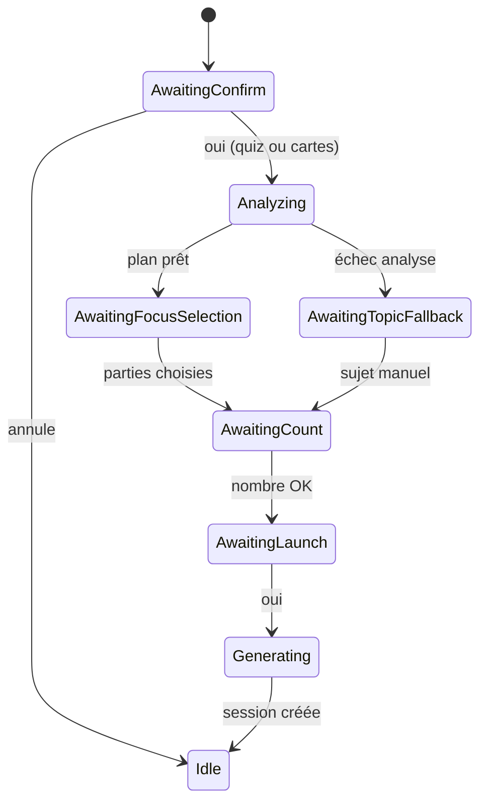

# Lucy — Mode professeur (analyse corpus avant Quiz + Cartes)

> **Statut** : **Validée produit** (2026-06-10)  
> **Parent** : [SPEC.md](../SPEC.md) §7.6 · [docs/spec-learning-generation-dialogue.md](./spec-learning-generation-dialogue.md) · [docs/spec-learning-generation.md](./spec-learning-generation.md)  
> **Alias fichier** : `spec-learning-composition-prep.md` (historique)  
> **Vision** : pour **chaque** demande de quiz ou de cartes, Lucy agit comme un **professeur** — elle **lit/analyse** les documents actifs, indique **quelles parties** méritent d’être travaillées et **pourquoi**, l’étudiant **choisit**, puis seulement ensuite génération ciblée. **Pas** de déclenchement réservé à « examen » ou « composition » : c’est le **flux standard**.

---

## 1. Objectif

### 1.1 Utilisateurs

| Persona | Besoin |
|---------|--------|
| **Apprenant** | Ne pas générer quiz/cartes « au hasard » sur tout le PDF |
| **Apprenant** | Être **guidé** : quelles sections/chapitres travailler en priorité |
| **Apprenant** | Comprendre **pourquoi** une partie compte (concepts clés, fondations, liens) |
| **Apprenant** | **Choisir** les parties puis le **nombre** d’items, avec **récap** avant lancement |
| **Développeur** | Un seul pipeline chat : analyse JSON → sélection → `generate({ focusAreas })` |

### 1.2 Problème actuel

- Génération **immédiate** au mot « quiz » / « cartes » ;
- Nombre et sujet **devinés** ;
- Retrieval **générique**, pas aligné sur la structure du livre ;
- Pas de posture **pédagogique** (prof qui oriente la révision).

### 1.3 Décision produit validée (2026-06-10)

| # | Sujet | Décision |
|---|--------|----------|
| **P1** | **Déclenchement** | **Toujours** — toute demande quiz/cartes dans le chat entre en **mode professeur** (analyse → recommandations → choix) |
| **P2** | Examen / composition | **Non requis** comme mot-clé ; `learning_goal` et profil **enrichissent** l’analyse mais ne **conditionnent pas** le flux |
| **P3** | Pas de raccourci « sujet libre seul » | L’étape analyse est **obligatoire** ; fallback sujet manuel **uniquement** si l’analyse LLM échoue |
| **P4** | Intégration LEARN-06 | Un **seul** flux : confirm type → **analyzing** → choix parties → nombre → récap → generate |

### 1.4 Flux unifié (mode professeur)



| Étape | Lucy (ex. FR) |
|-------|----------------|
| `awaiting_confirm` | « Tu veux un **quiz** ou des **cartes** sur tes documents ? » |
| `analyzing` | « Je parcours tes documents pour repérer ce qu’il est important de travailler… » |
| `awaiting_focus_selection` | « Voici ce que je te recommande : **1.** Ch. 3 — Entropie (priorité haute) — … **2.** … Quelles parties pour ton quiz ? » |
| `awaiting_count` | « Combien de questions ? (max 15) » |
| `awaiting_launch_confirm` | « **Récap** : 10 questions · sections 1 et 2 · Thermodynamique — je lance ? » |
| `generating` | « Je prépare ton quiz… » |

**Raccourci** : message complet « 10 cartes sur l’entropie » → après analyse, **pré-sélection** de la zone correspondante + récap (pas de génération sans confirmation finale).

### 1.5 Modèle `StudyFocusArea`

```json
{
  "id": "focus_1",
  "documentId": "doc_abc",
  "documentTitle": "Thermodynamique — Polycopié",
  "label": "Chapitre 3 — Entropie et second principe",
  "pageStart": 42,
  "pageEnd": 58,
  "ordinalStart": 12,
  "ordinalEnd": 18,
  "importance": "high",
  "rationale": "Concept central qui relie définitions et applications ; base pour la suite du cours.",
  "keyConcepts": ["entropie", "irréversibilité", "ΔS"]
}
```

### 1.6 Autres décisions

| # | Sujet | Décision |
|---|--------|----------|
| P5 | Recommandations max | **5 à 8** zones par corpus |
| P6 | Sélection | Numéros, noms, « tout », « les plus importantes » |
| P7 | Scope génération | `focusAreas[]` borne le retrieval |
| P8 | Cache plan | `corpusStudyPlan` sur le fil, **24 h** ; invalidation si docs actifs changent |
| P9 | Multi-docs | Tous les docs `searchEnabled` analysés |
| P10 | Contexte optionnel | Date d’examen / type d’épreuve : **optionnel** si l’utilisateur le mentionne |

### 1.7 Critères d’acceptation

- [ ] « Fais-moi un quiz » → **analyse** avant `generate`
- [ ] Liste numérotée avec **raison** + **concepts clés** par zone
- [ ] Sélection « 1 et 2 » → items générés depuis ces zones (sources vérifiables)
- [ ] Fonctionne **sans** mot « examen » ni `learning_goal: exam`
- [ ] « Tout le livre » → toutes les zones ou retrieval élargi explicite
- [ ] Échec analyse → fallback sujet manuel, pas de blocage
- [ ] l10n fr / en / de

---

## 2. Commandes

```bash
cd lucy_backend && npm test -- --testPathPattern="corpus-study|learning-session|chat-learning"
cd lucy_frontend && flutter gen-l10n && flutter test test/features/chat/
```

---

## 3. Structure projet

Voir §3 des versions précédentes ; renommages proposés :

| Ancien | Nouveau |
|--------|---------|
| `composition-prep-analyzer.service.ts` | `corpus-study-analyzer.service.ts` |
| `composition-prep-analyzer.*.hbs` | `corpus-study-analyzer.*.hbs` |
| clés l10n `chatComposition*` | `chatProfessor*` |

`corpusStudyPlan` sur `users/{uid}/chats/{chatId}` (inchangé).

---

## 4. Style de code

| Règle | Détail |
|--------|--------|
| Prompts analyse | Posture **professeur** : prioriser fondations, liens entre idées, pièges courants — pas seulement « examen » |
| Profil | Injecter `learnerProfile` entier (`learning_goal`, `main_domains`, `self_assessed_level`, `explanation_style`) |
| Scope | Valider `ordinal` / `documentId` côté Nest |

---

## 5. Tests

Cible **+30 tests** (analyzer, focus parser, scope retrieval, flux chat).

---

## 6. Limites

### Toujours faire

- Mode professeur pour **toute** génération quiz/carte
- Ancrer zones sur chunks réels
- Confirmation finale avant `generate`

### Ne jamais faire

- Génération sans passage analyse (sauf fallback explicite)
- Halluciner pages/chapitres hors chunks

---

## 7. Phases LEARN-07

| Phase | Livrable |
|-------|----------|
| LEARN-07a | `StudyFocusArea` + `CorpusStudyAnalyzerService` |
| LEARN-07b | Chat : analyzing → sélection + cache |
| LEARN-07c | Retrieval + generate scopés |

**Prérequis** : LEARN-06 (pending + confirm + count + récap + annulation).

---

## 8. Lot complet — toutes améliorations validées (2026-06-10)

> L’utilisateur a demandé d’**appliquer l’ensemble** des optimisations identifiées. Répartition par phase.

### LEARN-06 — Dialogue & garde-fous

| Id | Amélioration |
|----|----------------|
| D2 | Machine à états serveur `pendingLearningGeneration` |
| D9–D11 | Défauts nombre, annulation, message génération en cours |
| A2 | Message d’attente pendant génération LLM |
| A4 | Désambiguïsation quiz vs cartes (ordre + question) |
| D5–D7 | `topicHint` fallback si analyse échoue |

### LEARN-07 — Mode professeur (ce document)

| Id | Amélioration |
|----|----------------|
| P1–P7 | Analyse corpus + choix parties + scope |
| D1 | Exploitation `learnerProfile` dans l’analyse |
| B2 | Difficulté adaptée à `self_assessed_level` dans prompts génération |

### LEARN-08 — Outline à l’ingestion

| Id | Amélioration |
|----|----------------|
| B1 | `document.outline[]` persisté à l’upload → analyse plus fiable |

### LEARN-09 — Qualité session & erreurs

| Id | Amélioration |
|----|----------------|
| A1 | Titres session intelligents (`Quiz · Entropie`) |
| A3 | Erreurs actionnables (`LEARNING_GENERATION_FAILED` + conseils) |
| A5 | Regénération « refais pareil » depuis le chat |
| B4 | Sources visibles sur chaque item (vérif UI G8) |
| B3 | Consignes génération : définitions, liens, pas que fait isolé |

### LEARN-10 — Suivi pédagogique

| Id | Amélioration |
|----|----------------|
| B5 | Après quiz raté → proposer cartes sur points faibles (client puis API) |
| D2 | Type d’épreuve optionnel dans le dialogue (si mentionné) |
| D3 | Plan de révision exportable en texte dans le chat |

### LEARN-11 — Confort & phases tardives

| Id | Amélioration | Note |
|----|----------------|------|
| C1 | Chips rapides dans le chat | UX |
| C6 | Nombres en lettres (« quinze ») | Parser |
| C4 | Spaced repetition SM-2 | Cartes |
| C5 | Calendrier J-N avant examen | Plan multi-jours |
| C2 | Génération depuis onglet Quiz | **Hors G6b** — ticket séparé si décidé |
| C3 | Choix d’un PDF précis | **Hors G4** — ticket séparé |

### Ordre d’implémentation

```text
LEARN-06 → LEARN-07 → LEARN-09 (A1,A3 en parallèle possible) → LEARN-08 → LEARN-10 → LEARN-11
```

---

## 9. Relation entre specs

| Spec | Rôle |
|------|------|
| [spec-learning-generation.md](./spec-learning-generation.md) | Pipeline generate + sessions |
| [spec-learning-generation-dialogue.md](./spec-learning-generation-dialogue.md) | Pending, confirm, count, récap — **fusionné** avec mode professeur |
| **Ce document** | Analyse prof + choix parties — **flux standard** |

---

*Ce document a été créé avec Cursor (IA). Révisé — mode professeur obligatoire — 2026-06-10.*
