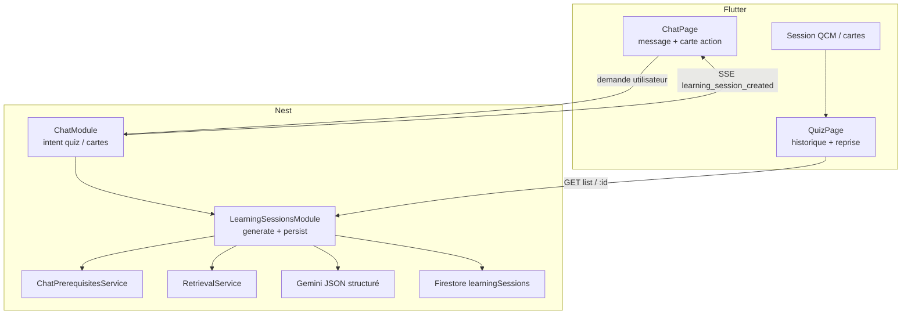
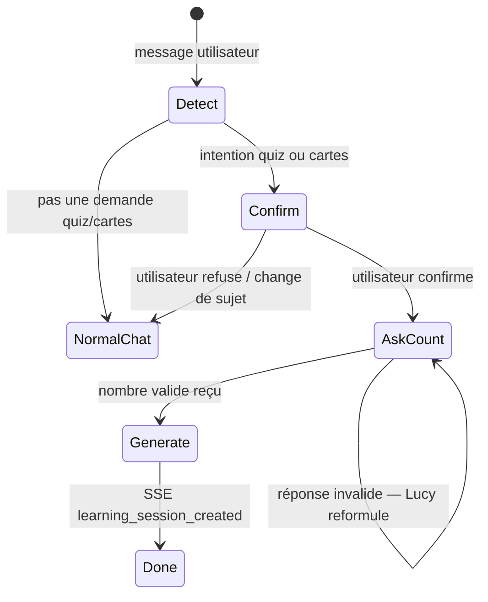

# Lucy — Génération d’activités d’apprentissage (Quiz + Cartes)

> **Statut** : **Proposition validée produit** (2026-05-29, révisé — génération via **Chat**)  
> **Parent** : [SPEC.md](../SPEC.md) §7 · [docs/spec-documents-rag.md](./spec-documents-rag.md) · [docs/spec-chat-rag.md](./spec-chat-rag.md)  
> **Remplace / étend** : [docs/spec-quiz.md](./spec-quiz.md) (QUIZ-01 livré ; génération = ce document)  
> **Dépendances** : documents D3, chat P4a (garde corpus alignée), onboarding `learnerProfile`

---

## 1. Objectif

### 1.1 Utilisateurs

| Persona | Besoin |
|---------|--------|
| **Apprenant** | Depuis le **Chat**, demander à Lucy de **créer** un quiz ou des cartes (point d’entrée unique en MVP) |
| **Apprenant** | Lucy génère la session, affiche une **carte action** dans le fil (« Ouvrir le quiz / les cartes ») |
| **Apprenant** | Depuis l’onglet **Quiz** : **consulter l’historique** et **rejouer** les sessions — **pas** de bouton « générer » en MVP |
| **Apprenant** | **Quiz QCM** (4 choix, 1 bonne réponse) pour s’auto-évaluer |
| **Apprenant** | **Cartes mémoire** (recto / verso) pour réviser par répétition |
| **Apprenant** | **Reprendre** une session passée (historique persisté serveur) |
| **Apprenant** | Sans corpus actif : **bannière + CTA Documents** — pas de **nouvelle** génération à vide ; **l’historique reste jouable** |
| **Développeur** | API Nest + Flutter Clean Architecture ; mêmes règles auth / corpus / profil que le chat |

### 1.2 Problème

L’apprenant converse avec Lucy dans le **Chat** ; quand il demande un quiz ou des cartes, Lucy **crée** la session depuis le corpus actif. L’onglet **Quiz** sert de **bibliothèque de révision** (historique + pratique), pas d’atelier de génération.

### 1.3 Décisions produit validées (2026-05-29)

| # | Sujet | Décision |
|---|--------|----------|
| G1 | **Formats MVP** | **Quiz QCM** + **cartes mémoire** (flashcards) |
| G2 | **UI onglet Quiz** | **Bibliothèque** : historique + reprise session (`/quiz/session/:id`) — **sans** génération locale |
| G2b | **UI Chat** | Demande naturelle (« fais-moi un quiz », « des cartes sur… ») → génération + **carte action** dans le fil |
| G3 | **Persistance** | **Firestore via Nest** — sessions listables et reprises |
| G4 | **Périmètre corpus (génération)** | **Tous les documents actifs** (`searchEnabled` + `ready`) pour **créer** une session — **pas** de sélecteur de docs (aligné chat C3) |
| G4b | **Reprise session existante** | **Indépendante** du corpus / domaines **actuels** : une session déjà persistée reste **lisible et jouable** même si des docs sont désactivés, supprimés de la recherche, ou si les **domaines** du profil apprenant changent ensuite |
| G5 | **Profil apprenant** | **Obligatoire** avant génération (miroir chat / quiz eligibility) |
| G6 | **Génération depuis le chat** | **Point d’entrée MVP** — le ChatModule détecte l’intention et appelle le pipeline `learning-sessions` (pas de génération depuis l’onglet Quiz) |
| G6b | **Génération depuis l’onglet Quiz** | **Hors MVP** — pas de tuiles « Générer » ni route `/quiz/generate/*` en première livraison |
| G9 | **Dialogue avant génération** | Lucy **confirme d’abord** qu’elle a compris la demande (type quiz/cartes) **avant** de lancer la génération — **implémentation** : [spec-learning-generation-dialogue.md](./spec-learning-generation-dialogue.md) |
| G10 | **Nombre d’items** | Lucy **demande en chat** (« Combien de questions / cartes ? ») — pas de génération tant que non précisé (défaut proposé si l’utilisateur dit « comme tu veux ») — **idem dialogue spec** |
| G11 | **Périmètre contenu** | **Tout le corpus actif** — même si l’utilisateur mentionne un sujet (« chapitre 3 »), pas de filtrage retrieval par sujet en MVP |
| G12 | **Quiz vide** | Texte seul : « Demandez à Lucy dans le chat » — **sans** bouton CTA vers le chat |
| G7 | **Streaming génération** | **Non** en MVP — une requête HTTP → JSON structuré (comme spec-quiz initiale) |
| G8 | **Sources** | Chaque item (question ou carte) référence **1+ `chunkId`** + métadonnées document (titre, pages) — affichage UI type chat allégé |

### 1.4 Cible (vision)



### 1.5 Hors périmètre MVP

| Exclu | Détail |
|-------|--------|
| Vrai/faux, texte libre, glisser-déposer | Types de questions avancés — phase ultérieure |
| Génération depuis l’onglet Quiz | Pas de CTA « Générer » en MVP — tout passe par le chat |
| Sélection de documents dans l’UI | Activation uniquement dans **Documents** |
| Streaming SSE de la génération | JSON unique en réponse |
| Spaced repetition algorithm (SM-2) | Cartes = flip manuel ; algorithme plus tard |
| Export PDF / partage | Plus tard |
| Miroir local obligatoire | Optionnel post-MVP ; vérité = Firestore |

---

## 2. Commandes

### 2.1 Développement backend

```bash
cd lucy_backend
npm test
npm run start:dev
```

### 2.2 Développement frontend

```bash
cd lucy_frontend
flutter pub get
dart run build_runner build --delete-conflicting-outputs
flutter gen-l10n
flutter analyze
flutter test test/features/quiz/
```

### 2.3 Vérification manuelle (checklist CP-LEARN)

- [ ] Aucun doc actif → chat **n’initie pas** la génération ; onglet Quiz : bannière + empty state « demandez à Lucy » ; **historique jouable** (G4b)
- [ ] Désactiver un doc ou un domaine **après** génération → reprise session **toujours OK**
- [ ] Profil incomplet → erreur traduite (chat + API)
- [ ] Chat : « fais-moi un quiz » → session créée + carte action → ouvrir QCM
- [ ] Chat : « des cartes mémoire » → session flashcards + carte action
- [ ] Onglet Quiz : liste sessions + reprise — **sans** bouton générer
- [ ] Quitter et rouvrir → historique OK

---

## 3. Structure projet

### 3.1 Backend (`lucy_backend`)

```
src/features/learning-sessions/
  learning-sessions.module.ts
  learning-sessions.controller.ts
  learning-sessions.service.ts
  learning-sessions.service.spec.ts
  dto/
    learning-session-type.enum.ts          # quiz | flashcards
    generate-learning-session.dto.ts
    learning-session-response.dto.ts
    learning-session-list-item.dto.ts
  repositories/
    learning-sessions.repository.port.ts
    firestore-learning-sessions.repository.ts
    in-memory-learning-sessions.repository.ts
  prompts/
    quiz-generator.system.hbs
    flashcards-generator.system.hbs
  validators/
    generated-quiz.validator.ts
    generated-flashcards.validator.ts
```

**Note** : le module `quiz/` existant (`GET /v1/quizzes/eligibility`) **reste** pour compatibilité QUIZ-01 ; la génération et les sessions vivent dans `learning-sessions/`. Option future : alias ou dépréciation progressive.

### 3.2 Firestore

```
users/{uid}/learningSessions/{sessionId}
  type: "quiz" | "flashcards"
  status: "ready" | "failed"
  itemCount: number
  title: string                    # auto : "Quiz · 29 mai" ou sujet LLM court
  createdAt: string (ISO)
  updatedAt: string (ISO)
  activeDocumentCount: number      # snapshot au moment de la génération
  sourceChatId?: string            # fil d’où la génération a été demandée (MVP chat)
  topicHint?: string               # extrait intention utilisateur (optionnel)
  items: LearningSessionItem[]     # voir §4.3
```

Pas de sous-collection en MVP — document unique par session (plafond items §4.2).

### 3.3 Frontend (`lucy_frontend`)

Étendre la feature `lib/features/quiz/` (route `/quiz` inchangée) :

```
lib/features/quiz/
  presentation/
    pages/
      quiz_page.dart                 # bibliothèque : historique + empty state
      quiz_session_page.dart         # QCM interactif
      flashcards_session_page.dart   # cartes recto/verso
    widgets/
      quiz_session_list_tile.dart
      quiz_question_card.dart
      flashcard_widget.dart
      learning_source_chip.dart
  ...

lib/features/chat/
  presentation/
    widgets/
      chat_learning_session_card.dart   # carte action post-génération
  ...
```

Routes :

| Route | Page |
|-------|------|
| `/quiz` | Bibliothèque (liste sessions + empty → chat) |
| `/quiz/session/:sessionId` | Pratique (type lu depuis session) |

**Hors MVP** : `/quiz/generate/:type`, `/quiz/history` (liste intégrée à `/quiz`).

### 3.4 API Nest

| Méthode | Route | Rôle |
|---------|-------|------|
| `GET` | `/v1/quizzes/eligibility` | **Existant** — `canQuiz`, `activeDocumentCount` |
| `POST` | `/v1/learning-sessions/generate` | Body `{ type, itemCount?, topicHint?, sourceChatId? }` — appelé par **ChatModule** (pas par l’onglet Quiz en MVP) |
| `GET` | `/v1/learning-sessions` | Liste sessions (tri `createdAt` desc, pagination optionnelle) |
| `GET` | `/v1/learning-sessions/:sessionId` | Détail session + items |
| `DELETE` | `/v1/learning-sessions/:sessionId` | Suppression session (option MVP — recommandé) |

Auth : `FirebaseAuthGuard` sur toutes les routes.

---

## 4. Comportement fonctionnel

### 4.1 Gardes — génération vs reprise

#### 4.1.1 Génération uniquement (`POST /v1/learning-sessions/generate`)

Réutiliser `ChatPrerequisitesService` (ou équivalent) **à la création seulement** :

- `canGenerate === canChat` (≥ 1 doc `ready` + `searchEnabled`)
- `learnerProfile` complet requis → `LEARNING_LEARNER_PROFILE_MISSING`
- Aucun doc actif → `LEARNING_NO_ACTIVE_DOCUMENTS`

**G4** ne filtre **pas** par domaine du profil apprenant (`mainDomains`) : tous les chunks des docs actifs entrent dans le retrieval. Les domaines influencent le **prompt** / style, pas l’éligibilité documentaire.

#### 4.1.2 Reprise & historique (`GET /v1/learning-sessions`, `GET …/:sessionId`)

- **Aucune** re-vérification corpus, `searchEnabled`, ni domaines profil.
- Le contenu est **figé** dans Firestore au moment de la génération (questions, cartes, sources snapshot).
- L’apprenant peut **jouer / réviser** une session même si :
  - tous les documents sont désactivés pour la recherche ;
  - le profil apprenant a des domaines modifiés ou « désactivés » ;
  - `GET /v1/quizzes/eligibility` retourne `canQuiz: false`.
- Seule garde : **auth** (`uid` propriétaire de la session) + session `status: ready`.

### 4.2 Paramètres de génération

| Type | `itemCount` défaut | Plafond MVP |
|------|-------------------|-------------|
| `quiz` | 5 | 15 |
| `flashcards` | 10 | 30 |

Validation Nest : entier ≥ 1 et ≤ plafond.

### 4.3 Modèle `LearningSessionItem`

**Quiz (`type: quiz`)**

```json
{
  "id": "item-1",
  "question": "…",
  "choices": ["A", "B", "C", "D"],
  "correctIndex": 2,
  "explanation": "…",
  "sources": [{ "chunkId": "…", "documentId": "…", "title": "…", "pageStart": 1, "pageEnd": 2, "excerpt": "…" }]
}
```

**Flashcards (`type: flashcards`)**

```json
{
  "id": "item-1",
  "front": "…",
  "back": "…",
  "sources": [{ "chunkId": "…", "documentId": "…", "title": "…", "pageStart": 1, "pageEnd": 2, "excerpt": "…" }]
}
```

### 4.4 Pipeline génération (Nest)

1. **Déclenchement** : intention détectée dans le **chat** (voir §4.7) — pas depuis l’UI Quiz.
2. Vérifier garde corpus + profil.
3. **Retrieval** : échantillonner N chunks diversifiés parmi **tous** les docs actifs (G11 — pas de filtre par sujet mentionné).
4. **Prompt LLM** : template par `type` ; langue = `learnerProfile.tutoringLanguage` (fallback `uiLocale`).
5. **Parse + validate** JSON (schéma strict ; retry 1× si invalide).
6. **Persister** session Firestore (`sourceChatId` ; pas de `topicHint` filtrant en MVP).
7. Retourner session au **ChatModule** → événement SSE + message texte court.

### 4.5 UI Flutter — onglet Quiz (bibliothèque)

```
┌─────────────────────────────────┐
│  Quiz                           │
├─────────────────────────────────┤
│  [bannière si !canQuiz]         │
│  Empty : « Demandez à Lucy… »   │
│  ── Historique ──               │
│  • Quiz · 5 questions · hier    │
│  • Cartes · 10 · lundi          │
└─────────────────────────────────┘
```

- **Pas** de tuiles « Générer quiz / cartes » en MVP.
- Tap session → `/quiz/session/:id`.
- **`canQuiz: false`** : empty state + bannière ; **historique toujours cliquable** (G4b).

Couleurs : **`ColorScheme`** — `primary`, `secondary`, `tertiary`, `surface` (pas de hex en dur).

### 4.7 Intégration Chat (point d’entrée génération)

Flux **multi-tours** obligatoire (G9 + G10) — **pas** de génération au premier message ambigu.



| Étape | Comportement |
|-------|--------------|
| 1 | Détection à partir du **message** et du **contexte du fil** (pas de génération immédiate sans confirmation) |
| 2 | Lucy **reformule et demande confirmation** : « Tu veux un quiz QCM sur tes documents — c’est bien ça ? » |
| 3 | Après **oui** : Lucy demande le **nombre** (« Combien de questions ? » / « Combien de cartes ? ») — plafonds §4.2 |
| 4 | Si l’utilisateur dit « comme tu veux » / pas de nombre : appliquer le **défaut** (5 quiz / 10 cartes) |
| 5 | Appel `LearningSessionsService.generate({ type, itemCount, sourceChatId })` — corpus = **tous les docs actifs** (G11) |
| 6 | Réponse : texte court + SSE **`learning_session_created`** + `ChatLearningSessionCard` |
| 7 | Corpus vide ou profil incomplet : message Lucy + CTA Documents — **pas** de session |

**État conversation** : le fil chat doit mémoriser une **pending generation** (type + étape `awaiting_confirm` \| `awaiting_count`) — côté serveur (Firestore message metadata) ou client ; **à trancher en implémentation LEARN-01d** (préférence serveur pour multi-appareil).

**Amendement** [spec-chat-rag.md](./spec-chat-rag.md) §C7 : création effective depuis le chat, avec confirmation préalable.

### 4.6 UI pratique

| Type | UX MVP |
|------|--------|
| Quiz | Une question à la fois ; feedback immédiat après choix ; score final |
| Cartes | Stack swipe ou bouton « Retourner » ; pas de scoring |

Progression session : **optionnel MVP** — stocker `userAnswers` côté client uniquement ; persistance progression = phase ultérieure.

---

## 5. Style de code

| Règle | Détail |
|--------|--------|
| Architecture | Clean Architecture : UI → Notifier → Service → Repository |
| l10n | `context.l10n.*` — fr / en / de ; clés `learning*`, `quiz*` |
| Erreurs API | `LearningErrorTranslator` → l10n (jamais `e.message` brut) |
| Models | Freezed + `@JsonKey` snake_case côté API |
| State | Riverpod `@riverpod` + `.g.dart` |
| Constantes | `ApiEndpoints`, `RoutePaths`, `RouteNames` — pas d’URL en dur |
| Backend | DTOs + parse/validate ; `LucyApiError` + codes centralisés |
| Prompts | Fichiers `.hbs` / `.md` dans `src/prompts/` ou feature |

---

## 6. Stratégie de tests

### 6.1 Backend

| Zone | Tests |
|------|-------|
| DTO / validators | `itemCount` hors bornes ; JSON LLM invalide |
| Service | garde corpus ; génération mock LLM ; persistance in-memory |
| Controller | auth ; 404 session ; codes erreur |
| E2E léger | `POST generate` → `GET` session avec items typés |

Cible : **+20 tests** minimum sur le module.

### 6.2 Frontend

| Zone | Tests |
|------|-------|
| Mappers | `LearningSession` depuis JSON API |
| `LearningNotifier` | generate success/failure ; liste sessions |
| Widgets | `QuizNoCorpusBanner` (existant) ; hub tiles |
| Router | routes `/quiz/generate/:type`, `/quiz/session/:id` |

```bash
flutter test test/features/quiz/
```

### 6.3 Non-régression

- `GET /v1/quizzes/eligibility` inchangé (tests QUIZ-01 verts)
- Chat orientation quiz inchangée

---

## 7. Frontières

### 7.1 Toujours faire

- Vérifier corpus actif **avant** appel LLM (**génération** seulement)
- Ne **pas** bloquer `GET` session / historique sur l’état actuel du corpus ou des domaines
- Passer par **Nest** pour Firestore (pas de SDK Firestore client)
- Ancrer chaque item sur **chunks** du retrieval (pas le PDF entier au LLM)
- Respecter `learnerProfile` (langue, style) dans les prompts
- Mapper erreurs backend en l10n

### 7.2 Demander avant

- Nouveau type d’activité (vrai/faux, exercices mixtes, etc.)
- Sélection de documents dans l’UI
- Changement de route `/quiz` ou renommage onglet
- Algorithme de répétition espacée
- Streaming de la génération

### 7.3 Ne jamais faire

- Exposer un bouton **Générer** dans l’onglet Quiz en MVP (entrée = chat)
- Envoyer le fichier document **entier** au LLM
- Texte UI en dur (hors l10n)
- Bypass Repository depuis l’UI
- Supprimer `GET /v1/quizzes/eligibility` sans migration

---

## 8. Phases d’implémentation

| Id | Livrable | Critères d’acceptation |
|----|----------|------------------------|
| **LEARN-01** | Backend `POST generate` + Firestore + prompts quiz | Session quiz persistée ; tests verts |
| **LEARN-02** | Backend flashcards + validateur | Même pipeline, `type: flashcards` |
| **LEARN-03** | Flutter bibliothèque Quiz + session QCM | Liste + reprise ; pas de génération UI |
| **LEARN-03b** | Chat intent + carte action + SSE | Génération depuis le fil |
| **LEARN-04** | Flutter cartes + polish | Flip cards ; reprise depuis bibliothèque |
| **LEARN-05** | `GET` liste/détail + `DELETE` + CP-LEARN | Checklist manuelle ; polish l10n |

**Prérequis livré** : QUIZ-01 (eligibility + bannière).

---

## 9. Codes erreur proposés

| Code | HTTP | Cas |
|------|------|-----|
| `LEARNING_NO_ACTIVE_DOCUMENTS` | 400 | Aucun doc actif |
| `LEARNING_LEARNER_PROFILE_MISSING` | 400 | Profil incomplet |
| `LEARNING_GENERATION_FAILED` | 502 | LLM / parse échoué après retry |
| `LEARNING_SESSION_NOT_FOUND` | 404 | `sessionId` inconnu |
| `LEARNING_VALIDATION_ERROR` | 400 | Body invalide |

---

## 10. Questions résolues / ouvertes

| Question | Réponse |
|----------|---------|
| Formats MVP | Quiz + cartes |
| Hub vs onglet dédié | **Bibliothèque** `/quiz` ; génération via **Chat** |
| Entrée génération | **Chat uniquement**, après **confirmation** + **nombre d’items** |
| Dialogue | Confirm → ask count → generate |
| Périmètre contenu | Toujours **corpus actif complet** (pas de sujet ciblé) |
| Quiz vide | Texte « Demandez à Lucy… » sans bouton |
| Persistance | Firestore via Nest |
| Scope corpus (génération) | Tous docs actifs — pas de filtre par domaine profil |
| Reprise session | **Toujours** possible ; indépendante docs/domaines actuels |
| Nb questions défaut | Quiz 5, cartes 10 |
| Citations | Oui, par item |
| Progression / score persisté | **Hors MVP** (client seulement pour le score quiz) |

---

*Ce document a été créé avec Cursor (IA).*
