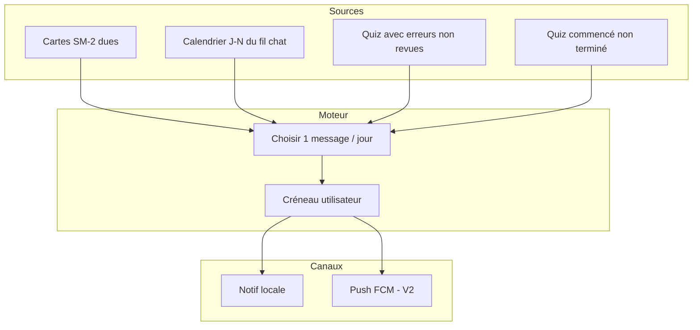

# Lucy — Rappels d’apprentissage + historique quiz (LEARN-12)

> **Statut** : **Proposition** (2026-06-10) — à valider avant implémentation  
> **Parent** : [SPEC.md](../SPEC.md) · [spec-learning-generation.md](./spec-learning-generation.md) · [spec-learning-composition-prep.md](./spec-learning-composition-prep.md)  
> **Prérequis livrés** : LEARN-01→11 (sessions, SM-2 cartes, calendrier J-N, points faibles quiz)

---

## 1. Objectif

### 1.1 Utilisateurs

| Persona | Besoin |
|---------|--------|
| **Apprenant** | Être **rappelé** au bon moment de réviser (cartes dues, plan J-N, quiz à reprendre) |
| **Apprenant** | Voir **l’historique** des quiz déjà faits (score, date) et mesurer ses progrès |
| **Apprenant** | Recevoir un message **actionnable** (« 5 cartes sur l’entropie »), pas un spam générique |
| **Produit** | Motiver **sans streak** ni gamification agressive (décision UI Motivant) |

### 1.2 Problème actuel

| Zone | État aujourd’hui |
|------|------------------|
| **Bibliothèque quiz** | Liste les **sessions générées** (contenu), pas les **passages** de l’élève |
| **Réponses quiz** | `selectedAnswers` en mémoire uniquement — **perdues** à la sortie de l’écran |
| **Score** | Calculé localement pendant la session — **non persisté** |
| **Rappels** | Aucune notification (pas de FCM, pas de notif locale) |
| **SM-2** | États cartes en **SharedPreferences** local — exploitable pour rappels mais pas branché |
| **Calendrier J-N** | Texte dans le chat — pas de rappel programmé |

Référence spec parente (hors MVP initial) :

> *« Progression session : optionnel MVP — stocker `userAnswers` côté client uniquement ; persistance progression = phase ultérieure. »* — [spec-learning-generation.md](./spec-learning-generation.md) §4.6

**LEARN-12** formalise cette phase ultérieure + les rappels associés.

---

## 2. Décisions produit (à valider)

| # | Sujet | Décision proposée |
|---|--------|-------------------|
| **R1** | Streak / compteur jours | **Non** — aligné spec UI Motivant |
| **R2** | Historique quiz | **Oui** — une session peut avoir **plusieurs tentatives** (rejouer le même QCM) |
| **R3** | Persistance tentative MVP | **Client d’abord** (SharedPreferences), API serveur en **V2** |
| **R4** | Rappels MVP | **In-app** + **notifications locales** (opt-in) ; FCM en V2 |
| **R5** | Contenu session | Inchangé — l’historique ne **régénère pas** le quiz ; on rejoue les mêmes items |
| **R6** | Cartes flashcards | Historique = états SM-2 déjà locaux ; rappels basés sur `dueAt` |
| **R7** | Fréquence rappels | Max **1 notification utile / jour** (priorisation) |
| **R8** | Opt-in | Rappels **désactivés par défaut** ; activation + créneau horaire dans Paramètres |

---

## 3. Historique des quiz (LEARN-12b)

### 3.1 Modèle `QuizAttempt`

```json
{
  "id": "attempt_abc",
  "sessionId": "learn_xyz",
  "startedAt": "2026-06-10T14:00:00.000Z",
  "completedAt": "2026-06-10T14:08:32.000Z",
  "scoreCorrect": 4,
  "scoreTotal": 5,
  "answers": [
    {
      "itemId": "item_1",
      "selectedIndex": 2,
      "correctIndex": 2,
      "isCorrect": true
    }
  ]
}
```

| Champ | Règle |
|-------|--------|
| `id` | UUID / `attempt_*` côté client en MVP |
| `sessionId` | Référence session existante (`GET /v1/learning-sessions/:id`) |
| `answers` | Snapshot au moment de la fin — permet points faibles même hors ligne |
| `completedAt` | Obligatoire pour apparaître dans l’historique |

**Tentative incomplète** (quitter avant la fin) : option MVP — sauvegarder brouillon `status: in_progress` pour proposer « Reprendre » ; sinon ignorer jusqu’à l’écran score.

### 3.2 Persistance — phases

| Phase | Stockage | Multi-appareil |
|-------|----------|----------------|
| **12b-MVP** | `SharedPreferences` — clé `quiz_attempts_{sessionId}` (liste JSON) + index `quiz_attempt_summaries` pour la bibliothèque | Non |
| **12b-V2** | Firestore `users/{uid}/learningSessions/{sessionId}/attempts/{attemptId}` via Nest | Oui |

Pattern à suivre : même approche que `FlashcardSm2PrefsDataSource` (LEARN-11c).

### 3.3 API backend (V2 uniquement)

| Méthode | Route | Body / réponse |
|---------|-------|----------------|
| `POST` | `/v1/learning-sessions/:sessionId/attempts` | Body `QuizAttempt` sans `uid` |
| `GET` | `/v1/learning-sessions/:sessionId/attempts` | Liste triée `completedAt` desc |
| `GET` | `/v1/learning-sessions?includeLastAttempt=true` | Enrichit la liste bibliothèque (optionnel) |

Garde : session doit exister et appartenir à `uid` ; **pas** de garde corpus sur GET (G4b inchangé).

### 3.4 UI bibliothèque quiz

Sur chaque tuile **quiz** :

| État | Affichage proposé |
|------|-------------------|
| Jamais joué | Comportement actuel (« Démarrer le quiz ») |
| Dernière tentative | Meta : **« 4/5 · hier »** (l10n) |
| Plusieurs tentatives | Tap long ou icône « historique » → liste des scores (V2) |

Écran score (fin de session) :

- Enregistrer automatiquement la tentative à l’affichage du récap
- CTA existant points faibles (LEARN-10a) inchangé

### 3.5 Critères d’acceptation — historique

- [ ] Terminer un quiz → tentative persistée avec score et réponses
- [ ] Quitter l’app et revenir → bibliothèque affiche le **dernier score**
- [ ] Rejouer le même quiz → **nouvelle** tentative ; historique conserve les précédentes
- [ ] Session flashcards : pas de `QuizAttempt` ; SM-2 reste la source de vérité
- [ ] l10n fr / en / de pour libellés score / historique
- [ ] Tests : service de persistance + notifier enregistre à `isComplete`

---

## 4. Rappels & motivation (LEARN-12a)

### 4.1 Sources de rappel (priorité décroissante)



| Source | Message exemple (FR) | Donnée |
|--------|----------------------|--------|
| SM-2 | « 8 cartes à revoir aujourd’hui » | `dueAt <= now` par session |
| J-N | « J-2 : révise les sections Entropie et ΔS » | Dernier plan chat parsé ou champ thread (V2) |
| Quiz erreurs | « 3 questions ratées au dernier quiz — 5 min de cartes ? » | Dernière `QuizAttempt` |
| Brouillon | « Tu n’as pas fini ton quiz Thermodynamique » | Tentative `in_progress` |

### 4.2 Paramètres utilisateur

Nouvelle section **Rappels** (Paramètres) :

| Réglage | Défaut |
|---------|--------|
| Activer les rappels | `false` |
| Heure du rappel | 18:00 (locale appareil) |
| Cartes dues | `true` |
| Plan de révision (J-N) | `true` si plan connu |
| Quiz / points faibles | `true` |

Stockage : `SharedPreferences` (clé `learning_reminder_prefs`) — pas de backend en MVP.

### 4.3 Phases techniques

| Phase | Livrable |
|-------|----------|
| **12a-MVP** | ~~Bandeau in-app~~ retiré (décision design) — rappels via notifs opt-in |
| **12a-M1** | `flutter_local_notifications` — planification quotidienne au créneau choisi |
| **12a-V2** | FCM + job serveur pour J-N multi-appareil |
| **12a-V3** | Export calendrier `.ics` depuis plan J-N (complément) |

**Hors scope** : SMS, appels téléphoniques, emails transactionnels (sauf décision produit ultérieure).

### 4.4 Critères d’acceptation — rappels

- [ ] Sans opt-in → **aucune** notif système
- [ ] Opt-in + cartes dues → notif locale au créneau avec nombre exact
- [ ] Max 1 notif / jour même si plusieurs sources
- [ ] Désactiver dans Paramètres → annulation des alarmes locales
- [ ] Pas de streak ni badge « jours consécutifs »
- [ ] l10n fr / en / de

---

## 5. Lien entre historique et rappels

| Lien | Comportement |
|------|--------------|
| Quiz raté | Historique alimente le message « points faibles » + CTA cartes (LEARN-10a) |
| Pas de quiz depuis N jours | Rappel doux « Reprends ton quiz Thermodynamique (dernier score 2/5) » — **N ≥ 3** configurable |
| Cartes après quiz | SM-2 + historique quiz = deux entrées distinctes ; priorité SM-2 si cartes dues |

---

## 6. Architecture Flutter (cible)

```
lib/features/quiz/
  data/datasources/quiz_attempt_prefs_data_source.dart
  domain/entities/quiz_attempt.dart
  services/quiz_attempt_service.dart
  services/learning_reminder_service.dart   # agrège SM-2 + attempts + prefs
lib/features/settings/
  presentation/pages/settings_reminders_page.dart
```

Flux : `QuizSessionNotifier` → à `isComplete` → `QuizAttemptService.recordAttempt()` → sync notifs locales si opt-in.

---

## 7. Architecture backend (V2 seulement)

```
learning-sessions/
  attempts/
    learning-session-attempts.controller.ts
    learning-session-attempts.service.ts
    quiz-attempt.types.ts
```

Firestore :

```
users/{uid}/learningSessions/{sessionId}/attempts/{attemptId}
```

Index : `completedAt` desc par session.

---

## 8. Plan d’implémentation proposé

| Id | Tâche | Dépend de |
|----|--------|-----------|
| **LEARN-12b-MVP** | Entité + prefs + enregistrement fin de quiz | — |
| **LEARN-12b-MVP** | Affichage dernier score bibliothèque | 12b-MVP |
| **LEARN-12a-MVP** | ~~Bandeau in-app~~ retiré — `LearningReminderService` pour notifs | 12b-MVP, SM-2 |
| **LEARN-12a-M1** | Page Paramètres rappels + notifs locales | 12a-MVP (service) |
| **LEARN-12b-V2** | API POST/GET attempts + sync | 12b-MVP |
| **LEARN-12a-V2** | FCM + plan J-N serveur | 12a-M1, chat thread metadata |

Ordre recommandé : **12b-MVP → 12a-MVP → 12a-M1 → V2**.

---

## 9. Frontières

### Toujours faire

- Respecter G4b : historique **par session** ; la session reste jouable même si corpus change
- Mapper erreurs en l10n
- Opt-in explicite pour notifications système

### Demander avant

- Gamification (badges, classements, streak)
- Partage score / export PDF
- Rappels email

### Ne jamais faire

- Streak obligatoire en style Motivant
- Régénérer un quiz à chaque tentative (coût LLM + perte comparabilité)
- Notifications sans plafond quotidien

---

## 10. Relation SPEC parent

Ajout proposé dans [SPEC.md](../SPEC.md) :

| Priorité | Brique | Statut |
|----------|--------|--------|
| **P4e** | Rappels + historique quiz (LEARN-12) | **Proposition** |

---

*Ce document a été créé avec Cursor (IA).*
