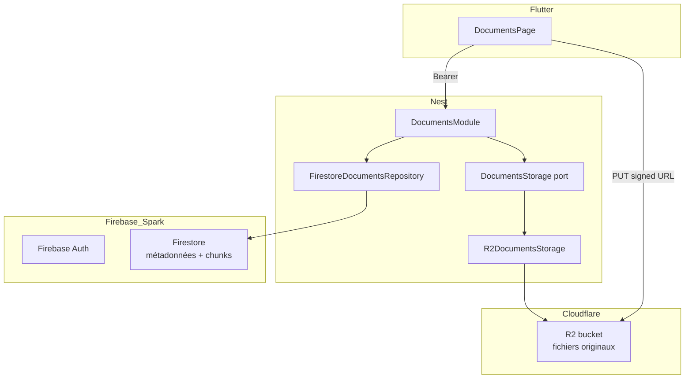

# Lucy — Stockage documents Cloudflare R2 (spec)

> **Statut** : **Validée** (2026-05-26 — implémentée backend R2-01…R2-05)  
> **Parent** : [SPEC.md](../SPEC.md) §3 · [docs/spec-documents-rag.md](./spec-documents-rag.md) §2.7  
> **Motivation** : Firebase **Cloud Storage** exige le plan **Blaze** (carte bancaire). **Cloudflare R2** offre un free tier (10 Go) sans billing Firebase pour les fichiers binaires.

---

## 1. Objectif

### 1.1 Utilisateurs

| Persona | Besoin |
|---------|--------|
| **Apprenant** | Upload / téléchargement de PDF, DOCX, txt, md **sans dépendre** de Firebase Storage |
| **Développeur** | Déployer en dev sans activer Blaze ; CORS web simple ; coûts egress nuls (R2) |
| **Produit** | **Aucun changement UX** Flutter — même flux signed URL + PUT + `complete` |

### 1.2 Problème

Aujourd’hui, `FirebaseDocumentsStorage` (Admin SDK GCS) est le provider par défaut dès que `FIRESTORE_PROVIDER=firebase`. Sans plan Blaze, le PUT client échoue ou le bucket est inaccessible → documents bloqués en `uploading` (`exists=false`).

### 1.3 Cible



**Décision R2-1** : R2 remplace **uniquement** le stockage binaire. **Firestore** (metadata, chunks, embeddings) et **Firebase Auth** restent inchangés (plan Spark OK).

### 1.4 Hors périmètre

- Migration automatique des objets déjà sur Firebase Storage (aucun doc `ready` en prod à ce jour).
- CDN Cloudflare devant R2 (URLs presignées suffisent).
- Workers / Durable Objects.
- Remplacement de Firestore ou Auth par Cloudflare.

---

## 2. Commandes

### 2.1 Prérequis Cloudflare (une fois)

1. Compte Cloudflare (gratuit).
2. Créer un bucket R2 (ex. `lucy-documents-dev`).
3. **API token** R2 : permissions *Object Read & Write* sur ce bucket.
4. Noter : `ACCOUNT_ID`, `ACCESS_KEY_ID`, `SECRET_ACCESS_KEY`, `BUCKET_NAME`.
5. Configurer **CORS** sur le bucket (dashboard R2 → Settings → CORS) :

Copier le contenu de [`backend/r2.cors.json`](../../backend/r2.cors.json) dans le dashboard (ou via Wrangler) :

```json
[
  {
    "AllowedOrigins": ["*"],
    "AllowedMethods": ["GET", "PUT", "HEAD", "OPTIONS"],
    "AllowedHeaders": ["*"],
    "ExposeHeaders": ["ETag"],
    "MaxAgeSeconds": 3600
  }
]
```

`OPTIONS` est **obligatoire** pour le preflight navigateur (Flutter web). Sans CORS R2, le PUT vers `*.r2.cloudflarestorage.com` échoue même si l’API Nest fonctionne.

> En production, restreindre `AllowedOrigins` aux domaines Lucy déployés.

### 2.2 Variables d’environnement backend

```bash
# backend/.env
STORAGE_PROVIDER=r2          # r2 | firebase (défaut firebase si absent — rétrocompat)
R2_ACCOUNT_ID=...
R2_ACCESS_KEY_ID=...
R2_SECRET_ACCESS_KEY=...
R2_BUCKET=lucy-documents-dev
# Optionnel — endpoint custom (défaut https://{R2_ACCOUNT_ID}.r2.cloudflarestorage.com)
# R2_ENDPOINT=...
```

Firestore / Auth inchangés :

```bash
FIRESTORE_PROVIDER=firebase
FIREBASE_AUTH_MODE=firebase
FIREBASE_PROJECT_ID=lucy-7504c
# FIREBASE_STORAGE_BUCKET — ignoré si STORAGE_PROVIDER=r2
```

### 2.3 Développement local

```bash
cd backend
npm install                    # ajoute @aws-sdk/client-s3, @aws-sdk/s3-request-presigner
STORAGE_PROVIDER=r2 npm run start:dev

cd frontend
flutter run -d chrome          # ou mobile — aucun changement code
```

### 2.4 Vérification manuelle CP-R2

```bash
# 1. Créer doc + récupérer uploadUrl
curl -s -X POST http://localhost:3001/v1/documents \
  -H "Authorization: Bearer $TOKEN" \
  -H "Content-Type: application/json" \
  -d '{"title":"Test R2","fileName":"a.pdf","mimeType":"application/pdf","byteSize":1234}'

# 2. PUT binaire vers uploadUrl
# 3. POST complete
# 4. Vérifier objet dans dashboard R2 + logs Nest isObjectPresent ok
```

### 2.5 Tests automatisés

```bash
cd backend && npm test
cd frontend && flutter analyze && flutter test test/features/documents/
```

---

## 3. Structure projet

### 3.1 Backend (Nest)

```
backend/src/
  core/config/
    lucy-config.ts                    # + storageProvider, r2* fields
  features/documents/
    storage/
      documents-storage.port.ts       # inchangé (contrat)
      firebase-documents.storage.ts   # conservé (fallback / prod legacy)
      r2-documents.storage.ts         # NOUVEAU
      in-memory-documents.storage.ts  # tests (inchangé)
      r2-documents.storage.spec.ts    # NOUVEAU
    documents.module.ts               # factory STORAGE_PROVIDER
```

### 3.2 Frontend (Flutter)

**Aucun fichier métier à modifier** — le client consomme déjà `{ uploadUrl, expiresAt }` et fait un `PUT` Dio.

Fichiers documentation uniquement :

```
frontend/docs/spec-storage-r2.md      # ce document
frontend/storage.cors.json            # obsolète pour R2 — note dans README backend
```

### 3.3 Dépendances npm (backend)

| Package | Rôle |
|---------|------|
| `@aws-sdk/client-s3` | Client S3-compatible vers endpoint R2 |
| `@aws-sdk/s3-request-presigner` | URLs presignées PUT / GET |

Pas de SDK Cloudflare propriétaire requis (API S3).

---

## 4. Style de code

| Règle | Application |
|-------|-------------|
| **Port `DocumentsStorage`** | `R2DocumentsStorage` implémente les 6 méthodes existantes sans changer la signature |
| **Chemins objet** | Conserver `users/{uid}/documents/{docId}/original.{ext}` (`buildDocumentStoragePath`) — portable GCS/R2 |
| **Logs** | Même format que `FirebaseDocumentsStorage` : `[R2DocumentsStorage] isObjectPresent ok/miss/failed` |
| **Secrets** | Uniquement via `LucyConfig` / `.env` — jamais en dur |
| **Erreurs** | Pas de fuite credentials ; échecs R2 → logs serveur + codes API existants (`DOCUMENT_UPLOAD_NOT_READY`, etc.) |
| **Factory module** | `STORAGE_PROVIDER` **indépendant** de `FIRESTORE_PROVIDER` (Firestore firebase + Storage r2) |
| **Mémoire dev** | `FIRESTORE_PROVIDER=memory` continue d’utiliser `InMemoryDocumentsStorage` (tests sans R2) |

---

## 5. Stratégie de tests

### 5.1 Backend unitaires

| Fichier | Cas |
|---------|-----|
| `r2-documents.storage.spec.ts` | Mock `@aws-sdk/client-s3` : presign PUT/GET, `HeadObject` (isObjectPresent), `GetObject` range (detectMime), `DeleteObject`, `GetObject` full (download) |
| `documents.module.spec.ts` | `STORAGE_PROVIDER=r2` injecte `R2DocumentsStorage` |
| `lucy-config.spec.ts` | Parsing env `STORAGE_PROVIDER`, validation champs R2 requis si `r2` |
| Flux existants (`documents.d1-flow`, `d2-flow`) | Continuent avec `InMemoryDocumentsStorage` — pas de régression |

### 5.2 Backend intégration (optionnel phase 2)

- Test manuel CP-R2 avec bucket dev réel (checklist §2.4).
- Pas de test CI contre R2 live (credentials).

### 5.3 Frontend

- **Aucun nouveau test** si l’API `{ uploadUrl, expiresAt }` reste identique.
- Tests existants `documents_api_remote_data_source_test.dart` inchangés.

### 5.4 Critères DoD tests

- `npm test` : 100 % suites vertes.
- Au moins 1 test par méthode publique de `R2DocumentsStorage`.

---

## 6. Frontières (boundaries)

### 6.1 Toujours faire

- Valider `STORAGE_PROVIDER=r2` → exiger `R2_ACCOUNT_ID`, `R2_ACCESS_KEY_ID`, `R2_SECRET_ACCESS_KEY`, `R2_BUCKET` au boot (fail fast).
- Presigned PUT : inclure contrainte `Content-Type` = `mimeType` déclaré (aligné Firebase v4).
- TTL URLs : **15 min** (`UPLOAD_URL_TTL_MS` existant).
- Retries `isObjectPresent` : **200, 500, 1000 ms** (C2 spec RAG).
- Bucket **privé** — accès client uniquement via URLs presignées (C7).

### 6.2 Demander avant

- Changer le format `storagePath` ou la structure bucket.
- Supprimer `FirebaseDocumentsStorage` (garder pour rollback / clients Blaze).
- Exposer R2 via domaine custom public.
- Migrer des fichiers existants Firebase → R2.

### 6.3 Ne jamais faire

- Stocker clés R2 dans le repo git ou le frontend.
- Bypass du port `DocumentsStorage` (upload multipart direct Nest — hors spec).
- Accès Firestore/Storage direct depuis Flutter.
- Coupler `STORAGE_PROVIDER` à `FIRESTORE_PROVIDER=memory` pour E2E Firebase (memory storage OK seulement pour tests unitaires).

---

## 7. Décisions techniques

| ID | Décision |
|----|----------|
| **R2-1** | Provider **`STORAGE_PROVIDER`** : `r2` \| `firebase` (défaut `firebase` si unset). |
| **R2-2** | SDK **AWS S3** + endpoint R2 `https://{accountId}.r2.cloudflarestorage.com`. |
| **R2-3** | Presign **PutObject** (upload) et **GetObject** (download) — pas de POST multipart. |
| **R2-4** | `isObjectPresent` via **HeadObject** ; taille doit égaler `expectedByteSize`. |
| **R2-5** | `detectMimeType` via **GetObject** `Range: bytes=0-15` + `detectMimeFromBytes` existant. |
| **R2-6** | Frontend **inchangé** ; contrat API Nest inchangé. |
| **R2-7** | `.env.example` + `backend/README.md` documentent R2 ; `storage.cors.json` (GCS) marqué legacy. |
| **R2-8** | Plan d’implémentation découpé en tickets **R2-01 … R2-06** (voir §9). |

---

## 8. Critères d’acceptation

- [ ] `STORAGE_PROVIDER=r2` + credentials valides → upload web **200 PUT** visible dans dashboard R2.
- [ ] `complete` → `isObjectPresent ok` → `processing` → `ready` (pipeline ingestion inchangé).
- [ ] `GET …/download` → URL presignée GET fonctionnelle.
- [ ] `DELETE` supprime objet R2 + doc Firestore.
- [ ] Sweeper `uploading` > 24 h supprime objet R2 orphelin.
- [ ] `STORAGE_PROVIDER=firebase` (ou unset) → comportement actuel préservé.
- [ ] `FIRESTORE_PROVIDER=memory` → `InMemoryDocumentsStorage` (tests sans R2).
- [ ] Boot échoue avec message clair si `r2` sans credentials.
- [ ] `npm test` + `flutter test test/features/documents/` verts.

---

## 9. Plan d’implémentation

| Id | Tâche | Estimation |
|----|-------|------------|
| **R2-01** | `LucyConfig` : `storageProvider`, champs R2, validation boot | 2 h |
| **R2-02** | `R2DocumentsStorage` (6 méthodes port) + deps npm | 4 h |
| **R2-03** | `documents.module.ts` factory `STORAGE_PROVIDER` | 1 h |
| **R2-04** | Tests unitaires R2 + config | 3 h |
| **R2-05** | README / `.env.example` / checklist CP-R2 | 1 h |
| **R2-06** | Validation manuelle web + mobile, marquer spec **Validée** | 2 h |

**Total estimé** : ~1,5 jour.

---

## 10. Hypothèses et questions ouvertes

### Hypothèses (implémentation par défaut si pas de réponse)

| # | Hypothèse |
|---|-----------|
| H1 | Aucun document `ready` sur Firebase Storage à migrer. |
| H2 | Un seul bucket R2 par environnement (dev / prod). |
| H3 | CORS R2 `AllowedOrigins: ["*"]` acceptable en dev. |
| H4 | Défaut reste `firebase` pour rétrocompat ; Lucy dev bascule `.env` → `r2`. |

### Questions pour validation (répondre avant implémentation)

1. **Compte Cloudflare** : as-tu déjà un compte + bucket R2 créé, ou faut-il inclure un guide pas-à-pas dans le README ?
2. **Environnements** : un bucket `lucy-documents-dev` + un `lucy-documents-prod` plus tard — OK ?
3. **Défaut provider** : préfères-tu `STORAGE_PROVIDER=r2` par défaut en dev (`lucy-config`) ou explicite dans `.env` seulement ?
4. **Firebase Storage** : on **garde** `FirebaseDocumentsStorage` pour rollback, ou on le retire après R2 validé ?

---

*Ce document a été créé avec Cursor (IA).*
