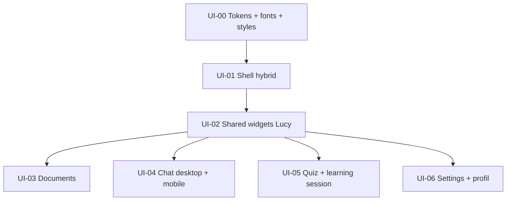

# Lucy — Refonte UI post-login (spec)

> **Statut** : **Validée** — plan détaillé dans [tasks/plan.md](../tasks/plan.md)  
> **Sources design** : `Lucy Design System.dc.html`, `Lucy Prototype v3.dc.html` (desktop), `Lucy Prototype v4.dc.html` (mobile)  
> **Parent** : [SPEC.md](../SPEC.md)  
> **Suivi tâches** : [tasks/todo.md](../tasks/todo.md)

---

## 1. Objectif

### 1.1 Utilisateurs

| Persona | Besoin |
|---------|--------|
| **Apprenant** | Une expérience cohérente, chaleureuse et « tuteur IA » après connexion — pas une UI générique Material/telC |
| **Apprenant** | Desktop : navigation latérale riche (sidebar design system) ; mobile : bottom nav + drawer conversations (V4) |
| **Apprenant** | Choisir un **style d’interface** (Académique par défaut, Premium sombre, Motivant) dans Paramètres |
| **Développeur** | Refonte **écran par écran**, sans casser la logique métier (notifiers, repositories, routes) |

### 1.2 Problème

L’UI post-login actuelle repose sur un shell hérité de telC (`animated_bottom_navigation_bar`, `LucySidebar` minimal, palette `#1E3D6F` / vert Material). Les maquettes V3/V4 définissent une identité Lucy distincte (palette `#2E4C8A`, fond crème `#F4F0E8`, titres Newsreader, rail/sidebar, bulles chat, cartes sources, hub quiz).

### 1.3 Cible

Refonte **visuelle et structurelle** de tout le parcours **après authentification** :

- Shell + 4 onglets (Documents, Chat, Quiz, Paramètres)
- Sous-écrans Settings (profil, AI config, mot de passe, domaines apprenant)
- Sessions Quiz / Learning
- **Hors périmètre** : pages auth (login, signup, reset), splash, onboarding chat (design inchangé sauf harmonisation tokens si nécessaire plus tard)

### 1.4 Références design

| Version | Rôle | Patterns clés |
|---------|------|----------------|
| **Design System** | Tokens, composants, sidebar desktop | Seeds Flex, typo, boutons, chips, champ message |
| **V3** | **Desktop** (≥ 1024 px) | Rail 88 px **ou** sidebar pleine (design system) ; chat master-detail (liste fils 300 px + conversation) ; documents grille 2 colonnes ; titres Newsreader 26 px |
| **V4** | **Mobile** (&lt; 600 px) | Bottom nav 4 onglets ; drawer gauche pour fils chat ; app bar contextuelle ; documents liste 1 colonne ; cartes quiz entièrement cliquables |

**Décision navigation (validée)** : **hybride** — desktop = sidebar design system ; mobile = bottom nav V4 + drawer conversations.

**Décision styles (validée)** : **Académique** par défaut ; **Premium sombre** et **Motivant** sélectionnables dans Paramètres (persistés localement).

**Décision typo (validée)** : pile complète — **Bricolage Grotesque** (marque), **Newsreader** (titres éditoriaux), **Hanken Grotesk** (UI), **JetBrains Mono** (pages, meta, progression quiz).

### 1.5 Valeur vs état actuel

| Avant | Après |
|-------|--------|
| Shell telC générique | Shell Lucy branded desktop/mobile |
| `colorScheme` seeds anciennes | Palette design system (#2E4C8A, #159A8B, #E5933C, #CE3A4E) |
| Chat / docs / quiz fonctionnels mais UI Material | Composants dédiés (bulles Lucy, cartes source, chips corpus) |
| Clair/sombre système uniquement | + 3 ambiances interface utilisateur |

---

## 2. Commandes

### 2.1 Développement

```bash
cd lucy_frontend
flutter pub get
dart run build_runner build --delete-conflicting-outputs
flutter analyze
flutter test
```

### 2.2 Fonts (à ajouter au `pubspec.yaml`)

```bash
# Option A — google_fonts (recommandé MVP, pas de fichiers .ttf versionnés)
flutter pub add google_fonts

# Option B — assets locaux dans assets/fonts/ (si offline strict)
# Télécharger depuis Google Fonts et déclarer dans pubspec
```

### 2.3 Vérification visuelle

```bash
flutter run -d chrome          # desktop + responsive
flutter run -d <device_id>     # mobile drawer / bottom nav
```

Checklist manuelle par slice : [tasks/plan-ui-redesign.md](../tasks/plan-ui-redesign.md) § Checkpoints.

---

## 3. Structure projet

### 3.1 Fichiers à créer

```
lib/core/theme/
  lucy_typography.dart          # TextTheme Newsreader + Hanken + Mono
  lucy_interface_style.dart     # enum Academic | PremiumDark | Motivant
  lucy_theme_extensions.dart    # couleurs sémantiques (rail, lucy bubble, teal chip…)
  lucy_theme_provider.dart      # Riverpod : brightness + interfaceStyle → ThemeData

lib/core/shell/
  lucy_bottom_nav.dart          # V4 — remplace AnimatedBottomNavigationBar
  lucy_desktop_sidebar.dart     # Design system — remplace LucySidebar
  lucy_chat_threads_panel.dart  # Desktop : colonne fils (V3)
  lucy_conversations_drawer.dart # Mobile : drawer V4

lib/shared/widgets/lucy/
  lucy_avatar.dart              # Lucy ✦ gradient + pulse typing
  lucy_brand_mark.dart            # Logo L + étoile
  lucy_primary_button.dart
  lucy_secondary_button.dart
  lucy_chip.dart                  # corpus actif, statut doc, type quiz
  lucy_source_card.dart           # citation chunk (chat + quiz)
  lucy_message_bubble.dart
  lucy_composer.dart              # champ message + bouton send
  lucy_segmented_control.dart     # clair/sombre, langue
  lucy_interface_style_picker.dart
  lucy_document_card.dart
  lucy_quiz_hub_card.dart
  lucy_empty_state.dart

lib/core/localization/
  lucy_interface_style_storage.dart  # SharedPreferences (existe partiellement pour locale)
```

### 3.2 Fichiers à modifier (par slice)

| Slice | Fichiers principaux |
|-------|---------------------|
| Tokens | `lucy_colors.dart`, `lucy_flex_theme.dart`, `app.dart` |
| Shell | `lucy_app_shell.dart`, `lucy_sidebar.dart` (déprécier / remplacer) |
| Documents | `documents_page.dart`, widgets liste/upload |
| Chat | `chat_page.dart`, widgets messages/sources/liste fils |
| Quiz | `quiz_page.dart`, `learning_session_page.dart`, `chat_learning_session_card.dart` |
| Settings | `settings_page.dart`, `settings_profile_page.dart`, sous-pages |

### 3.3 Flux architecture (inchangé)

```
UI (widgets Lucy) → Notifier → Service → Repository
```

La refonte ne modifie **pas** les contrats API ni la logique Riverpod existante sauf ajout du provider thème/style.

---

## 4. Style de code

### 4.1 Tokens et couleurs

| Règle | Détail |
|-------|--------|
| Couleurs hex | **Uniquement** dans `lucy_colors.dart` et `lucy_theme_extensions.dart` |
| Widgets feature | `Theme.of(context)`, `colorScheme`, extensions — **pas** de `Color(0x…)` en dur |
| Rayons / espacements | `lib/core/constants/lucy_spacing.dart` (nouveau) — alignés maquettes (10–14 px cartes, 999 px pills) |
| Typo | `Theme.of(context).textTheme` + rôles nommés (`displayEditorial`, `labelMono`) via extension |

### 4.2 Palette design system → FlexColorScheme

| Token design | Hex | Rôle Flex |
|--------------|-----|-----------|
| Primary | `#2E4C8A` | `primary` |
| Secondary | `#159A8B` | `secondary` (succès, teal chips) |
| Tertiary | `#E5933C` | `tertiary` (accent, avatar user) |
| Error | `#CE3A4E` | `error` |
| Background clair | `#F4F0E8` | `surfaceContainerLowest` / scaffold custom |
| Surface | `#FFFFFF` | `surface` |
| Ink | `#1B2336` | `onSurface` |
| Rail desktop | `#22315C` | extension `LucyColors.rail` |

### 4.3 Styles d’interface

| Style | Clair | Sombre | Spécificités |
|-------|-------|--------|--------------|
| **Académique** (défaut) | Fond crème, Newsreader titres | Variante dark tokens V3 | Chips bleu/gris |
| **Premium sombre** | Variante **clair** dédiée (bleu-gris adouci) | Fond `#0F1320`, glow Lucy | Accent néon teal sur avatar Lucy ; clair/sombre indépendants du style |
| **Motivant** | Fond chaud `#FBEEDD` accents | Variante dark chaude | **Pas** de badge streak / compteur jours |

Persistance : `SharedPreferences` clé `lucy_interface_style` + `lucy_brightness` (ou `ThemeMode`).

### 4.4 l10n

- Tous les libellés UI via ARB (`context.l10n.*`)
- Nouvelles clés : noms des 3 styles, empty states, suggestions chat, libellés chips corpus

### 4.5 Responsive

| Breakpoint | Comportement |
|------------|--------------|
| &lt; 600 px | Mobile V4 : bottom nav, drawer chat, pas de colonne fils permanente |
| 600–1024 px | Sidebar repliable (hamburger) — comportement actuel conservé |
| ≥ 1024 px | Sidebar permanente design system ; chat master-detail V3 |

---

## 5. Stratégie de tests

### 5.1 Automatisés

| Type | Cible |
|------|--------|
| **Widget tests** | `LucyBottomNav` (index actif), `LucySourceCard`, `LucyInterfaceStylePicker`, `LucyDocumentCard` (toggle) |
| **Golden tests** (optionnel slice 2+) | Bulle Lucy + carte source en Académique clair |
| **Provider tests** | `lucyThemeProvider` : défaut Académique ; changement style persiste |
| **Router tests** | Inchangés — shell paths toujours valides |
| **Régression** | `flutter analyze` + tests existants chat/settings/documents verts après chaque slice |

### 5.2 Manuel (par checkpoint)

- Desktop Chrome : sidebar, chat 2 colonnes, documents grille
- Mobile simulateur : bottom nav, drawer conversations, composer fixe bas
- Basculer les 3 styles + clair/sombre dans Paramètres
- fr / en / de : pas de débordement texte
- Accessibilité : contrastes chips, taille touch 44 px min mobile

---

## 6. Boundaries

### 6.1 Toujours faire

- Conserver Clean Architecture et flux Notifier → Service → Repository
- Mapper palette design system sur FlexColorScheme (pas de thème parallèle ad hoc)
- Implémenter **slice par slice** avec PR/revue intermédiaire
- Réutiliser widgets `lib/shared/widgets/lucy/` dans toutes les features
- Desktop = V3 patterns ; mobile = V4 patterns
- Style Académique livré en premier ; picker 3 styles dans Settings dès slice tokens

### 6.2 Demander avant

- Supprimer `animated_bottom_navigation_bar` ou fichiers shell existants
- Modifier routes GoRouter ou ordre des onglets
- Ajouter backend pour streak / gamification Motivant
- Changer auth/onboarding design
- Remplacer les emojis nav par des icônes Material (décision produit : **emojis conservés**)

### 6.3 Ne jamais faire

- Couleurs, URLs, routes en dur dans les widgets feature
- Texte utilisateur en dur (hors tests)
- Bypass repository depuis l’UI
- Big-bang refonte de tous les écrans en un seul PR
- Casser les tests CI existants sans les mettre à jour

---

## 7. Découpage vertical (ordre recommandé)



| Id | Livrable utilisateur testable |
|----|------------------------------|
| **UI-00** | App post-login avec nouvelle palette + polices ; Académique par défaut |
| **UI-01** | Navigation desktop sidebar + mobile bottom nav V4 |
| **UI-02** | Bibliothèque composants (Storybook manuel ou page dev) |
| **UI-03** | Onglet Documents conforme maquette |
| **UI-04** | Chat : master-detail desktop, drawer mobile, bulles + sources |
| **UI-05** | Hub quiz + session QCM + carte chat learning |
| **UI-06** | Paramètres : picker 3 styles, profil, logout |

---

## 8. Questions résolues

| Question | Réponse |
|----------|---------|
| Périmètre | Tout post-login, y compris settings/profil existants |
| Auth / onboarding | Hors refonte layout ; **thème global** OK (couleurs/polices) |
| V3 vs V4 | Desktop V3 + mobile V4 (hybride) |
| Styles interface | 3 choix ; Académique défaut ; réglage Settings |
| Premium sombre + clair | Variante claire dédiée (pas de forçage dark) |
| Typo | 4 polices (`google_fonts`) |
| Streak Motivant | **Retiré** — pas de compteur |
| Emojis | **Oui** — alignés maquettes |
| Bottom nav | **Widget custom** V4 ; package `animated_bottom_navigation_bar` retiré |
| Ordre écrans | Documents → Chat → Quiz → Settings |
| Ordre slices | CP-UI-1 → CP-UI-6 (tokens d’abord) |

---

## 9. Prochaine étape

Implémentation **CP-UI-1** (UI-01a → UI-01f) — voir [tasks/plan.md](../tasks/plan.md).

---

*Ce document a été créé avec Cursor (IA).*
