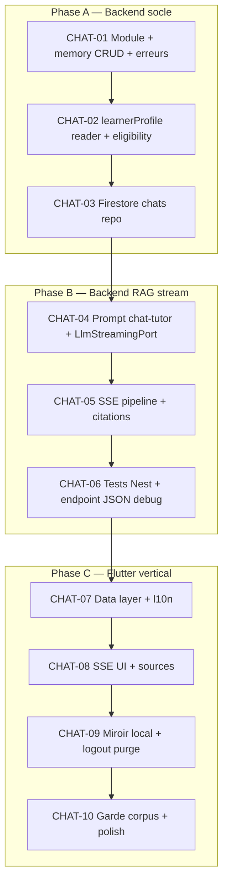

# Plan — Chat source-based (P4a)

> **Plan mode** — pas de modification de code applicatif dans ce document.  
> **Spec** : [SPEC.md](../SPEC.md) §6, [docs/spec-chat-rag.md](../docs/spec-chat-rag.md) (validée 2026-05-27).  
> **Prérequis livrés** : shell P0, auth, onboarding (`learnerProfile` sur `users/{uid}`), documents D1–D2, retrieval D3.

**Documents RAG (terminé)** : voir historique [tasks/todo.md](./todo.md) DOC-01→DOC-14 et [docs/spec-documents-rag.md](../docs/spec-documents-rag.md).

---

## 1. Objectif

Livrer l’onglet **Chat** : plusieurs fils persistés, réponses Lucy **streaming (SSE)** ancrées sur les docs **actifs** (`searchEnabled`), **sources** UI soignées, personnalisation via **`learnerProfile`** onboarding, miroir **SharedPreferences**, garde « activer vos documents ».

**Hors scope** : Quiz (D4b), streaming remplacé par JSON en prod, Firestore SDK Flutter, génération de quiz dans le chat.

**Arbitrages intégrés** : [docs/spec-chat-rag.md](../docs/spec-chat-rag.md) §12 (sync entrée fil, 409 stream, 100 msgs, états UI, A5-D tool calling).

### Git (frontend)

| Élément | Valeur |
|---------|--------|
| **Branche de travail** | `feature/chat-p4a` |
| **Cible PR** | `main` |
| **Dépôt** | `Lucy/lucy_frontend` (seul dépôt git du projet aujourd’hui) |
| **Backend** | Dépôt `Lucy/backend/` — branche **`feature/chat-p4a`** (même nom que frontend) |

```bash
# Frontend
cd lucy_frontend
git checkout feature/chat-p4a
git push -u origin feature/chat-p4a
gh pr create --base main --title "feat(chat): P4a frontend" --body "…"

# Backend
cd ../backend
git checkout feature/chat-p4a
git add -A && git commit -m "feat(chat): …"
git push -u origin feature/chat-p4a
gh pr create --base main --title "feat(chat): P4a backend" --body "…"
```

**Deux PRs** (repos séparés) ou un monorepo futur — jusqu’alors aligner les merges sur `main` des deux côtés.

---

## 2. État actuel vs cible

| Zone | Actuel | Cible |
|------|--------|--------|
| `ChatPage` | `LucyUnderDevelopmentPage` | Liste fils + conversation (master-detail desktop) |
| Backend `/v1/chats` | Absent | CRUD fils + messages + `eligibility` |
| Backend stream | Absent | `POST …/messages/stream` (SSE) |
| LLM chat | `generateStructured` onboarding only | `LlmStreamingPort` + citations post-flux |
| Prompts | `onboarding-*.md/hbs` | `chat-tutor.system.hbs` + user prompt builder |
| Profil apprenant | Firestore `learnerProfile` (écrit onboarding) | Lu par ChatModule à chaque message |
| Flutter cache chat | Absent | `lucy_chat_mirror_{uid}` SharedPreferences |
| `ApiEndpoints` | Pas de `chats` / `retrieval` | `chats`, `chatMessagesStream`, `chatEligibility` |
| `RetrievalModule` | N’exporte pas `RetrievalService` | Export pour `ChatModule` |

---

## 3. Graphe de dépendances



**Principe vertical** : chaque tâche est testable seule (memory avant Firestore ; mock stream avant Gemini réel en e2e).

---

## 4. Checkpoints (revue humaine)

| Checkpoint | Après | Validation manuelle |
|------------|-------|---------------------|
| **CP-CHAT-1** | CHAT-06 | `curl` SSE : token Firebase → créer fil → stream message → `text_delta` + `sources` + `done` ; profil `step_by_step` visible dans logs/prompt test |
| **CP-CHAT-2** | CHAT-08 | App : 2 fils, stream visible, cartes sources ; 0 doc actif → bannière (peut être finalisé CP-CHAT-3) |
| **CP-CHAT-3** | CHAT-10 | Kill app → fils depuis cache ; logout → cache vidé ; « fais un quiz » → message orientation ; `npm test` + `flutter test` verts |

---

## 5. Phase A — Backend socle

### CHAT-01 — Module chat + CRUD memory

| | |
|--|--|
| **Dépend de** | D3 retrieval livré |
| **Fichiers** | `backend/src/features/chat/**`, `lucy-error-codes.ts` (`CHAT_*`), `app.module.ts` |

**Livrable**

- `ChatModule`, `ChatController` avec `FirebaseAuthGuard` sur toutes les routes
- `InMemoryChatsRepository` : `users/{uid}/chats` + messages
- `GET /v1/chats`, `POST /v1/chats`, `GET /v1/chats/:id/messages`
- DTOs + validation body message (1–4000 car.)
- `404 CHAT_NOT_FOUND` si mauvais `chatId` / `uid`

**AC**

- [ ] Tests : list/create/get messages ; isolation `uid` (user A ne lit pas fil B)
- [ ] `npm test -- chat` vert

**Vérification**

```bash
cd backend && npm test -- chat
```

---

### CHAT-02 — `learnerProfile` + eligibility

| | |
|--|--|
| **Dépend de** | CHAT-01 |
| **Fichiers** | `users` repo extension ou `chat/services/learner-profile.reader.ts`, `GET /v1/chats/eligibility` |

**Livrable**

- Port/adapter lit `users/{uid}` : `learnerProfile`, `isConfigured`
- `GET /v1/chats/eligibility` → `{ canChat, activeDocumentCount }` (`canChat` = ≥1 doc `ready` + `searchEnabled`)
- Helper garde : `assertLearnerProfile(uid)` → `409 CHAT_LEARNER_PROFILE_MISSING`
- Helper garde : `assertActiveDocuments(uid)` → `409 CHAT_NO_ACTIVE_DOCUMENTS` (réutilise `DocumentsRepository.list`)

**AC**

- [ ] Tests : eligibility true/false ; profile missing → 409
- [ ] Pas d’exposition `learnerProfile` dans réponse publique eligibility (optionnel count seulement)

---

### CHAT-03 — Repository Firestore chats

| | |
|--|--|
| **Dépend de** | CHAT-02 |
| **Fichiers** | `firestore-chats.repository.ts`, factory module (memory \| firestore), `firestore.indexes.json` si tri `updatedAt` |

**Livrable**

- `FirestoreChatsRepository` : paths `users/{uid}/chats/{chatId}/messages/{messageId}`
- Factory comme `documents.module`
- Index composite si requis pour `orderBy updatedAt`

**AC**

- [ ] Tests memory inchangés ; test intégration firestore optionnel ou e2e manuel documenté
- [ ] **CP-CHAT-1** partiel : CRUD via API locale Firestore

---

## 6. Phase B — Backend RAG + streaming

### CHAT-04 — Prompt + port streaming LLM

| | |
|--|--|
| **Dépend de** | CHAT-03 |
| **Fichiers** | `prompts/chat-tutor.system.hbs`, `prompt-loader.service.ts`, `core/llm/llm-streaming.port.ts`, `gemini.llm-streaming.adapter.ts`, `mock.llm-streaming.adapter.ts` |

**Livrable**

- `PromptLoaderService.getChatTutorSystemPrompt(learnerProfile)` (Handlebars)
- `LlmStreamingPort.streamText(...)` → `AsyncIterable<string>`
- Mock émet 3–5 deltas fixes pour tests
- `RetrievalModule` **exporte** `RetrievalService`

**AC**

- [ ] Test unitaire : prompt contient `explanation_style` / `feedback_tone` du fixture profile
- [ ] Test mock stream : concat deltas = texte attendu

---

### CHAT-05 — Pipeline SSE complet

| | |
|--|--|
| **Dépend de** | CHAT-04 |
| **Fichiers** | `chat-rag.service.ts`, `chat-stream.service.ts`, `chat.controller.ts` (`POST …/messages/stream`) |

**Livrable**

- Pipeline §4.4 spec : profile → garde docs → save user → retrieval → stream text → citations structurées → save assistant → events SSE
- Events : `user_message`, `text_delta`, `sources`, `done`, `error`
- Titre fil auto (troncature 1er message user, option)
- `excerpt` sources max ~300 car.

**AC**

- [ ] Test e2e/memory : séquence events complète avec Mock stream + Mock structured citations
- [ ] Garde C5 : 409 JSON **avant** SSE si 0 doc actif
- [ ] Retrieval vide : stream OK, `sources: []`
- [ ] Consigne quiz dans prompt (pas de génération quiz)

**Vérification manuelle (début CP-CHAT-1)**

```bash
# Créer fil + stream (adapter URL/token à votre env)
curl -N -X POST "http://localhost:3001/v1/chats/{chatId}/messages/stream" \
  -H "Authorization: Bearer $TOKEN" \
  -H "Content-Type: application/json" \
  -d '{"content":"Explique le chapitre 2"}'
```

---

### CHAT-06 — Endpoint JSON debug + tests consolidation

| | |
|--|--|
| **Dépend de** | CHAT-05 |
| **Fichiers** | `POST /v1/chats/:id/messages` (non-stream), `DELETE /v1/chats/:id` (MVP+), specs auth |

**Livrable**

- `POST …/messages` même logique sans SSE (tests uniquement)
- `DELETE` fil + messages (cascade) ; **409** si stream actif
- `CHAT_STREAM_IN_PROGRESS` ; SSE ping 15 s ; `status` message assistant
- Test `FirebaseAuthGuard` : sans Bearer → 401 sur stream
- Gemini tool calling + fallback citations (§12 spec)

**AC**

- [ ] `npm test -- chat` vert
- [ ] **CP-CHAT-1** checklist complète (doc `docs/cp-chat-manual-checklist.md` à créer à l’implémentation)

---

## 7. Phase C — Flutter

### CHAT-07 — Data layer + l10n

| | |
|--|--|
| **Dépend de** | CP-CHAT-1 (backend stream stable) |
| **Fichiers** | `lib/features/chat/data/**`, `domain/**`, `services/chat_service.dart`, `api_endpoints.dart`, `*.arb`, `chat_error_translator.dart` |

**Livrable**

- Freezed : `ChatThread`, `ChatMessage`, `ChatSource`
- Remote : list/create threads, get messages, eligibility
- l10n toutes clés §4.7 spec + UI (titres, sources, offline, no corpus, default title)
- `ChatRepository` + providers Riverpod

**AC**

- [ ] Tests mapper / repository fake
- [ ] `flutter analyze` sans erreur sur feature chat

---

### CHAT-08 — SSE client + UI conversation

| | |
|--|--|
| **Dépend de** | CHAT-07 |
| **Fichiers** | `chat_stream_remote_datasource.dart`, `chat_conversation_notifier.dart`, widgets bulles + `chat_source_card.dart`, `chat_page.dart` |

**Livrable**

- Parse SSE (`dio` + transform ou client dédié)
- Notifier : états `sending`, `streaming`, `completed`, `error` ; append `text_delta` à bulle Lucy
- Afficher `ChatSourceCard` après event `sources`
- Réutiliser `LucyChatConstants` / `LucyAvatar` (shared ou chat widgets)
- Master-detail : liste fils + panneau conversation ; route `/chat` et option `/chat/:chatId`
- Indicateur frappe pendant stream

**AC**

- [ ] Widget test : `ChatSourceCard` avec titre/pages/extrait
- [ ] Test notifier : deltas agrégés → contenu final
- [ ] **CP-CHAT-2** partiel : stream + sources en UI

---

### CHAT-09 — Miroir SharedPreferences

| | |
|--|--|
| **Dépend de** | CHAT-08 |
| **Fichiers** | `chat_local_mirror.dart`, `chat_local_mirror_prefs_data_source.dart`, `chat_local_mirror_keys.dart`, intégration notifiers + `auth` logout |

**Livrable**

- Clé `lucy_chat_mirror_{uid}` ; pas de `learnerProfile` dans le JSON
- Hydratation UI au mount ; resync GET après lecture cache
- Debounce écriture pendant stream (~150 ms) ; max **100** msgs/fil en miroir
- **Sync à l’entrée fil** : GET messages remplace cache fil (§12.1)
- `AuthService.signOut` (ou listener) → `removeMirror(uid)`
- Bannière `chatOfflineBanner` si pas de réseau

**AC**

- [ ] Test round-trip prefs
- [ ] Test : après `writeMirror`, notifier expose threads sans attendre API

---

### CHAT-10 — Garde corpus + finition + CP-CHAT-3

| | |
|--|--|
| **Dépend de** | CHAT-09 |
| **Fichiers** | `chat_no_corpus_banner.dart`, eligibility dans page, tests intégration, `docs/cp-chat-manual-checklist.md` |

**Livrable**

- Si `!canChat` : désactiver envoi + CTA navigation Documents (`go_router`)
- `LucyConversationStatus` / pattern `AFEmptyState` : loading, empty, error, offline, noCorpus, streaming
- Snackbars erreurs via translator (jamais `e.message` brut)
- Nouveau fil bouton FAB / AppBar
- Tests `test/features/chat/**`
- Checklist manuelle CP-CHAT-3

**AC**

- [ ] 0 doc actif → pas d’envoi ; CTA visible
- [ ] « Génère un quiz » → réponse orientation (manuel)
- [ ] `flutter test test/features/chat/`
- [ ] **CP-CHAT-3** validé

---

## 8. Risques & mitigations

| Risque | Mitigation |
|--------|------------|
| SSE mal supporté par `dio` sur web | Tester web tôt CHAT-08 ; fallback `fetch` streams si besoin |
| `RetrievalModule` non exporté | CHAT-04 : export explicite |
| `learnerProfile` non lu côté users | CHAT-02 : reader dédié, test 409 |
| Miroir local désynchronisé | `updatedAt` serveur > `syncedAt` → remplacer fil |
| Citations hallucinées | Post-flux `citedChunkIds` validés ⊆ hits |
| Gemini stream indispo en CI | Mock `LlmStreamingPort` obligatoire en tests |

---

## 9. Commandes récurrentes

```bash
cd backend && npm test -- chat && npm run start:dev:local

cd lucy_frontend
dart run build_runner build --delete-conflicting-outputs
flutter gen-l10n
flutter analyze
flutter test test/features/chat/
```

---

## 10. Fichiers touchés (vue globale)

| Repo | Nouveau / modifié |
|------|-------------------|
| backend | `features/chat/**`, `core/llm/*streaming*`, `prompts/chat-tutor.system.hbs`, `prompt-loader`, `lucy-error-codes`, `retrieval.module` exports, `app.module`, `users` ou reader profile |
| frontend | `features/chat/**`, `api_endpoints.dart`, `l10n/*.arb`, `core/constants/chat_local_mirror_keys.dart`, `auth` logout hook, `app_router` (option `:chatId`) |
| docs | `docs/cp-chat-manual-checklist.md` (à créer en CHAT-10) |

---

*Ce document a été créé avec Cursor (IA). Plan Chat P4a — 2026-05-27.*
