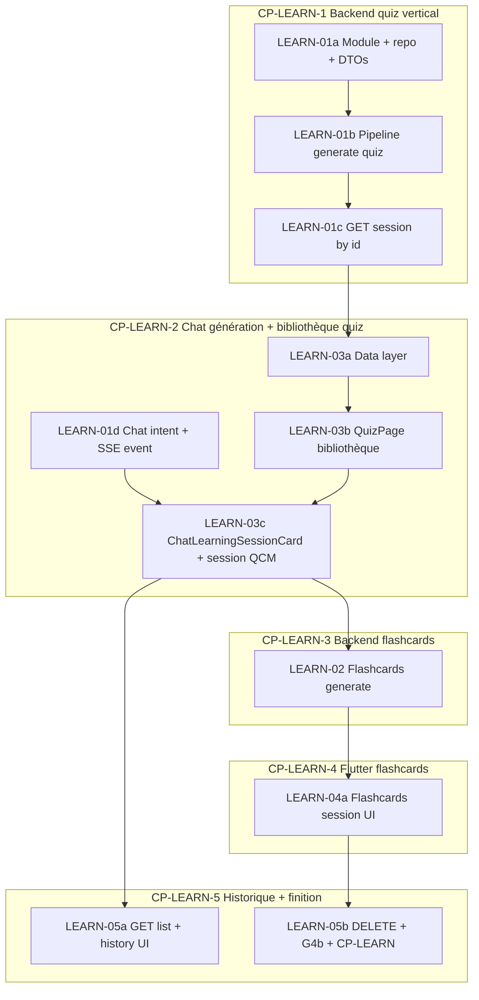

# Plan — Génération d’activités Quiz + Cartes (P4b)

> **Plan mode** — pas de modification de code applicatif dans ce document.  
> **Spec** : [docs/spec-learning-generation.md](../docs/spec-learning-generation.md) · [SPEC.md](../SPEC.md) §7  
> **Prérequis livrés** : documents D3, chat P4a, **QUIZ-01** (`GET /v1/quizzes/eligibility` + garde UI)

**Plans terminés** : [plan-chat.md](./plan-chat.md) (CHAT-01→10) · documents (DOC-01→14)

---

## 1. Objectif

Livrer la **génération depuis le Chat** (Lucy crée quiz / cartes) et l’onglet **Quiz** comme **bibliothèque** (historique + reprise). Sessions Firestore via Nest ; reprise possible sans corpus actif (G4b).

**Hors scope MVP** : bouton « Générer » dans l’onglet Quiz, streaming SSE de génération, sélection de documents, spaced repetition, score persisté serveur.

### Git

| Dépôt | Branche suggérée |
|-------|------------------|
| `lucy_frontend` | `feature/learning-generation` (depuis `feature/chat-p4a` ou `main`) |
| `lucy_backend` | même nom |

Deux PRs alignées (backend avant ou en parallèle du slice Flutter qui consomme l’API).

---

## 2. État actuel vs cible

| Zone | Actuel | Cible |
|------|--------|--------|
| `QuizPage` | Eligibility + bannière + « bientôt disponible » | **Bibliothèque** : liste sessions + empty « demandez à Lucy » |
| Chat stream | Pas d’événement learning | Intent quiz/cartes → SSE `learning_session_created` + carte UI |
| Routes `/quiz/*` | `/quiz` seul | `/quiz` + `/quiz/session/:id` |

---

## 3. Graphe de dépendances



**Règle de découpage** : chaque checkpoint livre un **chemin utilisateur complet** testable, pas une couche horizontale isolée.

---

## 4. Checkpoints

| Checkpoint | Contenu | Validation |
|------------|---------|------------|
| **CP-LEARN-1** | Backend : créer quiz + relire session | `curl POST generate` → `GET :id` avec 5 QCM + sources |
| **CP-LEARN-2** | Chat : « fais un quiz » → carte → jouer QCM ; Quiz : bibliothèque | Manuel + tests |
| **CP-LEARN-3** | Backend : flashcards | `curl POST type=flashcards` → 10 cartes |
| **CP-LEARN-4** | Flutter : cartes flip | Manuel : recto/verso + sources |
| **CP-LEARN-5** | Historique, reprise G4b, DELETE, checklist | CP-LEARN spec §2.3 entière |

---

## 5. Tâches détaillées (découpage vertical)

### LEARN-01a — Backend socle `learning-sessions`

| | |
|--|--|
| **Dépôt** | `lucy_backend` |
| **Dépend de** | QUIZ-01, ChatModule (`ChatPrerequisitesService`), RetrievalModule |
| **Livrable** | Module Nest, DTOs (`type`, `itemCount`, response, list item), codes `LEARNING_*`, repo port + in-memory + factory Firestore |

**Acceptance criteria**

- [ ] `LearningSessionsModule` importé dans `AppModule`
- [ ] `parseGenerateLearningSessionRequest` valide `type ∈ {quiz, flashcards}` et `itemCount` (défaut/plafond §4.2 spec)
- [ ] Repo in-memory : `create`, `getById`, `list`, `delete` sur `users/{uid}/learningSessions`
- [ ] Tests unitaires DTO + repo in-memory

**Vérification**

```bash
cd lucy_backend && npm test -- learning-sessions
```

---

### LEARN-01b — Backend pipeline `POST generate` (quiz)

| | |
|--|--|
| **Dépend de** | LEARN-01a |
| **Livrable** | Service génération quiz : garde corpus+profil **uniquement ici**, retrieval chunks, prompt `quiz-generator`, `LlmPort.generateStructured`, validateur JSON, persistance `status: ready` |

**Acceptance criteria**

- [ ] `POST /v1/learning-sessions/generate` body `{ "type": "quiz" }` → 201/200 + session avec **5** items par défaut
- [ ] Chaque item : `question`, `choices[4]`, `correctIndex`, `explanation`, `sources[]` (snapshot titre/pages/excerpt)
- [ ] Erreurs : `LEARNING_NO_ACTIVE_DOCUMENTS`, `LEARNING_LEARNER_PROFILE_MISSING`, `LEARNING_GENERATION_FAILED`
- [ ] Réutilise `ChatPrerequisitesService.requireActiveDocuments` + `requireLearnerProfile` (mapper codes → `LEARNING_*` si besoin)
- [ ] Mock LLM dans tests — pas d’appel Gemini en CI
- [ ] **Pas** de garde corpus sur les routes GET (préparer LEARN-01c)

**Vérification**

```bash
cd lucy_backend && npm test -- learning-sessions
# Manuel dev stack :
curl -s -X POST http://localhost:3001/v1/learning-sessions/generate \
  -H "Authorization: Bearer dev:<uid>" -H "Content-Type: application/json" \
  -d '{"type":"quiz"}' | jq '.id, .items | length'
```

---

### LEARN-01c — Backend `GET /v1/learning-sessions/:sessionId`

| | |
|--|--|
| **Dépend de** | LEARN-01b |
| **Livrable** | Lecture session par id ; **aucune** re-vérification corpus/domaines (G4b) |

**Acceptance criteria**

- [ ] `GET …/:sessionId` retourne session complète si `uid` propriétaire et `status: ready`
- [ ] `LEARNING_SESSION_NOT_FOUND` si id inconnu
- [ ] Test : générer avec docs actifs → désactiver tous les docs → `GET` **toujours 200**

**Vérification**

```bash
npm test -- learning-sessions
```

**→ Fin CP-LEARN-1**

---

### LEARN-01d — Backend Chat → génération (intent + SSE)

| | |
|--|--|
| **Dépend de** | LEARN-01b |
| **Livrable** | Détection intention dans `ChatStreamService` ; délégation `LearningSessionsService` ; événement SSE `learning_session_created` ; amendement prompt chat-tutor |

**Acceptance criteria**

- [ ] Message « fais-moi un quiz » → pas de réponse orientation seule — session créée
- [ ] SSE inclut `learning_session_created` avec `sessionId`, `type`, `title`
- [ ] `sourceChatId` persisté sur la session
- [ ] Corpus vide → message Lucy + pas de session (inchangé garde chat)
- [ ] Tests stream mock

**Vérification**

```bash
npm test -- chat-stream learning-sessions
```

---

### LEARN-03a — Flutter data layer learning sessions

| | |
|--|--|
| **Dépôt** | `lucy_frontend` |
| **Dépend de** | LEARN-01c (backend déployé local ou mock) |
| **Livrable** | `ApiEndpoints.learningSessions*`, modèles Freezed, mapper, repository, service, codes erreur + translator l10n de base |

**Acceptance criteria**

- [ ] Entités domain : `LearningSession`, `LearningSessionItem`, `LearningSessionType`
- [ ] `POST generate`, `GET by id` branchés via Dio
- [ ] Tests mapper + service (fake repository)
- [ ] `dart run build_runner build` sans conflit

**Vérification**

```bash
cd lucy_frontend && flutter test test/features/quiz/
```

---

### LEARN-03b — Flutter bibliothèque Quiz (sans génération)

| | |
|--|--|
| **Dépend de** | LEARN-03a, QUIZ-01 |
| **Livrable** | Refonte `QuizPage` : liste sessions (`GET list`), empty state « demandez à Lucy », bannière si `!canQuiz` |

**Acceptance criteria**

- [ ] **Pas** de tuiles / boutons « Générer quiz / cartes »
- [ ] Historique cliquable même si `canQuiz: false` (G4b)
- [ ] Couleurs `primary`, `secondary`, `tertiary`, `surface`
- [ ] l10n fr/en/de

---

### LEARN-03c — Chat carte action + session QCM

| | |
|--|--|
| **Dépend de** | LEARN-01d, LEARN-03b |
| **Livrable** | `ChatLearningSessionCard`, handler SSE ; `QuizSessionPage` |

**Acceptance criteria**

- [ ] Carte dans le fil → **Ouvrir** → `/quiz/session/:id`
- [ ] QCM interactif + sources + score local client
- [ ] Erreurs → translator l10n

**→ Fin CP-LEARN-2**

---

### LEARN-02 — Backend flashcards (`type: flashcards`)

| | |
|--|--|
| **Dépend de** | LEARN-01b (même pipeline) |
| **Livrable** | Prompt `flashcards-generator`, validateur recto/verso, branche `type` dans service |

**Acceptance criteria**

- [ ] `POST generate` `{ "type": "flashcards" }` → **10** cartes par défaut, plafond 30
- [ ] Items : `front`, `back`, `sources[]`
- [ ] Tests validateur + service mock LLM

**Vérification**

```bash
npm test -- learning-sessions
curl -s -X POST ... -d '{"type":"flashcards"}' | jq '.items[0].front'
```

**→ Fin CP-LEARN-3**

---

### LEARN-04a — Flutter session cartes mémoire

| | |
|--|--|
| **Dépend de** | LEARN-02, LEARN-03c |
| **Livrable** | `FlashcardsSessionPage` ; intent chat « cartes / flashcards » |

**Acceptance criteria**

- [ ] Génération cartes via **chat** (pas onglet Quiz)
- [ ] Flip recto/verso ; navigation carte suivante/précédente
- [ ] Sources par carte
- [ ] Pas de scoring

**Vérification**

Manuel + `flutter test`.

**→ Fin CP-LEARN-4**

---

### LEARN-05a — Backend `GET list` + Flutter historique

| | |
|--|--|
| **Dépend de** | LEARN-01c, LEARN-03c ou LEARN-04a |
| **Livrable** | `GET /v1/learning-sessions` (tri `createdAt` desc), `LearningHistoryPage`, section hub « Historique récent » |

**Acceptance criteria**

- [ ] Liste sessions sans garde corpus (G4b)
- [ ] Tap session → reprise `/quiz/session/:id` même si `canQuiz: false`
- [ ] Empty state historique vide (l10n)
- [ ] Test backend : list après 2 generates

**Vérification**

Manuel : générer → désactiver docs → historique + reprise OK.

---

### LEARN-05b — DELETE + checklist CP-LEARN

| | |
|--|--|
| **Dépend de** | LEARN-05a |
| **Livrable** | `DELETE …/:sessionId`, swipe/long-press delete UI (option simple), doc `docs/cp-learn-manual-checklist.md` |

**Acceptance criteria**

- [ ] DELETE owner-only ; 404 si inconnu
- [ ] Checklist spec §2.3 entière cochée manuellement
- [ ] `npm test` backend learning + quiz eligibility non-régression
- [ ] `flutter analyze` + `flutter test test/features/quiz/` verts
- [ ] Chat orientation quiz inchangé (non-régression)

**Vérification**

```bash
cd lucy_backend && npm test
cd lucy_frontend && flutter analyze && flutter test test/features/quiz/
```

**→ Fin CP-LEARN-5 — feature MVP livrable**

---

## 6. Ordre d’exécution recommandé

```
LEARN-01a → LEARN-01b → LEARN-01c → LEARN-01d     [CP-LEARN-1 + chat hook]
LEARN-03a → LEARN-03b → LEARN-03c                 [CP-LEARN-2]
LEARN-02                              [CP-LEARN-3]
LEARN-04a                             [CP-LEARN-4]
LEARN-05a → LEARN-05b                 [CP-LEARN-5]
```

Parallélisation possible : LEARN-03a (Flutter data) en parallèle de LEARN-01b si contrat API figé dans la spec §4.3.

---

## 7. Commandes globales

```bash
# Backend
cd lucy_backend
npm test
npm test -- learning-sessions
npm test -- quiz-eligibility

# Frontend
cd lucy_frontend
dart run build_runner build --delete-conflicting-outputs
flutter gen-l10n
flutter analyze
flutter test test/features/quiz/
```

---

## 8. Risques & mitigations

| Risque | Mitigation |
|--------|------------|
| JSON LLM invalide | Validateur strict + 1 retry ; `LEARNING_GENERATION_FAILED` |
| Session Firestore trop grosse | Plafonds itemCount (quiz 15, cards 30) |
| Confusion garde corpus | Tests explicites G4b : GET après désactivation docs |
| Duplication codes erreur chat/quiz | Mapper `CHAT_*` → `LEARNING_*` à la frontière service |

---

*Ce document a été créé avec Cursor (IA). Plan P4b learning-generation — 2026-05-29.*
