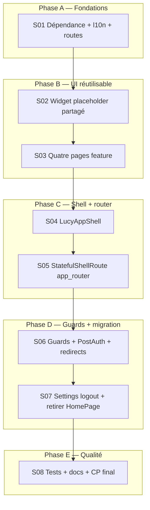

# Plan d’implémentation — Shell post-login (P0)

> Source : [SPEC.md](../SPEC.md) §2.  
> Référence UI : [`telC_frontend`](../../telC/telC_frontend) — `TcAppShell`, `StatefulShellRoute.indexedStack`, `AnimatedBottomNavigationBar`.  
> Découpage **vertical** : chaque tâche livre un chemin utilisateur testable.  
> **Plan mode** — pas de modification de code dans ce document.

---

## 1. Objectif

Après onboarding (`isConfigured: true`), l’apprenant voit une **coque à 4 onglets** (Documents, Chat, Quiz, Paramètres) avec barre du bas Material ; **Documents** est l’onglet par défaut. Contenu métier = placeholder l10n `pageUnderDevelopment` ; **Paramètres** inclut la déconnexion (ex-`HomePage`).

**Hors périmètre P0** : upload PDF, RAG, chat LLM, quiz, sidebar desktop.

---

## 2. État actuel du repo

| Élément | État |
|---------|------|
| Auth + onboarding | Livré |
| Route post-configuré | `/home` → `HomePage` (welcome + logout) |
| `StatefulShellRoute` | **Absent** |
| Routes `/documents`, `/chat`, `/quiz`, `/settings` | **Absentes** |
| `animated_bottom_navigation_bar` | **Absent** (`pubspec.yaml`) |
| l10n `pageUnderDevelopment`, libellés nav | **Absents** |
| `LucyRouterGuards` | Redirige vers `LucyRoutePaths.home` si configuré |
| `PostAuthRoute` | Retourne `home` si configuré |
| `onboarding_confirm_page` | `context.go(LucyRoutePaths.home)` après finalize |

---

## 3. Graphe de dépendances

**Ordre strict** : S04 dépend de S03 (pages existent avant branches). S06 dépend de S05 (chemins shell connus).

---

## 4. Découpage vertical (tâches)

### S01 — Fondations (pas d’écran visible seul)

| Champ | Détail |
|-------|--------|
| **Livrable** | Package + constantes routes + clés l10n générées |
| **Fichiers** | `pubspec.yaml`, `lucy_route_paths.dart`, `lucy_route_names.dart`, `app_*.arb` |
| **AC** | `documents`, `chat`, `quiz`, `settings` dans paths/names ; ARB fr/en/de : `pageUnderDevelopment`, `navDocuments`, `navChat`, `navQuiz`, `navSettings`, titres AppBar (`documentsTitle`, etc.) |
| **Vérification** | `flutter pub get` ; `flutter gen-l10n` ; `flutter analyze` sur router/l10n |

---

### S02 — Widget placeholder partagé (V1 partiel)

| Champ | Détail |
|-------|--------|
| **Livrable** | Corps réutilisable « En cours de réalisation » |
| **Fichiers** | `lib/shared/widgets/placeholders/lucy_under_development_body.dart` (ou `lucy_placeholder_page.dart` avec AppBar optionnel) |
| **AC** | `Scaffold` + `AppBar` (titre paramètre) + `Center` + `context.l10n.pageUnderDevelopment` ; `colorScheme` uniquement |
| **Vérification** | Widget test : trouve le texte l10n FR |

**Checkpoint CP-S0** : après S02, `flutter test` sur le widget placeholder.

---

### S03 — Quatre pages feature (V1 partiel)

| Champ | Détail |
|-------|--------|
| **Livrable** | Pages présentation minimales par onglet |
| **Fichiers** | `features/documents/.../documents_page.dart`, `chat/...`, `quiz/...`, `settings/...` |
| **AC** | Documents / Chat / Quiz utilisent le placeholder ; Settings affiche logout (`LucyPrimaryButton` + `authService.signOut`) + optionnel placeholder sous le bouton |
| **Vérification** | Tests widget légers (Settings : bouton présent) ; pas de texte en dur |

---

### S04 — LucyAppShell

| Champ | Détail |
|-------|--------|
| **Livrable** | Coque avec `AnimatedBottomNavigationBar` |
| **Fichiers** | `lib/core/shell/lucy_app_shell.dart` |
| **AC** | 4 icônes Material ; `activeIndex` dérivé de `GoRouterState.uri.path` ; `onTap` → `navigationShell.goBranch(index)` ; `activeColor: primary`, `inactiveColor: onSurfaceVariant` ; **MVP** : barre sur toutes largeurs (pas de sidebar) |
| **Référence** | `tc_app_shell.dart` lignes 69–89 (mode mobile uniquement) |
| **Vérification** | Analyse statique ; test widget optionnel (smoke pump avec mock shell) |

---

### S05 — Router : StatefulShellRoute (V2 — parcours complet navigation)

| Champ | Détail |
|-------|--------|
| **Livrable** | 4 branches indexed stack + `NoTransitionPage` |
| **Fichiers** | `app_router.dart` (+ `build_runner` si `.g.dart` impacté) |
| **AC** | Branches ordre : 0 Documents, 1 Chat, 2 Quiz, 3 Settings ; builder shell = `LucyAppShell` ; `/home` reste route top-level **ou** redirect only (préféré : redirect dans guards, pas de builder HomePage) |
| **Vérification** | **Manuel** : connecté + configuré → navigation entre 4 onglets sans flash |

**Checkpoint CP-S1** : après S05, parcours manuel 4 onglets (contenu placeholder).

---

### S06 — Guards, bootstrap, finalize (V3 — bonne destination post-login)

| Champ | Détail |
|-------|--------|
| **Livrable** | Destination `/documents` partout |
| **Fichiers** | `lucy_router_guards.dart`, `post_auth_route.dart`, `onboarding_confirm_page.dart` |
| **AC** | `_shellPaths` = documents, chat, quiz, settings ; non connecté sur shell → login ; non configuré sur shell → onboarding ; configuré sur onboarding → documents ; splash configuré → documents ; `/home` configuré → documents ; public auth configuré → documents |
| **AC** | `PostAuthRoute` → `documents` si configuré |
| **AC** | Finalize → `context.go(LucyRoutePaths.documents)` |
| **Vérification** | `lucy_router_guards_onboarding_test.dart`, `post_auth_route_test.dart`, `lucy_router_guards_test.dart` mis à jour |

---

### S07 — Nettoyage HomePage

| Champ | Détail |
|-------|--------|
| **Livrable** | Plus d’écran `/home` comme destination finale |
| **Fichiers** | Retirer ou garder `home_page.dart` uniquement si redirect ; mettre à jour imports tests (`login_page_test`, `auth_redirect_test`, `onboarding_cp4_e2e_flow_test`) |
| **AC** | Logout uniquement depuis Settings ; `homeWelcome` / `homeLogout` réutilisés ou renommés l10n settings si besoin |
| **Vérification** | `grep HomePage` — uniquement tests redirect ou fichier supprimé |

---

### S08 — Tests, docs, SPEC checklist (V4 — DoD P0)

| Champ | Détail |
|-------|--------|
| **Livrable** | Suite verte + spec cochée |
| **Fichiers** | Tests router/shell ; `docs/manual-checkpoints.md` (section shell) ; cocher SPEC §2.4 |
| **AC** | `flutter analyze` 0 issue ; `flutter test` vert ; smoke traceability si chemins `/home` |
| **Vérification** | **CP-S2** checklist ci-dessous |

**Checkpoint CP-S2 (DoD P0)** :

- [ ] Compte configuré : splash → `/documents`
- [ ] Tap chaque onglet → bon titre AppBar + « En cours de réalisation »
- [ ] Paramètres → déconnexion → login
- [ ] Non configuré : URL `/documents` → redirect onboarding
- [ ] Finalize onboarding → `/documents` (pas `/home`)
- [ ] `flutter test` + `flutter analyze` OK

---

## 5. Risques et mitigations

| Risque | Mitigation |
|--------|------------|
| Tests cassés sur `/home` | Mettre à jour en même temps que S06 ; garder redirect `/home` → `/documents` |
| `goBranch` index ≠ ordre branches | Constante `shellBranchDocuments = 0` documentée dans shell |
| Oubli l10n DE/EN | S01 : ajouter les 3 ARB avant toute page |
| `build_runner` router | Lancer après modification `@Riverpod` router |

---

## 6. Estimation relative

| Phase | Tâches | Complexité |
|-------|--------|------------|
| A | S01 | Faible |
| B | S02–S03 | Faible |
| C | S04–S05 | Moyenne |
| D | S06–S07 | Moyenne (nombreux tests) |
| E | S08 | Faible |

---

## 7. Après P0 (ne pas traiter dans ce plan)

| ID | Brique | Spec |
|----|--------|------|
| P1 | Upload documents | SPEC §3 Sprint 1 |
| P2 | Pipeline RAG | SPEC §3 Sprint 2 |
| P3 | Chat source-based | SPEC §3 Sprint 3 |
| P4 | Quiz | SPEC §3 Sprint 3 |

---

## 8. Références code actuel à modifier

| Fichier | Changement attendu |
|---------|-------------------|
| `lib/core/router/app_router.dart` | Shell 4 branches |
| `lib/core/router/lucy_router_guards.dart` | `home` → `documents`, shell paths |
| `lib/core/router/post_auth_route.dart` | `documents` |
| `lib/features/onboarding/.../onboarding_confirm_page.dart` | `go(documents)` |
| `test/core/router/*.dart` | Assertions `/documents` |
| `test/smoke/cp4_*` | Chemins backend inchangés ; E2E widget destination documents |

---

*Ce document a été créé avec Cursor (IA). Plan P0 shell — 2026-05-25.*
