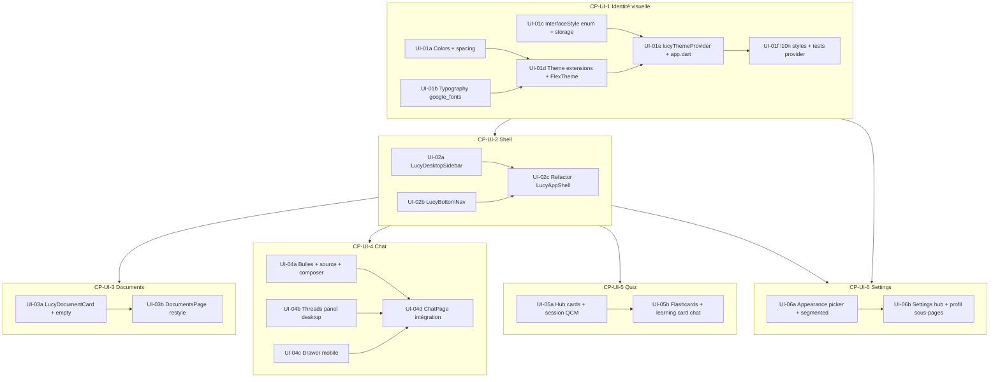

# Plan — Refonte UI post-login (P5)

> **Plan mode** — pas de modification de code applicatif dans ce document.  
> **Spec** : [docs/spec-ui-redesign.md](../docs/spec-ui-redesign.md) · [SPEC.md](../SPEC.md) P5  
> **Design** : Prototype v3 (desktop), v4 (mobile), Design System  
> **Prérequis livrés** : auth, onboarding, documents D1–D3, chat P4a, learning P4b

**Plans archivés** : [plan-learn.md](./plan-learn.md) (LEARN terminé) · [plan-chat.md](./plan-chat.md) · [plan-ui-redesign.md](./plan-ui-redesign.md) (brouillon — remplacé par ce fichier)

---

## 1. Objectif

Refondre **toute l’UI après connexion** (shell, Documents, Chat, Quiz, Paramètres/profil) selon les maquettes V3/V4, **sans modifier** la logique métier (notifiers, repositories, routes API).

**Hors scope** : login, signup, reset password, splash, onboarding chat (design inchangé en phase 1).

**Décisions produit (validées)**

| Sujet | Décision |
|-------|----------|
| Desktop | Sidebar design system (≥ 1024 px) ; chat master-detail V3 |
| Mobile | **Bottom nav custom** V4 (icône + label) — **pas** `animated_bottom_navigation_bar` |
| Styles | Académique (défaut), Premium sombre, Motivant — choix dans Paramètres |
| Premium sombre + clair | **Variante claire dédiée** (pas de forçage dark) |
| Typo | Bricolage + Newsreader + Hanken + JetBrains Mono (`google_fonts`) |
| Motivant | Accents chauds ; **pas de badge streak 🔥** (pas de compteur) |
| Icônes nav / chips | **Emojis** comme les maquettes (📄 💬 🎯 ⚙️, etc.) |
| Portée thème | Nouveau thème **app-wide** (auth inclus) — validé |
| Ordre écrans | Documents → Chat → Quiz → Settings (après shell) |

### Packages (réutiliser avant de coder custom)

| Besoin | Choix | Éviter |
|--------|--------|--------|
| Thème Material 3 + seeds | **`flex_color_scheme`** (déjà) | ThemeData manuel |
| Polices design system | **`google_fonts`** | `.ttf` en dur sauf offline strict |
| Persistance style / mode | **`shared_preferences`** (déjà) | Fichier custom |
| Bottom nav V4 | **Widget custom** `LucyBottomNav` | `animated_bottom_navigation_bar` (style telC) |
| Drawer mobile chat | **`Drawer` / `ModalBarrier` Flutter** | Package drawer tiers |
| Segmented clair/sombre | **`SegmentedButton` Material 3** | Custom si M3 suffit |
| Flip cartes quiz | **`flip_card`** ou `AnimationController` | — (à trancher CP-UI-5) |
| Markdown chat | **`flutter_markdown_plus`** (déjà) | — |

---

| Dépôt | Branche suggérée |
|-------|------------------|
| `lucy_frontend` | `feature/ui-redesign` (depuis `main`) |

Une PR par checkpoint recommandée (CP-UI-1 → CP-UI-6).

---

## 2. État actuel vs cible

| Zone | Actuel | Cible |
|------|--------|--------|
| Palette | `#1E3D6F`, vert Material secondaire | Design system `#2E4C8A`, `#159A8B`, `#E5933C` |
| Thème | `ThemeMode.system` statique dans `app.dart` | Riverpod : brightness + `LucyInterfaceStyle` persistés |
| Shell mobile | `animated_bottom_navigation_bar` (telC) | `LucyBottomNav` custom V4 — package **retiré** en UI-02c |
| Shell desktop | `LucySidebar` surface claire telC | `LucyDesktopSidebar` fond `#22315C` |
| Chat | `chat_message_bubble`, master-detail basique | Bulles Lucy gradient, `LucySourceCard`, drawer mobile |
| Documents | `LucyAdminCard` / liste Material | Cartes grille desktop / liste mobile + toggle |
| Quiz | Bibliothèque + session fonctionnelles | Hub cartes cliquables, session Newsreader + barre Mono |
| Settings | Hub telC | Carte profil, segmented clair/sombre, picker 3 styles |

**Fichiers existants à réutiliser / étendre**

- `lib/shared/widgets/branding/lucy_avatar.dart` → aligner gradient Lucy ✦
- `lib/shared/widgets/buttons/lucy_*_button.dart` → tokens ou wrappers `lib/shared/widgets/lucy/`
- `lib/core/localization/lucy_ui_locale_storage.dart` → modèle pour `lucy_interface_style_storage.dart`
- `lib/features/chat/presentation/widgets/*` → remplacer progressivement par composants Lucy

---

## 3. Graphe de dépendances



**Règle** : chaque checkpoint = **un parcours utilisateur testable** de bout en bout sur au moins un écran.

---

## 4. Checkpoints

| Checkpoint | Chemin utilisateur testable | Validation |
|------------|----------------------------|------------|
| **CP-UI-1** | Login → app : palette `#2E4C8A`, fond crème, polices Google | **Livré** — `flutter test test/core/theme/` |
| **CP-UI-2** | Naviguer Documents / Chat / Quiz / Settings desktop + mobile | Router tests verts ; pas de régression branches |
| **CP-UI-3** | Gérer corpus : liste, upload, toggle, états processing | Widget test carte ; manuel grille/liste |
| **CP-UI-4** | Chat : fils, message, stream, sources, drawer mobile | Tests chat existants + manuel master-detail |
| **CP-UI-5** | Quiz hub → session QCM ; carte learning dans chat | `flutter test test/features/quiz/` |
| **CP-UI-6** | Changer style interface + clair/sombre ; profil | Settings tests ; persistance redémarrage app |

---

## 5. Tâches détaillées (découpage vertical)

### UI-01a — Tokens couleurs + espacements

| | |
|--|--|
| **Dépend de** | — |
| **Fichiers** | `lucy_colors.dart`, `lucy_spacing.dart` (nouveau) |
| **Livrable** | Seeds design system ; neutres crème/ink ; constantes rayons 10–14 px, pills 999 |

**Acceptance criteria**

- [ ] `primary` `#2E4C8A`, `secondary` `#159A8B`, `tertiary` `#E5933C`, `error` `#CE3A4E`
- [ ] Tokens sémantiques : `rail`, `scaffoldBackgroundLight`, `lucyGradient` (dans colors ou extensions)
- [ ] Aucun hex nouveau dans les features (grep audit)

**Vérification**

```bash
cd lucy_frontend && flutter analyze
```

---

### UI-01b — Typographie (`google_fonts`)

| | |
|--|--|
| **Dépend de** | UI-01a |
| **Fichiers** | `pubspec.yaml`, `lucy_typography.dart` |
| **Livrable** | `TextTheme` : Newsreader titres, Hanken corps, Mono labels pages |

**Acceptance criteria**

- [ ] `flutter pub add google_fonts`
- [ ] Rôles : `headlineEditorial` (Newsreader 20–26), `bodyUi` (Hanken), `labelMono` (JetBrains 10–13)
- [ ] Bricolage réservé à `LucyBrandMark` (pas tout le TextTheme)

**Vérification**

```bash
flutter analyze
```

---

### UI-01c — `LucyInterfaceStyle` + persistance

| | |
|--|--|
| **Dépend de** | — |
| **Fichiers** | `lucy_interface_style.dart`, `lucy_interface_style_storage.dart` |
| **Livrable** | Enum `academic`, `premiumDark`, `motivant` ; SharedPreferences |

**Acceptance criteria**

- [ ] Défaut `academic` si clé absente
- [ ] `read()` / `write()` async ; clé dédiée `lucy_interface_style`
- [ ] Pattern identique à `LucyUiLocaleStorage`

**Vérification**

```bash
flutter test test/core/theme/
```

---

### UI-01d — Extensions thème + `LucyFlexTheme`

| | |
|--|--|
| **Dépend de** | UI-01a, UI-01b, UI-01c |
| **Fichiers** | `lucy_theme_extensions.dart`, `lucy_flex_theme.dart` |
| **Livrable** | `ThemeExtension<LucyThemeColors>` : rail, lucyBubble, tealChipBg, motivantStreak… |

**Acceptance criteria**

- [ ] `LucyFlexTheme.themeFor(brightness, interfaceStyle)` retourne `ThemeData` par variante
- [ ] Académique clair : scaffold `#F4F0E8`, surface blanche
- [ ] Premium sombre : dark `#0F1320` **et** variante **clair** dédiée (fond bleu-gris adouci, glow Lucy atténué)
- [ ] Motivant : accents chauds `#FBEEDD` (light) ; **sans** badge streak / compteur jours

**Vérification**

```bash
flutter analyze
```

---

### UI-01e — `lucyThemeProvider` + `app.dart`

| | |
|--|--|
| **Dépend de** | UI-01d |
| **Fichiers** | `lucy_theme_provider.dart`, `main.dart`, `app.dart` |
| **Livrable** | Bootstrap style depuis prefs ; `MaterialApp.router` branché sur provider |

**Acceptance criteria**

- [ ] `@riverpod` : `themeMode` + `interfaceStyle` ; `build_runner`
- [ ] `main.dart` : `LucyInterfaceStyleStorage.read()` avant `runApp` (comme locale)
- [ ] Remplace `themeMode: ThemeMode.system` fixe

**Vérification**

```bash
dart run build_runner build --delete-conflicting-outputs
flutter run -d chrome
```

**→ Fin CP-UI-1**

---

### UI-01f — l10n clés styles + tests provider

| | |
|--|--|
| **Dépend de** | UI-01e |
| **Fichiers** | `app_*.arb`, `test/core/theme/lucy_theme_provider_test.dart` |

**Acceptance criteria**

- [ ] Clés : `interfaceStyleAcademic`, `interfaceStylePremiumDark`, `interfaceStyleMotivant`, descriptions
- [ ] fr / en / de
- [ ] 2+ tests : défaut academic ; write + read persistance

**Vérification**

```bash
flutter gen-l10n
flutter test test/core/theme/
```

---

### UI-02a — `LucyDesktopSidebar`

| | |
|--|--|
| **Dépend de** | CP-UI-1 |
| **Fichiers** | `lucy_desktop_sidebar.dart`, `lucy_brand_mark.dart` |
| **Livrable** | Sidebar `#22315C`, item actif fond blanc, avatar tertiary bas |

**Acceptance criteria**

- [ ] 4 branches : documents, chat, quiz, settings (même indices que shell actuel)
- [ ] Logo Bricolage « L » + marque Lucy
- [ ] Logout en bas (délègue `authServiceProvider`)
- [ ] Largeur ~264 px (constante `lucy_spacing` / `lucy_constants`)

**Vérification**

Manuel Chrome ≥ 1024 px.

---

### UI-02b — `LucyBottomNav` (widget custom)

| | |
|--|--|
| **Dépend de** | CP-UI-1 |
| **Fichiers** | `lucy_bottom_nav.dart` |
| **Livrable** | Barre plate V4 : emoji + label par onglet ; actif `primary` |

**Pourquoi pas `animated_bottom_navigation_bar`** : ce package impose une barre flottante / animation bulle (style telC), incompatible avec la maquette V4 (barre fixe, bordure haute, 4 colonnes égales). On implémente un `StatelessWidget` maison (~80 lignes).

**Acceptance criteria**

- [ ] Emojis nav : 📄 Documents, 💬 Chat, 🎯 Quiz, ⚙️ Paramètres (libellés l10n)
- [ ] Index dérivé de `state.uri.path` (chat/quiz/settings prefixes)
- [ ] Hauteur touch ≥ 44 px ; bordure top `border` token ; fond `surface`

**Vérification**

```bash
flutter test test/core/shell/lucy_bottom_nav_test.dart
```

---

### UI-02c — Refactor `LucyAppShell`

| | |
|--|--|
| **Dépend de** | UI-02a, UI-02b |
| **Fichiers** | `lucy_app_shell.dart` ; déprécier `lucy_sidebar.dart` |
| **Livrable** | Mobile &lt; 600 : bottom nav ; desktop : sidebar permanente ; tablet hamburger |

**Acceptance criteria**

- [ ] Breakpoints alignés `responsive_constants.dart`
- [ ] `navigationShell` inchangé (pas de modif routes)
- [ ] Tests router existants verts

**Vérification**

```bash
flutter test test/core/router/
flutter analyze
```

**→ Fin CP-UI-2** — retirer `animated_bottom_navigation_bar` du `pubspec.yaml` dans UI-02c

---

### UI-03a — Composants Documents

| | |
|--|--|
| **Dépend de** | CP-UI-2 |
| **Fichiers** | `lucy_document_card.dart`, `lucy_chip.dart`, `lucy_empty_state.dart` |
| **Livrable** | Carte : icône type, titre, meta Mono, statut chip, toggle searchEnabled, barre processing |

**Acceptance criteria**

- [ ] Props data-only (pas d’appel repository dans le widget)
- [ ] Callback `onToggle`, `onTap` optionnel
- [ ] Widget test : toggle appelle callback

**Vérification**

```bash
flutter test test/shared/widgets/lucy_document_card_test.dart
```

---

### UI-03b — `DocumentsPage` restyle

| | |
|--|--|
| **Dépend de** | UI-03a |
| **Fichiers** | `documents_page.dart`, widgets upload/liste existants |
| **Livrable** | Header Newsreader + CTA Ajouter ; grille 2 col desktop / liste mobile |

**Acceptance criteria**

- [ ] Logique `documents_notifier` **inchangée**
- [ ] Upload, download, delete, toggle fonctionnels
- [ ] l10n pour empty / compteur docs

**Vérification**

Manuel : upload PDF → processing → ready → toggle actif.

**→ Fin CP-UI-3**

---

### UI-04a — Composants Chat message

| | |
|--|--|
| **Dépend de** | CP-UI-2 |
| **Fichiers** | `lucy_message_bubble.dart`, `lucy_source_card.dart`, `lucy_composer.dart` ; étendre `lucy_avatar.dart` |
| **Livrable** | Bulle user primary ; Lucy avatar gradient + typing dots ; source bordure teal |

**Acceptance criteria**

- [ ] Réutilise `LucyFormattedMessageText` si pertinent
- [ ] `LucyComposer` : Enter envoie, bouton ↑ primary carré arrondi
- [ ] Widget test `LucySourceCard` affiche titre + pages

**Vérification**

```bash
flutter test test/shared/widgets/lucy_source_card_test.dart
```

---

### UI-04b — Panneau fils desktop (V3)

| | |
|--|--|
| **Dépend de** | CP-UI-2 |
| **Fichiers** | `lucy_chat_threads_panel.dart` |
| **Livrable** | Colonne 300 px : titre Conversations, + nouveau, liste fils |

**Acceptance criteria**

- [ ] Largeur fixe 300 px ; `surface2` background
- [ ] Délègue sélection / création à callbacks (branchés sur `chatThreadsProvider` dans page)

**Vérification**

Manuel desktop : créer fil, changer fil.

---

### UI-04c — Drawer conversations mobile (V4)

| | |
|--|--|
| **Dépend de** | CP-UI-2 |
| **Fichiers** | `lucy_conversations_drawer.dart` |
| **Livrable** | Overlay 80 % largeur, animation slide, bouton + Nouvelle conversation |

**Acceptance criteria**

- [ ] Ouvert via ☰ dans app bar chat mobile uniquement
- [ ] Fermeture tap extérieur + après sélection fil

**Vérification**

Manuel simulateur &lt; 600 px.

---

### UI-04d — `ChatPage` intégration

| | |
|--|--|
| **Dépend de** | UI-04a, UI-04b, UI-04c |
| **Fichiers** | `chat_page.dart`, widgets chat feature (délégation) |
| **Livrable** | Master-detail desktop ; mobile conversation + drawer ; empty state suggestions ; chip « N docs actifs » |

**Acceptance criteria**

- [ ] SSE stream + sources inchangés (notifier)
- [ ] `ChatLearningSessionCard` visuellement alignée (tokens)
- [ ] Tests `chat_conversation_notifier_test` verts

**Vérification**

```bash
flutter test test/features/chat/
```

**→ Fin CP-UI-4**

---

### UI-05a — Quiz hub + session QCM

| | |
|--|--|
| **Dépend de** | CP-UI-2 |
| **Fichiers** | `lucy_quiz_hub_card.dart`, `quiz_page.dart`, `learning_session_page.dart` |
| **Livrable** | Cartes hub cliquables ; session : barre progression Mono, choix A–D, écran score |

**Acceptance criteria**

- [ ] `quiz_session_notifier` / routes inchangés
- [ ] Desktop : cartes ~280 px ; mobile : pleine largeur
- [ ] Badge type Quiz / Cartes (chips)

**Vérification**

```bash
flutter test test/features/quiz/
```

---

### UI-05b — Flashcards + carte chat learning

| | |
|--|--|
| **Dépend de** | UI-05a |
| **Fichiers** | `flashcards_session_page.dart`, `chat_learning_session_card.dart` |
| **Livrable** | Flip card ; carte action chat style Lucy |

**Acceptance criteria**

- [ ] Navigation carte préc/suiv ; tap flip
- [ ] Bouton Ouvrir sur carte chat → route session

**Vérification**

Manuel : générer quiz + cartes depuis chat.

**→ Fin CP-UI-5**

---

### UI-06a — Appearance : segmented + picker 3 styles

| | |
|--|--|
| **Dépend de** | CP-UI-1 |
| **Fichiers** | `lucy_segmented_control.dart`, `lucy_interface_style_picker.dart`, `settings_notifier` |
| **Livrable** | UI Paramètres : clair/sombre + grille 3 previews |

**Acceptance criteria**

- [ ] Changement style → `lucyThemeProvider` + persistance immédiate
- [ ] Preview cards comme maquette (Aa académique, glow premium, dégradé chaud motivant — **sans** streak)
- [ ] Tests settings : changement style déclenche write storage

**Vérification**

```bash
flutter test test/features/settings/
```

---

### UI-06b — Settings hub + profil sous-pages

| | |
|--|--|
| **Dépend de** | UI-06a, CP-UI-2 |
| **Fichiers** | `settings_page.dart`, `settings_profile_page.dart`, `settings_ai_config_page.dart`, etc. |
| **Livrable** | Carte profil, langue, logout error outline ; profil apprenant layout V3/V4 |

**Acceptance criteria**

- [ ] `settings_notifier` logique inchangée
- [ ] Navigation sous-routes OK
- [ ] fr / en / de sans overflow

**Vérification**

```bash
flutter analyze && flutter test test/features/settings/
```

**→ Fin CP-UI-6**

---

## 6. Ordre d’exécution recommandé

```
UI-01a → UI-01b → UI-01c → UI-01d → UI-01e → UI-01f     [CP-UI-1]
UI-02a ∥ UI-02b → UI-02c                                  [CP-UI-2]
UI-03a → UI-03b                                           [CP-UI-3]
UI-04a → UI-04b ∥ UI-04c → UI-04d                         [CP-UI-4]
UI-05a → UI-05b                                           [CP-UI-5]
UI-06a → UI-06b                                           [CP-UI-6]
```

Parallélisation après CP-UI-2 : **CP-UI-3**, **CP-UI-4**, **CP-UI-5** en parallèle si plusieurs devs ; **CP-UI-6** peut démarrer dès CP-UI-1 pour UI-06a uniquement.

---

## 7. Commandes globales

```bash
cd lucy_frontend
flutter pub add google_fonts   # UI-01b
dart run build_runner build --delete-conflicting-outputs
flutter gen-l10n
flutter analyze
flutter test
```

Checklist finale : `docs/spec-ui-redesign.md` §5.2 + section CP-UI ci-dessous.

---

## 8. Risques & mitigations

| Risque | Mitigation |
|--------|------------|
| Régression chat/quiz | Lancer tests feature après chaque CP |
| Performance `google_fonts` | Cache fonts ; éviter rebuild thème complet inutile |
| 3 styles × 2 brightness = 6 variantes | `themeFor()` centralisé ; tests sur academic light + premium dark |
| Duplication widgets chat / shared | Migrer vers `lib/shared/widgets/lucy/` ; supprimer anciens widgets feature quand inutilisés |
| Package bottom nav | Remplacer par widget custom ; retirer dépendance dans UI-02c |

---

## 9. Checklist manuelle CP-UI (fin)

- [ ] Desktop Chrome ≥ 1024 : sidebar + chat 2 colonnes + documents grille
- [ ] Mobile : bottom nav + drawer chat + composer fixe
- [ ] 3 styles interface + clair/sombre persistés après kill app
- [ ] Auth / onboarding visuellement inchangés
- [ ] `flutter analyze` + `flutter test` verts

---

*Ce document a été créé avec Cursor (IA). Plan P5 UI redesign — 2026-06-10.*
