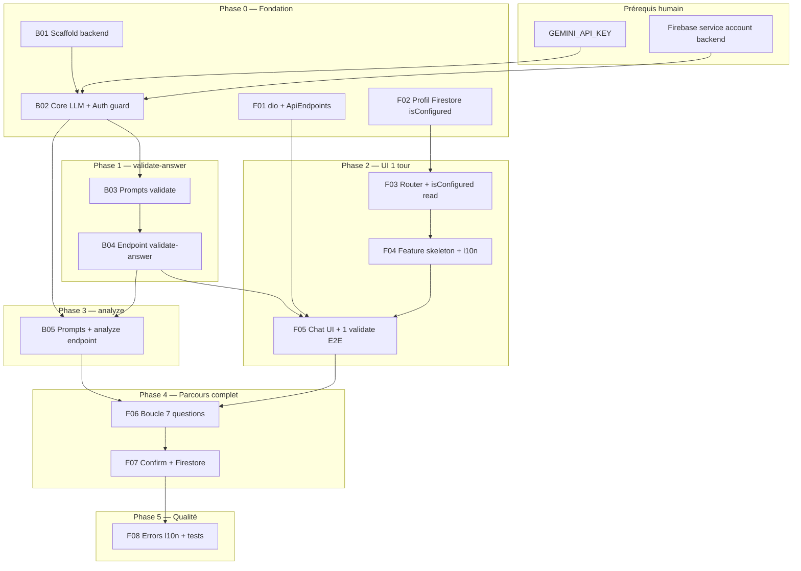

# Plan d’implémentation — Lucy Onboarding (config apprenant)

> Source : [SPEC.md](../SPEC.md) §4. Auth phase 1 : **livrée** ([todo.md](./todo.md) historique auth).  
> Découpage **vertical** : chaque tâche livre un chemin testable de bout en bout.  
> **Pas de modification de code** dans ce document — plan uniquement.

---

## 1. Objectif du plan

Livrer le parcours onboarding **obligatoire** :

1. `validate-answer` → `turnSummary` → **« C’est bon »** → **`confirm-turn`** (Nest → Firestore) + local.
2. 7 tours → `analyze` → récap → **`finalize`** → `/home`.
3. Fallbacks après **10** échecs (question ou analyze) — §4.12.
4. Nest **Admin** writer ; Flutter read ; **2000** car. — [SPEC.md](../SPEC.md) §4.12.
5. UI **7 chats** + typing Lucy + design messagerie — §4.5.1.

**Stack :** Flutter (`frontend/`) + NestJS (`Lucy/backend/`) + Gemini via `LlmPort`.

---

## 2. État actuel du repo

| Élément | État |
|---------|------|
| Auth Firebase (login, signup, reset) | Livré |
| `users/{uid}` (`fullName`, `email`, `createdAt`) | Livré |
| `isConfigured`, onboarding feature | **Absent** |
| `backend/` NestJS | **Absent** |
| `dio`, `ApiEndpoints` | **Absent** (`pubspec`) |
| Route `/onboarding` | **Absente** |
| Router guard `isConfigured` | **Absent** (redirect → `/home` si connecté) |

---

## 3. Graphe de dépendances



**Chemins critiques :** `B01 → B02 → B04` (API validate) puis `F01 → F02 → F03 → F05` en parallèle partiel ; `B05` avant `F06` complet.

**Parallélisable :** après `B02`, équipe peut scinder **backend** (B03–B05) et **frontend** (F01–F04) jusqu’à CP-2.

---

## 4. Prérequis humains (bloquants)

| ID | Action | Bloque |
|----|--------|--------|
| P0 | Créer `Lucy/backend/` + `npm`/`pnpm` install | B01+ |
| P1 | Clé **`GEMINI_API_KEY`** dans `backend/.env` | B02, appels réels |
| P2 | **Compte de service Firebase** pour Nest (vérif idToken) | B02 |
| P3 | CORS dev : autoriser origine Flutter web + `localhost` | F05+ (web) |
| P4 | Étendre **Firestore rules** si nouveaux champs (même `users/{uid}`) | F07 |

---

## 5. Phases, tâches et critères d’acceptation

### Phase 0 — Fondation (bloquant)

**But :** backend démarre ; Flutter prêt pour HTTP ; profil signup avec `isConfigured: false`.

| ID | Tâche | AC (acceptation) | Vérification |
|----|--------|------------------|--------------|
| **B01** | Scaffold NestJS `Lucy/backend/` (`nest new`, prefix `/v1`, health) | `npm run start:dev` → serveur écoute `PORT` | `curl localhost:3000/health` ou équivalent |
| **B02** | Core : `FirebaseAuthGuard`, config `.env.example`, `LlmPort`, `GeminiLlmAdapter`, filtres erreurs HTTP structurés | Guard rejette requête sans token ; adapter mockable | Test unit guard + adapter avec clé ou mock |
| **F01** | `dio` dans `pubspec` ; `lib/core/network/` (`ApiEndpoints`, client + interceptor `getIdToken`) | Aucune URL en dur dans features | `flutter analyze` |
| **F02** | Étendre `UserProfileDto` + mapper + signup : `isConfigured: false` ; lecture profil pour guard (stream/fetch) | Nouveau signup → doc Firestore avec `isConfigured: false` | Test mapper + signup integration / console Firestore |

| **CP-0** | `flutter analyze` vert ; backend démarre ; signup crée `isConfigured: false` |

---

### Phase 1 — Vertical slice : `validate-answer` (backend)

**But :** un appel API valide une réponse et renvoie `rephrasedQuestion` si besoin.

| ID | Tâche | AC | Vérification |
|----|--------|-----|--------------|
| **B03** | `PromptLoaderService` + `prompts/onboarding-validate-answer.*` (règles SPEC : pas « Peux-tu préciser », `rephrasedQuestion` obligatoire si `valid: false`) | Fichiers présents ; chargement au boot | Revue prompt + test loader |
| **B04** | `POST /v1/onboarding/validate-answer` : DTO, `OnboardingService`, controller, validation JSON sortie | Réponse claire → `{ valid: true, acknowledgment? }` ; vague → `{ valid: false, rephrasedQuestion }` | `curl` avec token Firebase test ; tests unit service mock `LlmPort` |

| **CP-1** | 2 cas manuels : réponse OK + réponse vague → JSON conforme SPEC §4.6 |

---

### Phase 2 — Vertical slice : UI 1 question + validate (Flutter)

**But :** un utilisateur connecté voit 1 question, envoie une réponse, Lucy valide ou repose la question.

| ID | Tâche | AC | Vérification |
|----|--------|-----|--------------|
| **F03** | Route `/onboarding` ; `LucyRoutePaths` ; guard : connecté + `isConfigured == false` → onboarding ; `true` → `/home` ; signup/login → `/onboarding` si non configuré | Connecté non configuré sur `/home` → `/onboarding` | Test `LucyRouterGuards` + manuel |
| **F04** | Feature `onboarding/` skeleton (domain/data/presentation) ; l10n 7 questions (`onboarding.*` ARB fr/en/de) ; constantes `questionId` | Pas de texte UI en dur | `flutter gen-l10n` ; analyze |
| **F05** | `OnboardingChatPage` : bulles Lucy, champ réponse, envoi → `validate-answer` ; si `valid: false` afficher **`rephrasedQuestion`** (pas meta « préciser ») ; si `valid: true` acknowledgment + stocker tour localement | 1 tour validé visible dans l’état ; loading pendant appel | `flutter run` + backend local ; widget test états loading/error |

| **CP-2** | Parcours manuel : réponse vague → nouvelle question Lucy ; réponse claire → passage (étape 2 ou fin slice selon implémentation temporaire) |

---

### Phase 3 — Vertical slice : `analyze` (backend)

**But :** transcript 7 entrées → `learnerProfile` + `summaryForUser`.

| ID | Tâche | AC | Vérification |
|----|--------|-----|--------------|
| **B05** | Prompts `onboarding-analyze.*` + `POST /v1/onboarding/analyze` + validator enums §4.4.1 | 7 entrées valides → 200 + profil complet ; &lt;7 → 400 ; enum invalide → 422 | `curl` + tests unit |

| **CP-3** | Postman/curl : transcript fixture 7 tours → `learnerProfile` conforme |

---

### Phase 4 — Vertical slice : parcours complet (Flutter)

**But :** 7 questions avec validate à chaque tour → analyze → confirmation → Firestore.

| ID | Tâche | AC | Vérification |
|----|--------|-----|--------------|
| **F06** | Boucle 7 `questionId` ; transcript local (ajout seulement si `valid: true`) ; progression 1/7…7/7 ; après 7ᵉ → appel `analyze` | Impossible d’atteindre analyze avec &lt;7 tours validés | Test notifier ; manuel complet |
| **F07** | `OnboardingConfirmPage` : `summaryForUser` + libellés enums l10n ; Valider → Firestore (`learnerProfile`, `onboardingTranscript`, `onboardingCompletedAt`, `isConfigured: true`) ; Modifier → retour chat | Après Valider → `/home` ; doc Firestore complet | Console Firestore ; manuel |
| **F07b** | Auth signup redirect `/onboarding` (plus `/home` direct si profil incomplet) | Nouveau compte → onboarding | Manuel signup |

| **CP-4** | E2E : signup → 7 Q/R (dont 1 rephrase) → confirm → `/home` ; `isConfigured: true` |

---

### Phase 5 — Qualité

| ID | Tâche | AC | Vérification |
|----|--------|-----|--------------|
| **F08** | `onboarding_error_translator` (codes API → l10n) ; pas de message brut | Codes 401, 422, 502, 503 couverts | Tests translator |
| **F09** | Tests : `OnboardingService` mock repos ; widget confirm ; router guard avec profil mock | `flutter test` vert | CI |
| **B06** | README `backend/` (run local, env) ; optionnel rate limit | Doc à jour | Revue |

| **CP-5** | `flutter analyze` + `flutter test` verts ; revue SPEC §4.8 cochée |

---

## 6. Ordre d’exécution recommandé

```
P0–P2 (humain)
→ B01 → B02 ─┬→ B03 → B04 ────────────────┐
             │                            │
             ├→ B05 (après B04)           │
             │                            │
             └→ F01 → F02 → F03 → F04 → F05 (CP-2, besoin B04)
→ F06 → F07 (besoin B05)
→ F08 → F09 → B06 (CP-5)
```

---

## 7. Stratégie de test (SPEC §4.8)

| Niveau | Cible |
|--------|--------|
| Backend unit | `OnboardingService`, validator enums, `LlmPort` mock |
| Backend e2e | Controller + guard (token mock) |
| Flutter unit | Router guards, notifiers, translators, mappers profil |
| Flutter widget | Chat (loading, rephrasedQuestion, acknowledgment) |
| Manuel | CP-1 à CP-4 sur web Chrome + backend local |

**Mode dev sans Gemini :** mock `LlmPort` dans backend pour F05–F07 si P1 pas prêt (documenter dans README backend).

---

## 8. Risques et mitigations

| Risque | Mitigation |
|--------|------------|
| Latence Gemini à chaque réponse (7+ appels) | `gemini-2.5-flash` ; loading UX ; désactiver double-submit |
| Coût API | Rate limit ; pas de retry agressif |
| `rephrasedQuestion` meta « préciser » | Tests prompt + revue JSON schema |
| Guard sans lecture Firestore | Provider `userProfileProvider` au bootstrap post-auth |
| Comptes existants sans `isConfigured` | Traiter absent = `false` (SPEC) |

---

## 9. Hors périmètre de ce plan

- Chat tuteur, documents, RAG.
- Édition profil dans Paramètres.
- `openai` adapter (seul stub prévu).
- Home fonctionnel au-delà du placeholder.

---

## 10. Références

| Document | Rôle |
|----------|------|
| [SPEC.md](../SPEC.md) | Spec produit §4 |
| [docs/firebase-console-t11.md](../docs/firebase-console-t11.md) | Firestore rules |
| `afroschool_admin_web` | Patterns Clean Arch / auth layouts |

---

*Ce document a été créé avec Cursor (IA). Dernière mise à jour : plan onboarding vertical (validate par tour + analyze).*
