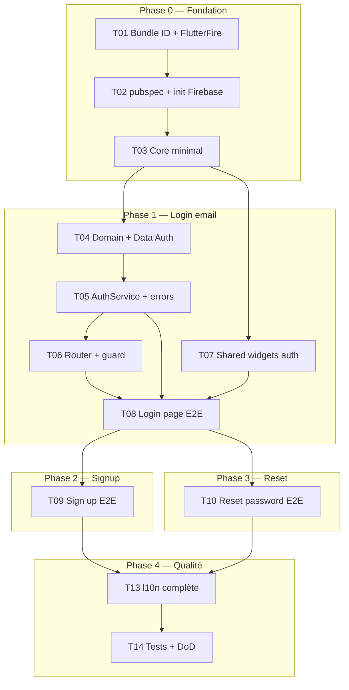

# Plan d’implémentation — Lucy Phase 1 (Authentification Firebase)

> Basé sur [SPEC.md](../SPEC.md). Mode plan : pas de modification de code applicatif dans cette étape.  
> État repo au 2026-05-25 : `firebase_options.dart` + configs natives présents ; **0 %** feature auth ; `pubspec` sans deps Firebase.

---

## 1. Objectif du plan

Livrer un parcours auth **complet et vérifiable** sur **web + Android + iOS** :

- Login **email + mot de passe** uniquement (pas de Google/Apple)  
- Inscription → profil Firestore `users/{uid}` → session auto → `/home` (échec Firestore = pas de `/home`)  
- Reset password (anti-énumération + UI succès)  
- Splash bootstrap (`authStateChanges`)  
- l10n **fr / en / de**, Clean Architecture, design Lucy  

Découpage **vertical** : chaque tâche livre un chemin utilisateur testable de bout en bout, pas une couche vide (ex. « tout le data layer » sans UI).

---

## 2. Graphe de dépendances



**Chemins critiques :** T01 → T02 → T03 → T04 → T05 → T06 → T08 (premier vertical slice débloquant tout le reste).

**Parallélisable après T03 :** T07 (widgets) en parallèle de T04–T05.

**Bloquant externe (humain / console) :** règles Firestore `users/{uid}`, domaines auth web, email enumeration protection.

---

## 3. Décisions techniques figées pour le plan

| Sujet | Choix plan |
|--------|------------|
| Profil | Firestore **obligatoire** `users/{uid}` (`fullName`, `email`, `createdAt`) ; mot de passe **Auth seulement** |
| OAuth Google/Apple | **Hors scope** — supprimé du frontend (pas T11/T12) |
| Plateformes | Web + Android + iOS ; pas macOS auth phase 1 |
| Bundle ID | `com.lucy.app` (T01 fait) |
| Bootstrap | Splash + 1er `authStateChanges` (T06) |
| Vérif. email | Non (Firebase Auth suffit) |
| Home | Placeholder + logout |

---

## 4. Phases et checkpoints

### Phase 0 — Fondation (bloquant)

**But :** `flutter analyze` vert, app démarre avec Firebase initialisé, squelette `core/` + `app.dart`.

| Checkpoint | Critère |
|------------|---------|
| **CP-0** | `flutter pub get` + `flutter analyze` sans erreur ; `flutter run -d chrome` affiche shell Lucy (pas demo compteur) |

---

### Phase 1 — Vertical slice : Login email → Home

**But :** Un utilisateur peut se connecter avec email/mot de passe et atterrir sur `/home`.

| Checkpoint | Critère |
|------------|---------|
| **CP-1** | Compte Firebase test : login → `/home` ; logout → `/login` ; refresh web : session conservée |

---

### Phase 2 — Vertical slice : Sign up → Home

**But :** Création compte + `displayName` + redirection auto `/home`.

| Checkpoint | CP-2 |
|------------|------|
| **CP-2** | Nouvel email : signup → home sans repasser par login ; email déjà utilisé → message l10n |

---

### Phase 3 — Vertical slice : Reset password

**But :** Demande reset + UI « vérifiez votre email » (design).

| Checkpoint | Critère |
|------------|---------|
| **CP-3** | Email envoyé (console Firebase / boîte test) ; UI succès + try again + back login |

---

### Phase 4 — Console Firestore & qualité

**But :** Règles Firestore + polish l10n/tests.

| Checkpoint | Critère |
|------------|---------|
| **CP-4** | T11 : règles `users/{uid}` OK ; signup crée document Firestore |
| **CP-5** | Tous les AC SPEC §1.4 ; `flutter test` + `flutter analyze` verts |

---

### Phase 5 — Definition of Done (alias CP-5)

| Checkpoint | Critère |
|------------|---------|
| *(voir CP-5 ci-dessus)* | Revue UI web ~1440px + mobile ~390px |

---

## 5. Tâches détaillées (vertical slices)

### T01 — Alignement identifiants & Firebase

**Dépendances :** aucune  
**Référence :** gap audit bundle `afroschool.cloud.frontend` vs OAuth `lucy` dans `google-services.json`

**Travail :**
- Décider bundle ID final (`com.lucy.app` recommandé).
- Mettre à jour Android `applicationId`, iOS/macOS `PRODUCT_BUNDLE_IDENTIFIER`, `MainActivity` package.
- Relancer `flutterfire configure` pour régénérer `firebase_options.dart`, `google-services.json`, plist.
- Vérifier cohérence des 3 plateformes dans console Firebase `lucy-7504c`.

**AC :**
- [ ] Un seul bundle ID sur Android / iOS / macOS / `firebase_options`
- [ ] Pas de client OAuth iOS avec un bundle différent du projet Xcode

**Vérification :**
```bash
grep -r "afroschool.cloud" android/ ios/ macos/ lib/firebase_options.dart  # doit être vide ou justifié
flutterfire configure  # si changement bundle
```

---

### T02 — Dépendances & bootstrap Firebase

**Dépendances :** T01  
**Référence :** SPEC §5.1, `lib/main.dart` actuel (demo)

**Travail :**
- Ajouter deps : `firebase_core`, `firebase_auth`, `cloud_firestore`, `flutter_riverpod`, `riverpod_annotation`, `freezed`, `freezed_annotation`, `go_router`, `flutter_localizations`, `intl`, `flutter_svg`, `flex_color_scheme`.
- **Pas** de `google_sign_in` ni `sign_in_with_apple`.
- Dev : `build_runner`, `riverpod_generator`, `json_serializable`.
- `main.dart` : `WidgetsFlutterBinding.ensureInitialized()` → `Firebase.initializeApp(options: DefaultFirebaseOptions.currentPlatform)` → `ProviderScope` → `LucyApp`.
- Supprimer template compteur.

**AC :**
- [ ] `flutter analyze` : 0 erreur (y compris `firebase_options.dart`)
- [ ] App compile web + au moins une plateforme mobile

**Vérification :**
```bash
flutter pub get && flutter analyze && flutter run -d chrome
```

---

### T03 — Core minimal (thème FlexColorScheme, routes, l10n, extensions)

**Dépendances :** T02  
**Référence :** AfroSchool `l10n.yaml`, `af_flex_theme.dart`, `af_colors.dart`, SPEC §4

**Travail :**
- `l10n.yaml` + `app_fr.arb` (template) + stubs `app_en.arb`, `app_de.arb`.
- **`flex_color_scheme`** + `LucyFlexTheme` + `lucy_custom_theme/` (`lucy_colors`, `lucy_button_theme`, `lucy_text_field_theme`, `lucy_form_theme`).
- **`LucyColors`** : triplet **primary / secondary / tertiary** harmonisé + seeds light/dark (comme `AFColors.colorScheme*Seed`).
- `LucyFlexTheme` passe `primary`, `secondary`, `tertiary` à `FlexThemeData` — widgets utilisent `colorScheme.*`.
- `LucyRoutePaths`, `LucyRouteNames`, `context.l10n`, `build_context_responsive`.
- `app.dart` : `MaterialApp.router`, locales fr/en/de, `theme: LucyFlexTheme.lightTheme`.

**AC :**
- [ ] Router + splash : **uniquement** `context.colorScheme` — **0** `Color(0x…)` / `LucyColors` hors `lib/core/theme/`
- [ ] `flutter gen-l10n` génère `AppLocalizations`

**Vérification :**
```bash
flutter gen-l10n  # ou via flutter pub get
flutter analyze
```

---

### T04 — Auth domain + data (Firebase encapsulé)

**Dépendances :** T03  
**Référence :** SPEC §4.2, AfroSchool `auth_repository.dart` (contrat simplifié)

**Travail :**
- `AuthUser` entity (uid, email, displayName).
- `AuthRepository` abstract.
- `FirebaseAuthDatasource` : wrappers `FirebaseAuth` uniquement ici.
- `FirestoreUserDatasource` (ou méthodes dans repo) : `users/{uid}`.
- **`auth_user_mapper.dart`** : `User` (SDK) → `AuthUser`.
- **`user_profile_dto.dart`** + **`user_profile_mapper.dart`** pour Firestore.
- `signUp` : Auth + `updateDisplayName` + Firestore ; échec Firestore → `deleteUser` + throw.
- `AuthRepositoryImpl` + `authRepositoryProvider`.

**AC :**
- [ ] Aucun import `firebase_auth` / `cloud_firestore` hors `data/`
- [ ] `authStateChanges()` exposé au domaine
- [ ] Signup sans `/home` si écriture profil échoue

**Vérification :**
```bash
rg "firebase_auth" lib/ --glob "!**/firebase_auth_datasource.dart" --glob "!**/auth_repository_impl.dart"
# doit ne retourner que providers/service si imports types uniquement — idéalement zero hors data
```

---

### T05 — AuthService + traduction erreurs

**Dépendances :** T04  
**Référence :** AfroSchool `auth_error_translator.dart`

**Travail :**
- `AuthService` : login email, signup, reset email, signOut, streams.
- `auth_error_translator.dart` : codes `user-not-found`, `wrong-password`, `email-already-in-use`, `weak-password`, `invalid-email`, `network-request-failed`, `too-many-requests`, `user-disabled`, `operation-not-allowed`, etc.
- Clés ARB `auth.*` (fr/en/de) pour chaque code mappé.

**AC :**
- [ ] Service ne importe pas `firebase_auth` directement
- [ ] Tests unitaires translator (codes → clés l10n)

**Vérification :**
```bash
flutter test test/core/utils/auth_error_translator_test.dart
```

---

### T06 — Router GoRouter + guard session

**Dépendances :** T05  
**Référence :** AfroSchool `af_router_guards.dart`, routes auth publiques

**Travail :**
- Routes : `/` (splash), `/login`, `/signup`, `/reset-password`, `/home`.
- Splash : attend le **1er** `authStateChanges` avant redirect (pas de flash login).
- `GoRouter` `refreshListenable` sur stream auth.
- Redirect : auth sur login/signup → home ; non auth → login (après splash).
- Provider `authStateProvider` basé sur `authStateChanges()`.

**AC :**
- [ ] Cold start : pas de flash `/login` si déjà connecté
- [ ] Guard empêche `/home` sans session

**Vérification :**
- Test widget/integration mock `AuthRepository` + navigation

---

### T07 — Shared widgets & layouts auth (design Lucy)

**Dépendances :** T03  
**Référence :** design React + AfroSchool `auth_web_layout.dart`, `auth_mobile_layout.dart`, boutons shared

**Travail :**
- **`LucyPrimaryButton` / `LucySecondaryButton` / `LucyTertiaryButton`** (pattern `AF*Button`).
- **`LucyTextFieldWeb` / `LucyTextFieldMobile`** (pattern `af_text_field_*`, thème `LucyTextFieldTheme`).
- `LucyLogo`, `AuthScaffold`, `AuthWebLayout`, `AuthMobileLayout`.
- Styles **uniquement** via `Theme.of(context).colorScheme` — **interdit** hex / `LucyColors` dans widgets.
- **Aucune** section « or continue with » / boutons Google/Apple (supprimés du design).

**AC :**
- [x] Rendu carte ~max 448px web, plein écran mobile
- [x] Couleurs via `colorScheme` uniquement (grep features/shared sans `Color(0x`)

**Vérification :**
- Revue manuelle chrome + simulateur iPhone

---

### T08 — Vertical slice : Login email → Home

**Dépendances :** T05, T06, T07  
**Référence :** `login.tsx`, AfroSchool `login_page.dart`

**Travail :**
- `LoginState` (Freezed) + `LoginNotifier`.
- `LoginPage` : formulaire, loading, erreurs l10n, liens signup/reset.
- `HomePage` placeholder + logout.
- Flux : `submitLogin` → service → `go('/home')`.

**AC :**
- [ ] **CP-1** validé sur compte Firebase console
- [ ] Pas de texte UI en dur (l10n)
- [ ] Layout web vs mobile basé sur `context.isDesktop` / responsive

**Vérification :**
```bash
flutter run -d chrome
# login test user → home → logout → login
```

---

### T09 — Vertical slice : Sign up → Home

**Dépendances :** T08  
**Référence :** `sign-up.tsx`

**Travail :**
- `SignUpNotifier` + page : fullName, email, password.
- Service : createUser + updateDisplayName + **Firestore** `users/{uid}`.
- Redirect `/home` **uniquement** si Auth + Firestore OK.
- Test manuel : couper réseau / règles Firestore → signup échoue, pas de home.

**AC :**
- [ ] **CP-2** validé (document Firestore présent)
- [ ] Échec Firestore → pas de session persistante sur `/home`

---

### T10 — Vertical slice : Reset password

**Dépendances :** T08  
**Référence :** `reset-password.tsx` (form + success state)

**Travail :**
- `ResetPasswordNotifier` avec état `form | success`.
- `sendPasswordResetEmail`.
- UI succès : email affiché, try again, back to login.

**AC :**
- [ ] **CP-3** : email reçu ou log Firebase Auth OK
- [ ] UI succès **identique** email inconnu vs connu (anti-énumération Q13)
- [ ] Pas d’écran custom « nouveau MDP » (SPEC)

**Vérification :**
- Soumettre email compte existant → état succès → try again → formulaire

---

### T11 — Configuration console Firebase (humain, parallèle T08)

**Dépendances :** T01  
**Type :** DevOps / console

**Travail :**
- Auth : **Email/Password** uniquement.
- Firestore : règles `users/{uid}` (lecture/écriture owner).
- Web : domaines autorisés + templates reset.
- **Email enumeration protection** : activée.
- Nettoyer configs natives OAuth inutiles (entitlements Apple Sign-In, URL scheme Google) si présents — optionnel, pas bloquant email auth.

**AC :**
- [ ] SPEC §B, §C, §D cochés
- [ ] Signup test crée doc `users/{uid}`

---

### ~~T12 — OAuth~~ — **Annulé** (hors scope PO)

---

### T13 — l10n complète & polish UI

**Dépendances :** T09, T10

**Travail :**
- Compléter fr/en/de : tous libellés auth + home placeholder + erreurs.
- `untranslated_messages.txt` vide ou justifié.
- Harmoniser titres web (`index.html`, manifest : « Lucy »).
- Renommer package `frontend` → `lucy` si décidé (imports, tests).

**AC :**
- [ ] Changer locale device → libellés changent
- [ ] `flutter gen-l10n` sans untranslated critiques

---

### T14 — Tests & Definition of Done

**Dépendances :** T13  
**Référence :** SPEC §7, §1.4

**Travail :**
- Tests : `AuthService` (mock repo), translator, widgets formulaires.
- Mettre à jour `widget_test.dart` (smoke LucyApp).
- Checklist SPEC §1.4 dans PR / `tasks/todo.md`.

**AC :**
- [ ] **CP-5** : `flutter test` + `flutter analyze` verts
- [ ] Revue design 3 écrans web + mobile

---

## 6. Ordre d’exécution recommandé

```
T01 → T02 → T03 ─┬→ T04 → T05 → T06 → T08 → T09 → T10 → T13 → T14
                 └→ T07 ────────────────────────────────┘
T11 (parallèle dès T01, Firestore + console)
```

**Durée indicative (dev seul) :** 2–4 jours ouvrés (sans OAuth).

---

## 7. Risques & mitigations

| Risque | Impact | Mitigation |
|--------|--------|------------|
| Règles Firestore manquantes | Signup échoue toujours | T11 avant tests T09 |
| Signup partiel (Auth OK, Firestore KO) | Compte orphelin | Rollback `deleteUser` dans T04 |
| `pubspec` name `frontend` | Confusion imports | T13 ou T02 renommer en `lucy` |
| Enumération emails reset | Fuite existence compte | Protection Firebase + UI succès générique (T10) |
| Flash login au cold start | UX | Splash T06 |

---

## 8. Livrables fin phase 1

- App Flutter Lucy : auth complète Firebase  
- `lib/features/auth/` + `lib/core/` + `lib/shared/` conformes SPEC  
- l10n fr/en/de  
- `tasks/todo.md` entièrement coché  
- Prêt pour phase 2 (module IA sur `/home`)

---

## 9. Références code à copier/adapter

| Élément | Projet référence |
|---------|------------------|
| Layouts auth | `afroschool_admin_web/lib/features/auth/presentation/widgets/` |
| Login page structure | `.../presentation/pages/login/login_page.dart` |
| Router guards | `.../core/router/af_router_guards.dart` |
| l10n 3 langues | `.../core/localization/l10n/app_{fr,en,de}.arb` |
| Design UI | `Design Authentication Flow Screens/src/app/components/` |

---

*Ce document a été créé avec Cursor (IA).*
